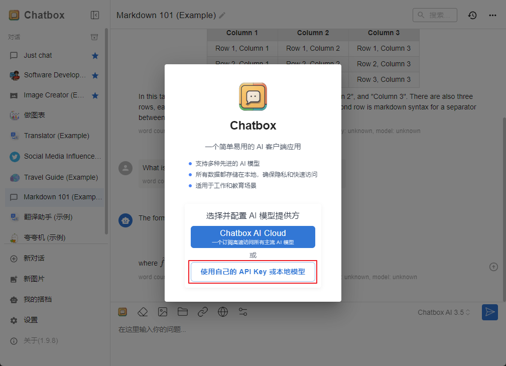
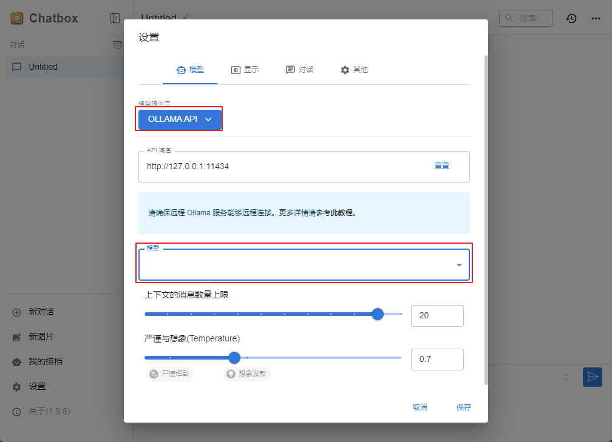

# DeepSeek-R1


## 安装 Ollama

进入[官网](https://ollama.com/)下载对应的系统安装包

验证安装是否完成

```bash:no-line-numbers
C:\Users\xxxx> ollama --version
ollama version is 0.5.7
```

查看当前本地的模型列表
```bash:no-line-numbers
C:\Users\xxxx> ollama list
NAME    ID    SIZE    MODIFIED
```

查看帮助信息
```bash:no-line-numbers
C:\Users\xxxx> ollama --help
Large language model runner

Usage:
  ollama [flags]
  ollama [command]

Available Commands:
  serve       Start ollama
  create      Create a model from a Modelfile
  show        Show information for a model
  run         Run a model
  stop        Stop a running model
  pull        Pull a model from a registry
  push        Push a model to a registry
  list        List models
  ps          List running models
  cp          Copy a model
  rm          Remove a model
  help        Help about any command

Flags:
  -h, --help      help for ollama
  -v, --version   Show version information

Use "ollama [command] --help" for more information about a command.
```


## 加载 DeepSeek-R1 模型

进入 [ollama安装DeepSeek-R1 模型](https://ollama.com/library/deepseek-r1:14b) 教程地址

执行命令 `ollama run deepseek-r1` 即可完成下载 <b>deepseek-r1</b>的默认版本，如果需要下载指定版本则执行如下命令

```bash:no-line-numbers
ollama run deepseek-r1:671b   # 官方 671b 版本模型

ollama run deepseek-r1:1.5b  # 经过 Qwen 蒸馏过后的 1.5b 版本模型  -> DeepSeek-R1-Distill-Qwen-1.5B

ollama run deepseek-r1:7b  # 经过 Qwen 蒸馏过后的 7b 版本模型 -> DeepSeek-R1-Distill-Qwen-7B

ollama run deepseek-r1:8b  # 经过 Llama 蒸馏过后的 8b 版本模型 -> DeepSeek-R1-Distill-Llama-8B

ollama run deepseek-r1:14b  # 经过 Qwen 蒸馏过后的 14b 版本模型 -> DeepSeek-R1-Distill-Qwen-14b

ollama run deepseek-r1:32b  # 经过 Qwen 蒸馏过后的 32b 版本模型 -> DeepSeek-R1-Distill-Qwen-32b

ollama run deepseek-r1:70b  # 经过 Llama 蒸馏过后的 70b 版本模型 -> DeepSeek-R1-Distill-Llama-70b
```

执行此步骤会耗费较长时间（需要下载对应的模型文件，模型越大对应的下载文件越大，或者由于网络问题导致超时等），所下载的模型越大后期运行时所要求的硬件性能越强，推荐安装 `ollama run deepseek-r1` 或者 `ollama run deepseek-r1:7b` 版本大小的模型（模型文件大小约4.7GB）

## Chatbox 安装

进入[官网](https://chatboxai.app/zh)下载对应的系统安装包

安装完成后打开 <b>Chatbox</b>，然后选择使用本地的 <b>DeepSeek</b> 模型



选择 <b>ollama api</b>，选择所下载的指定模型



完成后即可实现本地的 <b>DeepSeek-R1</b> 的本地对话

:::tip 注意
Ollama 需要保持后台运行方可提供服务，如果发现服务关闭可重启 Ollama
:::
