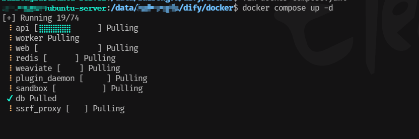
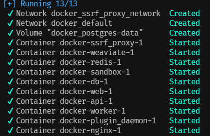
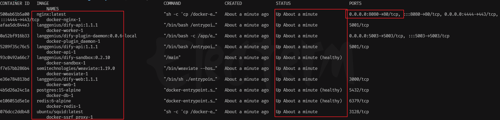

# Dify
> Version: 1.1.1


## 克隆 Dify 代码仓库
克隆 Dify 源代码至本地环境，假设所要安装的版本为 <b>V1.1.1</b>, 则执行如下命令：

> [!TIP] 提示
> 1.1.1 为 Dify 版本号，可根据实际情况修改，执行命令前请先安装 git 环境。

```bash:no-line-numbers
$ git clone https://github.com/langgenius/dify.git --branch 1.1.1
```

## 配置 Dify

1. 进入 Dify 源代码的 Docker 目录

```bash:no-line-numbers
$ cd dify/docker
```

2. 复制 `.env.example` 为 `.env`
```bash:no-line-numbers
$ cp .env.example .env
```

## 启动 Dify 容器

1. 启动 Dify

```bash:no-line-numbers
$ docker-compose up -d
```

首次执行 `docker compose up -d` 命令后，会自动进入安装流程



执行完 `docker compose up -d` 命令后，会有如下结果



2. 查看 docker 容器运行情况，执行命令 `docker ps`，得到如下结果



3. 访问 `127.0.0.1:8080` 即可进入 Dify 页面


> [!TIP] 注意⚠️
> 1. 如果镜像下载失败则需要配置一下镜像源，首次启动可能需要等待一段时间，等待所有服务启动完毕。
> 2. 配置完镜像源后，再次执行 `docker compose up -d` 命令即可。


## <span style="color:#0CCA5D;">TIP：</span> 修改 `Dify` 默认 `80` 端口

<i>解决方案：</i>

1. 进入 Dify 源代码的 Docker 目录

```bash:no-line-numbers
$ cd dify/docker
```

2. 编辑 `.env` 文件

```bash:no-line-numbers
$ vim .env
```

3. 找到 `Docker Compose Service Expose Host Port Configurations` 部分，替换对应的端口号例如：`8080`
```text 5,6
...
# ------------------------------
# Docker Compose Service Expose Host Port Configurations
# ------------------------------
EXPOSE_NGINX_PORT=80 # 替换为 8080
EXPOSE_NGINX_SSL_PORT=443 # 替换为 4444
...
```

4. 执行命令 `:wqa` 保存并退出，重新执行 `docker compose up -d` 命令即可。


## <span style="color:#0CCA5D;">TIP：</span> 重置管理员密码


```bash:no-line-numbers
$ docker exec -it docker-api-1 flask reset-password
```

然后按照提示输入新密码即可。


## <span style="color:red;">ERROR：</span> docker-db-1 无法正常启动

<i>问题描述：</i>

- 执行命令 `docker compose up -d` 后，docker-db-1 无法正常 Running，总是重启 Restarting。
- 进入 `http://127.0.0.1/install` 页面后出现一直加载中，无法正常显示的情况。

<i>解决方案：</i>

1. 进入 Dify 源代码的 Docker 目录

```bash:no-line-numbers
$ cd dify/docker
```

2. 编辑 `docker-compose.yaml` 文件

```bash:no-line-numbers
$ vim docker-compose.yaml
```

3. 找到 `The postgres database.` 部分，将 `volumes/db/data` ，替换为 `postgres-data`

```yaml {18,19}
...
  # The postgres database.
  db:
    image: postgres:15-alpine
    restart: always
    environment:
      PGUSER: ${PGUSER:-postgres}
      POSTGRES_PASSWORD: ${POSTGRES_PASSWORD:-difyai123456}
      POSTGRES_DB: ${POSTGRES_DB:-dify}
      PGDATA: ${PGDATA:-/var/lib/postgresql/data/pgdata}
    command: >
      postgres -c 'max_connections=${POSTGRES_MAX_CONNECTIONS:-100}'
               -c 'shared_buffers=${POSTGRES_SHARED_BUFFERS:-128MB}'
               -c 'work_mem=${POSTGRES_WORK_MEM:-4MB}'
               -c 'maintenance_work_mem=${POSTGRES_MAINTENANCE_WORK_MEM:-64MB}'
               -c 'effective_cache_size=${POSTGRES_EFFECTIVE_CACHE_SIZE:-4096MB}'
    volumes:
      - ./volumes/db/data:/var/lib/postgresql/data  # 删除这行
      - postgres-data:/var/lib/postgresql/data  # 新增这行
    healthcheck:
      test: [ 'CMD', 'pg_isready' ]
      interval: 1s
      timeout: 3s
      retries: 30
...
```


4. 在文件的最后部分 `volumes`，新增 `postgres-data`
```yaml 5
...
volumes:
  oradata:
  dify_es01_data:
  postgres-data:
```

5. 执行命令 `:wqa` 保存并退出，重新执行 `docker compose up -d` 命令即可。
