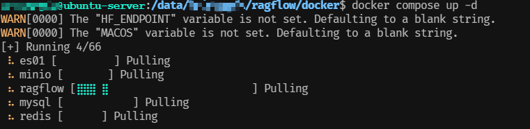

# RagFlow
> Version: 0.17.2


## 前置条件📝 

- CPU >= 4 核
- RAM >= 16 GB
- Disk >= 50 GB
- Docker >= 24.0.0 & Docker Compose >= v2.26.1
> 如果你并没有在本机安装 Docker（Windows、Mac，或者 Linux）, 可以参考文档 [Install Docker Engine](https://docs.docker.com/engine/install/) 自行安装。
- 确保 `vm.max_map_count` 不小于 `262144`：
> 可通过命令查看 `vm.max_map_count` 的大小：
> ```bash:no-line-numbers
> $ sysctl vm.max_map_count
> ```
>
> 如果 `vm.max_map_count` 的值小于 `262144`，可以通过命令修改：
> ```bash:no-line-numbers
> $ sudo sysctl -w vm.max_map_count=262144
> ```
> 
> 为了永久改动 `vm.max_map_count` ， 还需要更改 `/etc/sysctl.conf` 文件
> ```bash:no-line-numbers
> $ sudo vim /etc/sysctl.conf
> ```
>
> 在文件末尾添加以下内容：
> ```bash:no-line-numbers
> ...
> vm.max_map_count=262144
> ...
> ```
>
> 执行命令 `$ :wqa!` 保存并退出文件
>
> 执行命令 `$ sudo sysctl -p` 使配置生效
>


> [!TIP] 注意⚠️
> 请注意，目前官方提供的所有 Docker 镜像均基于 x86 架构构建，并不提供基于 ARM64 的 Docker 镜像。 如果你的操作系统是 ARM64 架构，请参考这篇文档自行构建 Docker 镜像。

## 克隆 RagFlow 代码仓库

克隆 RagFlow 源代码至本地环境，执行如下命令：

```bash:no-line-numbers
$ git clone https://github.com/infiniflow/ragflow.git
```

## 配置 RagFlow

> 如需下载不同于 `v0.17.2-slim` 的 Docker 镜像，请在运行 docker compose 启动服务之前先更新 `docker/.env` 文件内的 `RAGFLOW_IMAGE` 变量。比如，你可以通过设置 `RAGFLOW_IMAGE=infiniflow/ragflow:v0.17.2` 来下载 RAGFlow 镜像的 `v0.17.2` 完整发行版。

1. 进入 RagFlow 源代码的 Docker 目录
```bash:no-line-numbers
$ cd ragflow/docker
```
2. 编辑 `.env` 文件
```bash:no-line-numbers
$ vim.env
```
修改如下内容，可选的值，用于更新所选择的镜像。
- ragflow:v0.17.2                ---               【≈9GB|Stable release】
- ragflow:v0.17.2-slim           ---               【≈2GB|Stable release】
- ragflow:nightly                ---               【≈9GB|Unstable nightly build】
- ragflow:nightly-slim           ---               【≈2GB|Unstable nightly build】

```env 2
...
RAGFLOW_IMAGE=infiniflow/ragflow:v0.17.2-slim
...
```
执行命令 `:wqa` 保存并退出。

3. 编辑 `docker-compose.yaml` 文件
```bash:no-line-numbers
$ vim docker-compose.yaml
```

修改如下内容，用于更新对外可访问的端口。【默认对外端口为 80】
```yaml 6,7
...
services:
    ...
    ports:
      - ${SVR_HTTP_PORT}:9380
      - 8080:80
      - 4444:443
...
```

执行命令 `:wqa` 保存并退出。

4. 如果需要配置本地模型，请编辑 ` service_conf.yaml.template` 文件里面的属性 `user_default_llm`, 可以根据对应字段进行填写即可。
```yaml 2-11
...
# user_default_llm:
#   factory: 'Tongyi-Qianwen'
#   api_key: 'sk-xxxxxxxxxxxxx'
#   base_url: ''
#   default_models:
#     chat_model: 'qwen-plus'
#     embedding_model: 'BAAI/bge-large-zh-v1.5@BAAI'
#     rerank_model: ''
#     asr_model: ''
#     image2text_model: ''
...
```

> [!TIP] 提示（每个配置文件的作用）
> - .env：存放一些基本的系统环境变量，比如 SVR_HTTP_PORT、MYSQL_PASSWORD、MINIO_PASSWORD 等。
>
> - service_conf.yaml.template：配置各类后台服务。
>
> - docker-compose.yml: 系统依赖该文件完成启动。


## 启动 RagFlow 容器

1. 启动 RagFlow

```bash:no-line-numbers
$ docker-compose up -d
```

首次执行 `docker compose up -d` 命令后，会自动进入安装流程



2. 服务器启动成功后再次确认服务器状态：

```bash:no-line-numbers
$ docker logs -f ragflow-server
```

出现以下界面提示说明服务器启动成功：
```bash:no-line-numbers
     ____   ___    ______ ______ __
    / __ \ /   |  / ____// ____// /____  _      __
   / /_/ // /| | / / __ / /_   / // __ \| | /| / /
  / _, _// ___ |/ /_/ // __/  / // /_/ /| |/ |/ /
 /_/ |_|/_/  |_|\____//_/    /_/ \____/ |__/|__/

 * Running on all addresses (0.0.0.0)
```

> [!TIP] 提示
> 如果您在没有看到上面的提示信息出来之前，就尝试登录 RAGFlow，你的浏览器有可能会提示 network anormal 或 网络异常。

3. 访问 `127.0.0.1:8080` 即可进入 RagFlow 页面


> [!TIP] 注意⚠️
> 1. 如果镜像下载失败则需要配置一下镜像源，首次启动可能需要等待一段时间，等待所有服务启动完毕。
> 2. 配置完镜像源后，再次执行 `docker compose up -d` 命令即可。


