# 核酸中主要的五种碱基

> 生物体中常见的碱基有5种，分别是腺嘌呤（A）、鸟嘌呤（G）、胞嘧啶（C）、胸腺嘧啶（T）和尿嘧啶（U）。

> 其中碱基 A、G、C 和 T 存在于 DNA 中，而 A、G、C 和 U 存在于 RNA 中。

> [!TIP] 说明
> 文档中的3d结构球棍模型和动画均使用 [Qbics-Molstar](https://molstar.szbl.ac.cn/viewer/) 

## 腺嘌呤（A）

    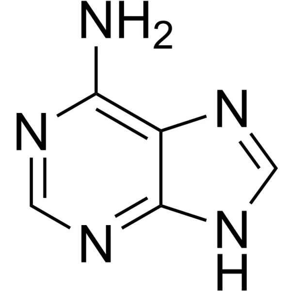
    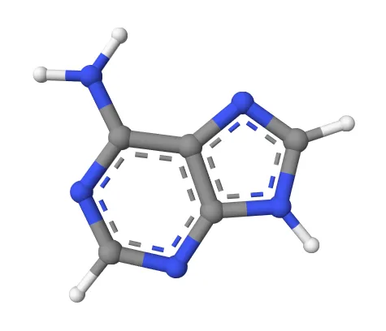

动图如下:

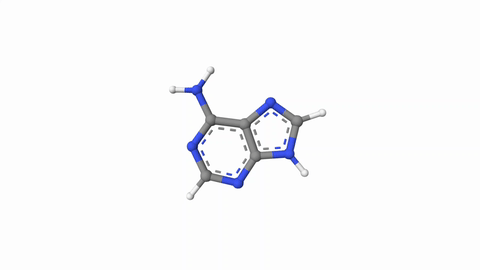

## 胸腺嘧啶（T）

    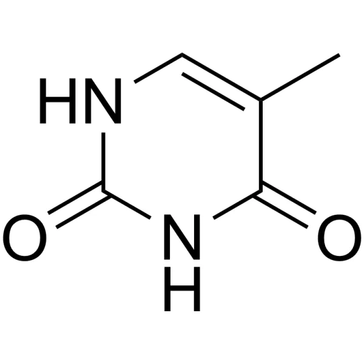
    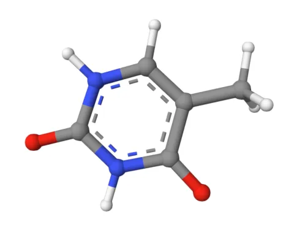

动图如下:

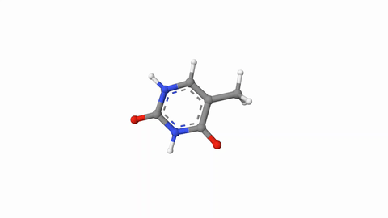

## 鸟嘌呤（G）

    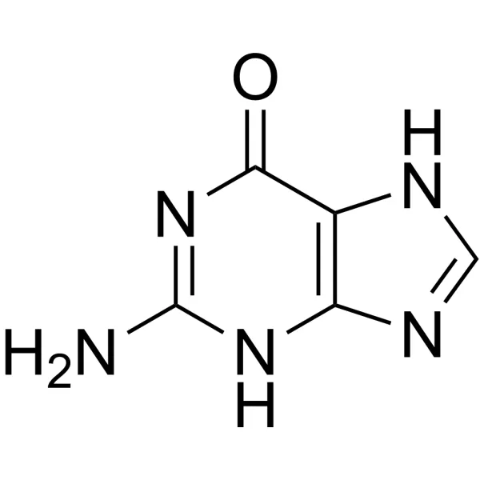
    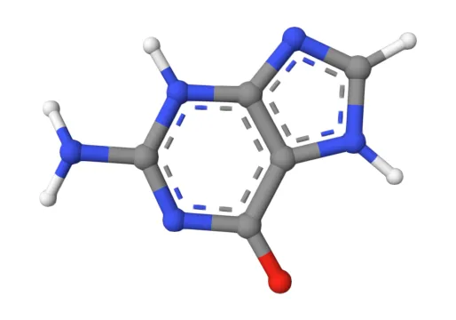

动图如下:

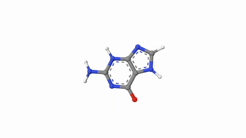

## 胞嘧啶（C）

    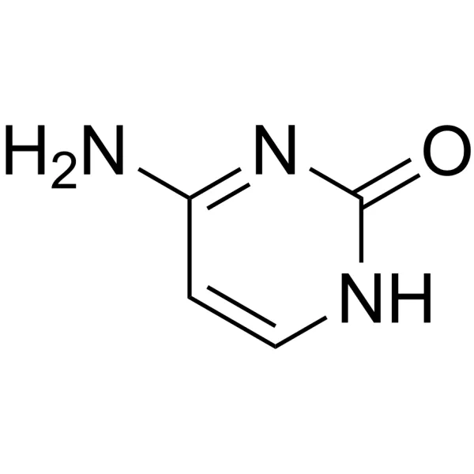
    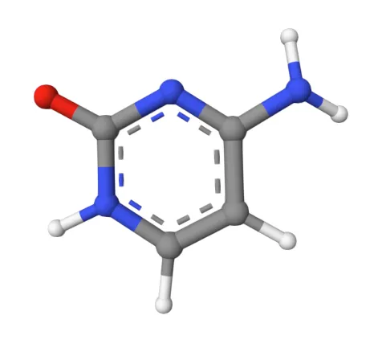

动图如下:

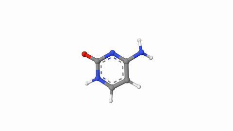

## 尿嘧啶（U）

    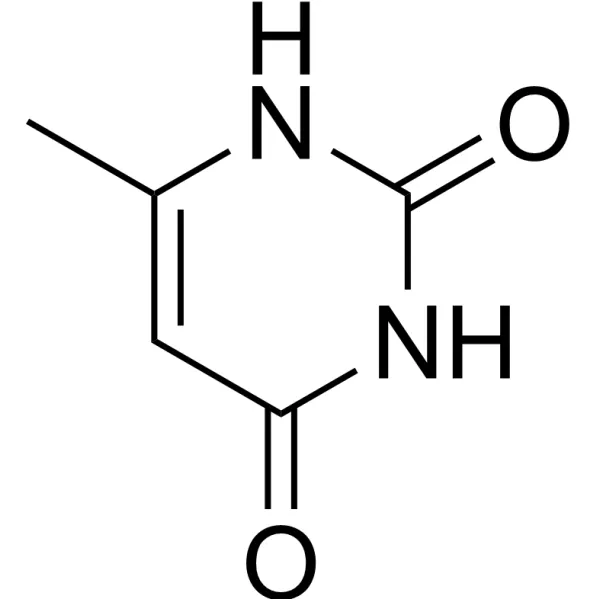
    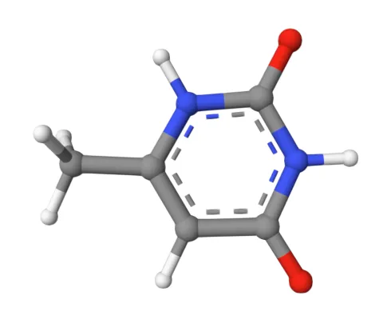

动图如下:

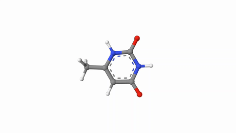