# 四种重要的核苷酸

> 生物体中四种重要的核苷酸，分别是腺嘌呤核苷三磷酸（ATP）、三磷酸鸟苷（GTP）、三磷酸胞苷（CTP）和尿苷三磷酸（UTP）。

> [!TIP] 说明
> 文档中的3d结构球棍模型和动画均使用 [Qbics-Molstar](https://molstar.szbl.ac.cn/viewer/)

## 腺嘌呤核苷三磷酸（ATP）

> 被誉为 **生命的能量货币**

- 转录时，作为AMP的来源
- 生物体内最直接的能量来源
- 通过合成cAMP调节糖原、脂肪、蛋白质、核酸代谢
- 作为一种神经递质起作用
- 是磷酸基团转移的重要物质，fAMP是NAD+、NADP+、FAD、辅酶A的合成前体

    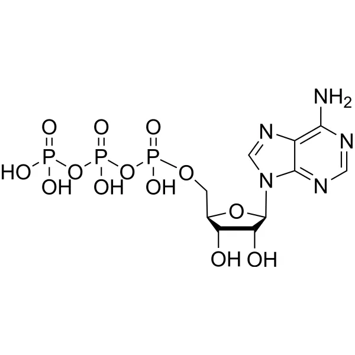
    

动图如下:

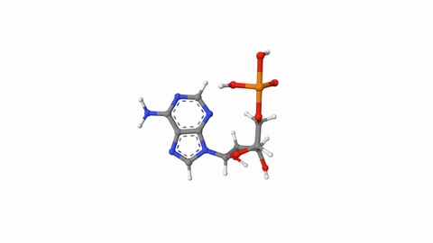

## 三磷酸鸟苷（GTP）

- 转录时，作为GMP的来源
- 在蛋白质的生物合成、寻靶作用、转运等作为推动力提供自由能
- 对G蛋白的活化和产生cGMP第二信使起作用
- 是琥珀酸辅酶A→琥珀酸中磷酸基团的受体
- 糖原合成中GDP–甘露糖是糖蛋白合成的前体物质
- 经UTP氨化由酶催化合成，一种在胞苷的核糖-5'－OH基上结合三分子磷酸的核苷酸；有二个高能磷酸键。是RNA生物合成的直接前体之一。

    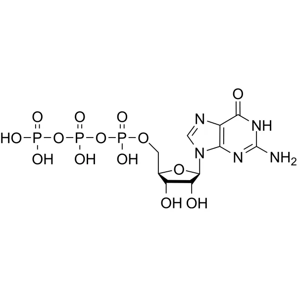
    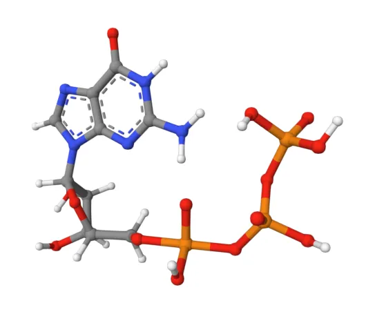

动图如下:

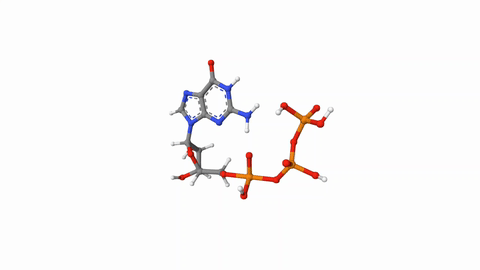

## 三磷酸胞苷（CTP）

- 转录时，作为CMP的来源
- 在合成磷脂酰胆碱、磷脂酰乙醇胺以及合成纤维素中起推动作用
- DNA复制时的引物和转录时的鸟嘌呤核苷酸的提供者。是三羧酸循环中琥珀酰辅酶A转变为琥珀酸过程中的能量载体，它可以和ATP相互转换。

    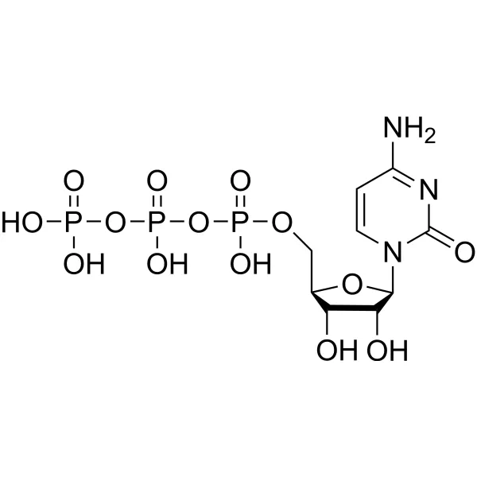
    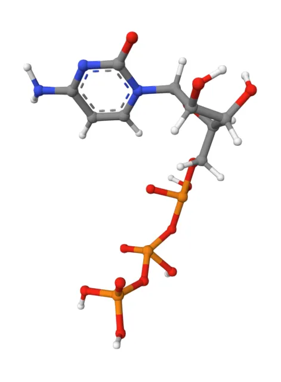

动图如下:

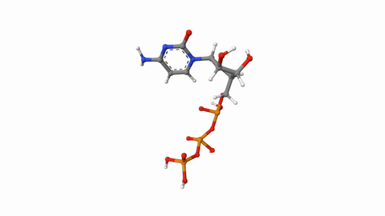

## 尿苷三磷酸（UTP）

- 转录时，作为UMP的来源
- 在半乳糖代谢中起作用，UDP-半乳糖是乳糖的前体物质
- 在糖原合成中起活化葡萄糖分子的作用
- UDP-葡萄糖、UDP-N-乙酰葡糖胺是糖蛋白生物合成的前体物质
- 在淀粉代谢、蔗糖代谢中是糖基转移的重要物质
- 要用途是RNA合成（转录）时的原料，是RNA合成的直接前体。

    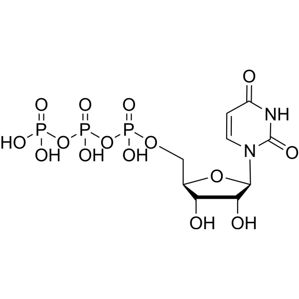
    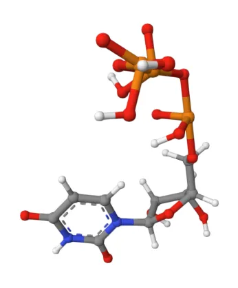

动图如下:

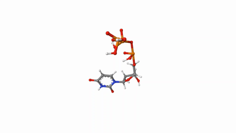