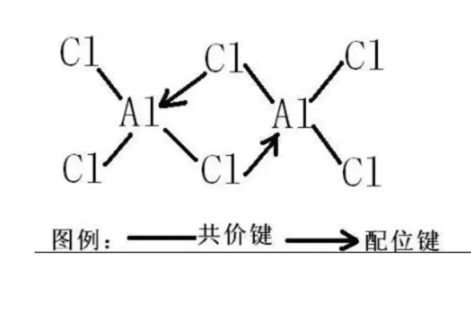

# 化学键的类型

## 离子键

**本质：** 由静电引力形成，发生在原子间电负性相差较大的元素之间（通常是活泼金属和活泼非金属）。

**形成过程：** 电负性低的原子（金属原子）容易失去电子形成阳离子。电负性高的原子（非金属原子）容易得到电子形成阴离子。阴阳离子之间通过强烈的静电引力相互吸引结合在一起。

**特点：** 没有方向性和饱和性（离子在空间尽可能多地吸引异号离子）；通常形成离子晶体，具有高熔点、高沸点、硬度较大、固态不导电（离子被固定）、熔融状态或水溶液导电的性质。

**例子：** NaCl、CaO、KBr

## 共价键

**本质：** 原子间通过共享电子对形成的化学键，通常发生在电负性相同或相近的非金属原子之间。

**形成过程：** 成键原子各自提供未成对电子，这两个电子在两个原子核周围的轨道上运动，为两个原子所共用，形成共用电子对。共用电子对受到两个原子核的共同吸引，将两个原子结合在一起。

**特点：** 具有方向性（电子云最大重叠原理）和饱和性（一个原子的未成对电子配对后就不能再成键）；可以形成分子（如 H₂, O₂, H₂O, CH₄）或原子晶体（如金刚石，二氧化硅）。

### 非极性共价键

> 成键原子之间电负性差小于0.5，电子对基本不偏向任何一方（如 H-H, Cl-Cl）。

**定义：** 由同种元素的原子间形成的共价键，称为非极性共价键。由于同种原子吸引共用电子对的能力相等，成键电子对匀称地分布在两核之间，不偏向任何一个原子，成键的原子都不显电性。
形成过程：以氢气（H₂）的形成为例，氢原子最外层有1个电子，要达到2电子稳定结构，两个氢原子各提供1个电子，形成1对共用电子对，两个氢原子都达到稳定结构，从而形成氢气分子，其中的H-H键就是非极性共价键。

**判断方法：** 由相同元素的原子形成的共价键是非极性键。例如单质分子（如H₂、Cl₂、O₃、P₄等）和某些共价化合物（如C₂H₂、C₂H₄、CH₃CH₂OH等）、某些离子化合物（如Na₂O₂、CaC₂等）含有非极性键。

**特点：**
- 电负性差值小：成键原子之间电负性差小于0.5，电子对基本不偏向任何一方。
- 具有方向性和饱和性：与一般的共价键一样，非极性共价键也具有方向性和饱和性，一个原子的未成对电子配对后就不能再成键。

**实例：**
- 单质分子中的非极性共价键：如氮气（N₂）分子中，两个氮原子通过三对共用电子对形成N≡N键，是典型的非极性共价键。
- 化合物中的非极性共价键：在乙炔（C₂H₂）分子中，两个碳原子之间通过一对共用电子对形成C≡C键，这是非极性共价键，而碳氢原子之间形成的是极性共价键。

### 极性共价键

> 成键原子不同，电负性差大于0.5但小于约1.7（非固定标准），电子对偏向电负性大的一方（如 H-Cl, C-O）。电负性差越大，键的极性越强。

**定义：**
极性共价键是指在共价键中，成键原子对共用电子对的吸引能力不同，导致共用电子对发生偏移，使成键的原子呈正电性或负电性的共价键。

**形成原因：**
由于不同原子的电负性不同，电负性大的原子吸引电子的能力强，电负性小的原子吸引电子的能力弱。在形成共价键时，电负性大的原子会将共用电子对更多地吸引到自己一方，从而使电子云密度在两个原子之间分布不均匀，形成极性共价键。

**判断方法：**
- 电负性差值法：一般来说，形成键的两个原子的电负性差为0.6～1.6的是极性共价键。
- 原子种类法：由不同种元素的原子形成的共价键通常为极性共价键，如HCl、H₂O等分子中的共价键。
特点
- 电子云分布不均匀：共用电子对偏向电负性大的原子，使得电负性大的原子带部分负电荷，电负性小的原子带部分正电荷。
- 具有方向性：极性共价键的方向性与成键原子的电负性有关，电子云密度大的一端指向电负性大的原子。
- 键能与键长有特定关系：一般来说，极性共价键的键能越大，键长越短，键越牢固。

**对物质性质的影响：**
- 对分子极性的影响：极性共价键是分子具有极性的主要原因。如果分子中所有极性共价键的极性相互抵消，分子整体不显极性，如CO₂、CH₄等；如果分子中极性共价键的极性不能相互抵消，分子则具有极性，如H₂O、NH₃等。
- 对物质溶解性的影响：极性共价键的物质通常易溶于极性溶剂，如水，而不易溶于非极性溶剂，如苯。这是因为极性分子之间存在偶极-偶极作用，与极性溶剂分子之间也能形成偶极-偶极作用，从而相互吸引，使物质溶解。
- 对物质化学性质的影响：极性共价键的强度和极性会影响物质的化学反应活性。例如，在有机化学中，羧酸分子中的羧基（-COOH）中的O-H键是极性共价键，由于O的电负性较大，电子云偏向O原子，使得O-H键的极性较强，容易断裂，从而使羧酸具有酸性，能电离出H⁺。

## 配位键

**本质：** 一种特殊的共价键，其特殊性在于形成键的共用电子对完全由成键原子中的一方单独提供。

**形成过程：** 一方原子（配体）提供孤对电子，另一方原子或离子（中心原子/离子）提供空轨道接受这对电子。提供电子对的原子称为电子对给予体（Lewis碱），接受电子对的原子或离子称为电子对
接受体（Lewis酸）。

**特点：** 一旦形成，在性质上与普通共价键没有区别；同样具有方向性和饱和性；是形成配位化合物（络合物）的基础。

**例子：**  [Cu(NH₃)₄]²⁺（四氨合铜离子），其中 Cu²⁺是中心离子，NH₃是配体，N原子提供孤对电子与Cu²⁺的空轨道形成配位键。
