# XRPD

> X-射线粉末衍射（XRPD, X-ray Powder Diffraction），是一种用于研究物质晶体结构的技术，常用于药物多晶型结构分析。在实践中，术语“XRPD”通常被“XRD”（X射线衍射）取代。去掉字母“P”后，XRD 的缩写含义更加广泛，涵盖了 X 射线衍射的所有领域，例如单晶衍射、纤维 X 射线衍射、前面提到的 X 射线粉末衍射、外延层 X 射线衍射等等。

:::tip 小提示
1. X-射线是原子内层电子在快速运动的电子轰击下跃迁产生的光辐射。

2. XRPD主要用于研究物质的晶体结构，而XRD则更侧重于分析物质的微观结构。
:::

:::tip 应用**布拉格定律**来满足衍射条件
`nλ = 2dsinθ，n=1,2...`
> - D 为晶面间距
> - θ 为入射X射线与相应晶面的夹角
> - λ 为X射线的波长
> - n 为衍射级数，即只有当相邻两晶面的光程差为X射线波长的n倍时，才会发生衍射。

上式表明，**当晶面与X射线的几何关系满足上述条件时，X射线衍射强度会相互加强。**
:::

**XRPD 几何测量原理图**

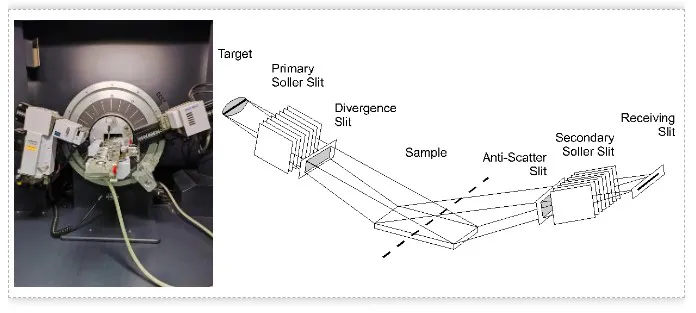

## XRPD 信息组成

X射线粉末衍射图是化合物结构参数间接信息，变化万千，随物质结构不同而异。那么，该如何解读衍射图？

组成X射线粉末衍射图的三要素为：
- 峰位
- 峰强
- 峰形（线形）

衍射峰强受晶体结构、样品特性（择优取向、吸收、孔隙率）和仪器参数影响。晶型是由化合物的晶胞参数（a,b,c,a,β,γ）定义的，而晶胞参数（a,b,c,a,β,γ）影响的是衍射峰的峰位置。其他检测指标如峰强度，则由原子参数决定，并受到择优取向的影响。

**因此，判断晶型一致性时，取决于药物晶型衍射峰的位置，而不是衍射峰的强度或强弱顺序。**

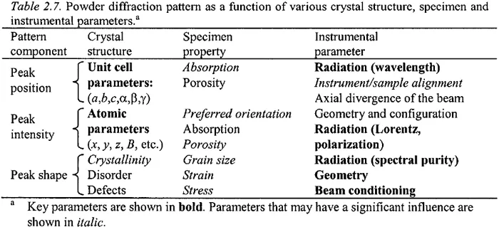

## XRPD 具体应用

1. 区分晶态物质和非晶态物质（无定型）

中国药典2020版0451指出，晶态物质的粉末X射线粉末衍射峰是由数十乃至上百个锐峰（窄峰）组成；而非晶态物质的粉末X射线粉末衍射峰的数量较少且呈弥散状（为宽峰或馒头峰）

**化合物结晶态和无定型的 XRPD 对比图**

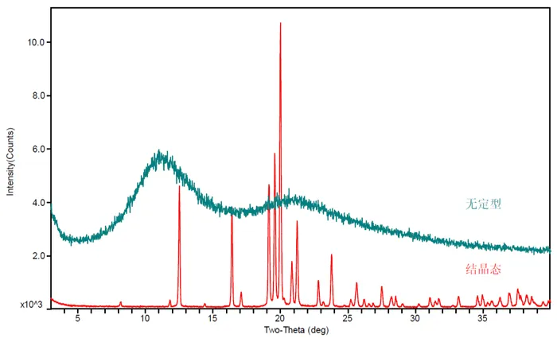

2. 鉴别多晶型

当某一化合物有两种或两种以上的不同固体物质状态时，即存在有多晶型（或称为同质异晶）现象。

多晶型现象可以由样品的分子构象、分子排列规律、分子作用力等变化引起，也可由结晶水或结晶溶剂的加人（数量与种类）形成。不同晶型的XRPD图在衍射峰数量、衍射峰位置、衍射峰强度以及衍射峰的形状上显现出差异。

化合物的每一种晶型都会产生一种特有的X射线粉末衍射图，XRPD图可以作为晶体的指纹图谱，用于鉴定区分不同晶型。

**化合物不同晶型的 XRPD 对比图**

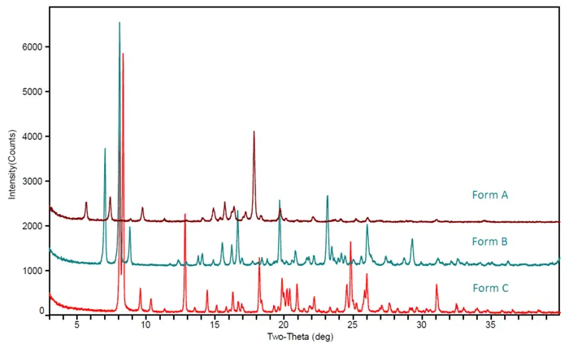

3. 评估物质的结晶度

当化合物结晶状态比较好、结晶度比较高时，XRPD图基线水平，峰形尖锐。反之，结晶度低时，基线不水平，出现漫散包，峰不尖锐，峰形宽化。

结晶度用来表示物相中结晶态物质所占的比例，同一种晶型，一般结晶度越高，熔点越高。

**化合物同一晶型不同结晶度的 XRPD 对比图**

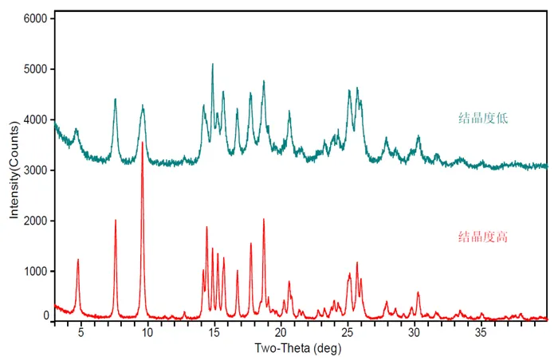

## XRPD 常见问题

多数情况下，晶型的判断并不困难。只要其XRPD谱图一致（所有的衍射峰位置一致），就可以判断为同一晶型。但是在实际晶型鉴别中，我们也会经常遇到以下问题：

1. 单一晶型还是混晶？

- 培养单晶，通过和单晶模拟的粉末衍射图比对

单晶是判断晶型是否为单一晶型最直接的方法。通过培养目标晶型的单晶，然后通过单晶数据模拟XRPD谱图，与实测XRPD谱图进行对比。如果一致，则说明是单一晶型。

**化合物单晶模拟和实测的 XRPD 对比图**

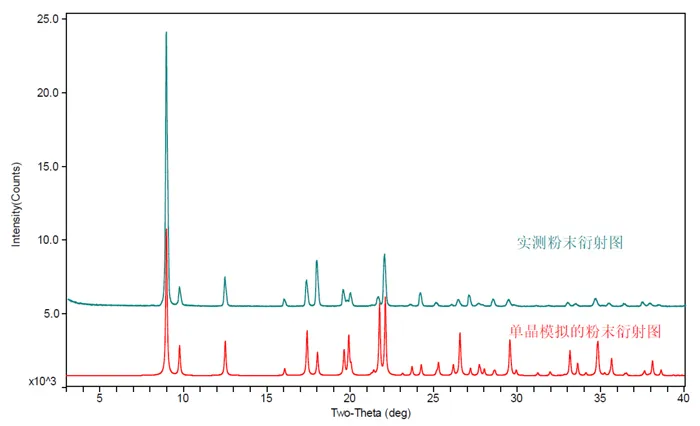

- 通过不同的结晶方式，获得多批次样品的XRPD

若多批次重结晶实验（采用不同的结晶方式，不同的溶剂体系）获得样品的XRPD图一致，那么就可以认为是单一晶型。

**化合物不同结晶方式获得的 XRPD 对比图**

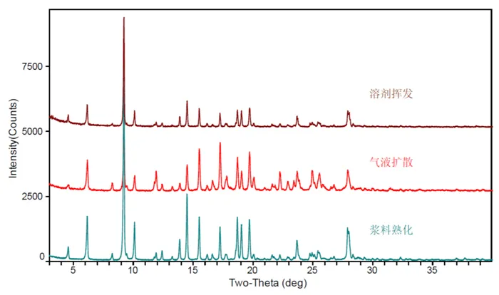

- 结合不同表征技术进行全面的表征

DSC等辅助手段也可以用于是否单一晶型的判断。如果是单一晶型，那应该有单一的熔化峰。如果DSC检测有两个或者多个熔化峰，则有可能是混晶。NMR、TGA、KF等则可以对水合物、溶剂化物的情况进行判断。

- 晶型标准谱图对比

和对照品XRPD图对比，和专利文献报道的XRPD谱图对比，以确定当前制备的晶型是混晶还是单一晶型。

2. 相似的XRPD图，晶型是否一致？

同种物质（单一成分或者包含溶剂）的不同晶型可能晶体结构相似。比如无水物和水合物之间，不同含水量的水合物之间，无水物和溶剂合物之间，水合物和溶剂合物之间，不同的溶剂合物之间就可能晶型结构相似，简称isostructural。

此外，不同物质其实也可能具有相似的结构（即相似的XRPD图），比如氘代和非氘代化合物，异构体。对于这些情况，仅从XRPD图谱是很难判断的。需要结合项目背景信息，比如合成工艺，结晶工艺、化合物的多晶型情况，还需要结合其它表征手段综合分析，才能得到客观科学的结论。

**氘代和非氘代的 XRPD 对比图**

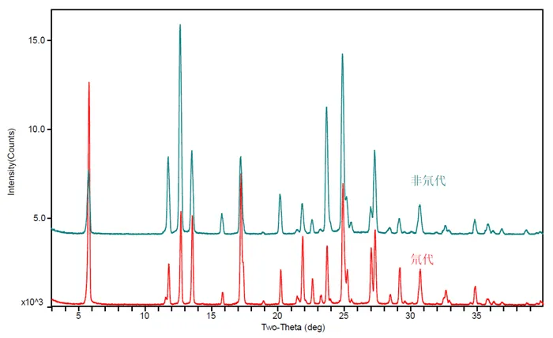

**对映异构体（苹果酸）的 XRPD 对比图**

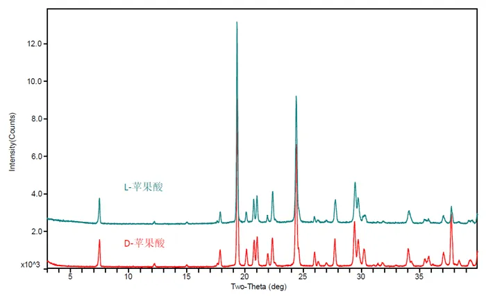

**不同溶剂合物的 XRPD 对比图**

3. XRPD多峰或者少峰，晶型该如何判断？

在进行晶型一致性判断时，少峰的情况（与标准品对比）相对问题较小，可以认为是该批次样品可能由于结晶情况与以往批次不同，导致某个或者某些晶面结晶度比较低，因而没有出峰。比较难判断的是XRPD谱图多峰的情况，出现多峰的情况，一定要引起重视。

多峰很可能有以下几种情况：
- 样品晶型不纯，不是单一晶型而是混晶；
- 样品未完全干燥，溶剂引起的多峰，尤其是在低角度多出的一些未知衍射峰，很可能是溶剂引起，建议干燥后再进行XRPD检测；
- 样品被污染，混入了外来物质（机械杂质和化学杂质），比如搅拌子的涂层PTFE脱落导致在18-19°有特征的衍射峰，化学杂质包括工艺相关杂质、异构体、无机盐等；
- 择优取向或者颗粒较大也是引起多峰或者少峰的最常见原因。择优取向体现在XPRD谱图上为有某个或者几个衍射峰强度非常高，其它的衍射峰相比则显得非常低，甚至不出峰。

择优取向常发生在片状和针状晶体。比较极端的情况，某些比较弱的衍射峰会消失，但对其研磨后衍射峰会出现。无论是片状晶体还是针状晶体，在研磨后，样品的形貌会趋向于不规则和随机的分布，此时每个晶面暴露在X射线下的概率也会趋向于一致，所以XRPD衍射峰就没有明显的择优取向。当然，研磨有可能会导致样品结晶度下降，甚至变为无定形，所以研磨时要注意研磨的强度和时间。

**混晶引起的 XRPD 多峰图**

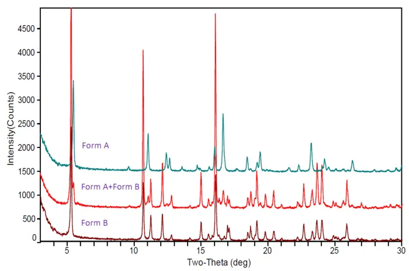

**外来物引起的 XRPD 多峰图**

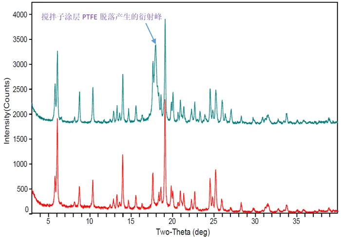

**溶剂引起的 XRPD 多峰图**

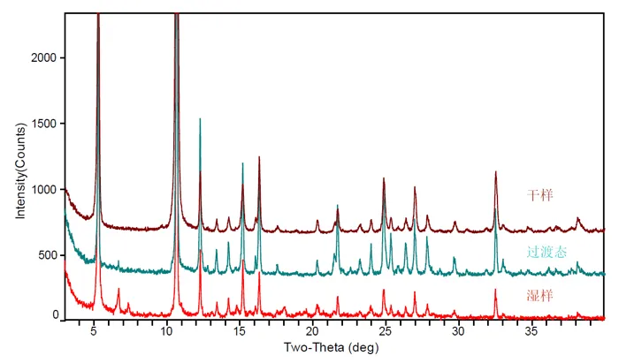

**择优取向引起的 XRPD 多峰图**

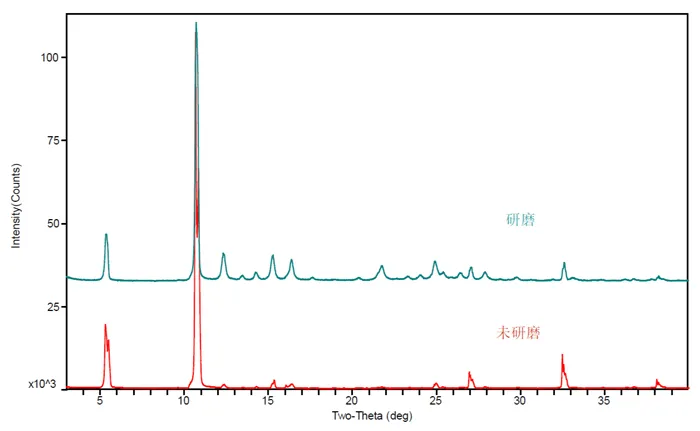

4. XRPD峰偏移，晶型该如何判断？

峰偏移经常发生在水合物脱水前后或者样品热处理前后的XRPD图上。非化学计量比水合物与对应的无水晶型具有相似的晶体结构，只有少数衍射峰有差异。脱水后，晶格收缩，晶面间距减小，导致衍射峰右移。

同样，温度对于XRPD的位置也有影响。热胀冷缩是一个物质的基本属性，同样适用于晶体。根据布拉格公式`nλ = 2dsinθ`，温度升高，晶体膨胀，在波长不变的情况下，晶面间距d值增大，必然使 `sinθ` 变小，即峰位左移。

另外，样品受到挤压，产生均匀的颗粒应变，比如压片，亦可能导致峰位右移。

**水合物脱水引起的 XRPD 峰偏移图**

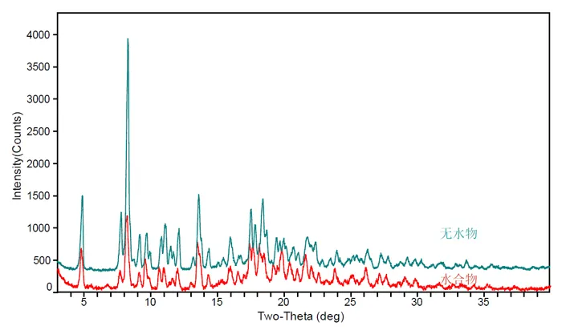

**受热和应力存在引起的 XRPD 峰偏移图**

5. XRPD峰分叉晶型又该如何抉择？

在XRPD谱图分析时，如果遇到峰裂分等情况时，可能是颗粒表面粗糙度、颗粒太大、晶体结构缺陷等因素引起，研磨再测试可以解决大部分的问题。

**氯化钠不同颗粒大小引起的 XRPD 峰分叉图**

## XRPD 无法回答的问题

1. 由于缺乏结晶峰，XRPD 无法准确识别玻璃或液体等无定形物质的类型。
> 其他光谱方法，例如 FTIR 或 NIR，可以实现这一目标。另一方面，结晶度的控制或量化（物质是纯无定形还是结晶）是 XRPD 在制药领域的重要应用。

2. XRPD 并不总是适用于识别特定原子类型的存在：例如 “我的样品中含有碳吗？”。
> 在这种情况下，XRF 通常是首选工具。不过，当使用 XRPD 确定了精确的晶体形态后，这些信息通常可以用来推断原子类型。