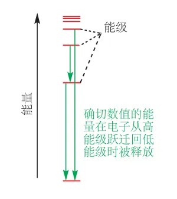
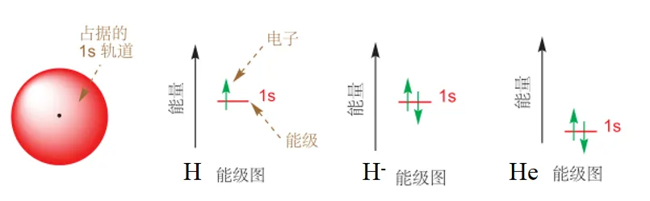
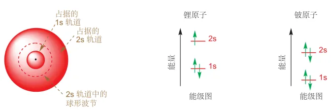
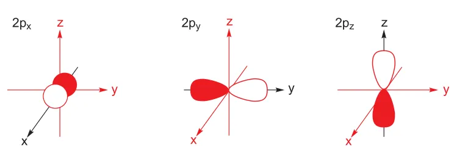
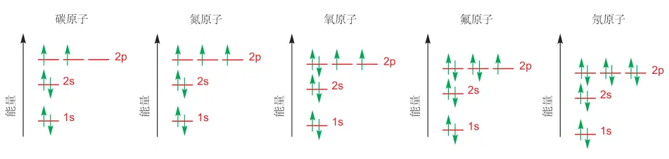

# 原子轨道

> 轨道指的是围绕着原子运动的电子运行的轨道，更准确地说是电子出现在外空间某个地方的概率，有 s、p、d、f、g、h 等。

> [!TIP] 原子轨道说明
> s 有 1 个轨道、p 有 3 个轨道、d 有 5 个轨道、f 有 7 个轨道、g 有 9 个轨道、h 有 11 个轨道等，依此类推。每个轨道上，最多能够容纳 2 个电子。
>
> 示例：原子核 ) 1s ) 2s 2p ) 3s 3p 3d ) 4s 4p 4d 4f ) 5s 5p 5d 5f 5g ) 6s 6p 6d 6f 6g 6h )....
>
> - 第 1 层外层只有 1 个 s 轨道，轨道总数量为 1=1²，最大可容纳电子数为 2\*1²=2；
> - 第 2 层外层有 1 个 s 轨道和 3 个 p 轨道，可容纳的轨道数为 1+3=4=2²，最大可容纳电子数为 2\*2²=8；
> - 第 3 层外层有 1 个 s 轨道、3 个 p 轨道和 5 个 d 轨道，可容纳的轨道数为 1+3+5=9=3²，最大可容纳电子数为 2\*3²=18；
> - 可推导第 n 层电子层，可容纳的最多轨道数为 n²，可容纳的最多电子数为 2n²

围绕原子核运动的电子具有的能量是量子化的，也就是说电子的能量只能是几种确切的数值，并不是任意的。电子从外界得到能量时，会从低能级跃迁到高能级（激发态），返回低能级时会以光的形式释放能量。

电子围绕原子核在三维空间中的运动不能被精确定位，只能确定其在一个位置出现的概率，将不同位置的概率合并在一起，即为电子运动的区域，称为原子轨道。原子轨道描述的是电子能量可能取值的一种，即能级，当电子处于某一能级时，我们称其占据某一轨道。

1s 轨道是围绕原子核成球形分布的区域，分布在该轨道的电子，只在这个范围内运动。对于氢原子而言，其核外有一个电子，则其单独占据 1s 轨道。对于氢负离子，核外有两个电子，则两个电子共同占据 1s 轨道，且这两个电子自旋方向相反，我们用两个朝向相反的箭头表示这两个电子。氦原子与氢负离子类似，也是两个电子共同占据 1s 轨道，不同的是由于氦原子核具有两个正电荷，对核外电子吸引更强，因此其轨道能量更低。

对于 Li 和 Be，其核外分别有 3 个、4 个电子，而一个原子轨道最多只能容纳两个电子，即泡利不相容原理，第 3、4 个电子必须去占据 1s 轨道之外更高能量的轨道，我们称为 2s 轨道。2s 轨道也是球形的，与 1s 不同的是，2s 轨道有一个波节，在该节面电子不会出现。

B 原子核外有 5 个电子，除去 1s、2s 轨道各占据的两个电子，还有另外一个电子，只能去占据能量更高的轨道，称为 p 轨道。p 轨道外形类似螺旋桨，桨中心仍然有一个波节。其共有三个能量一致的轨道，称为简并轨道，区别在于这三个轨道的朝向不同，分别沿着三个坐标轴分布，分为 $p_x$、$p_y$、$p_z$ 轨道。

B 原子的第五个电子当然填充在 2p 的一个轨道中，而对于 C 原子，p 轨道分布两个电子，这时由于电子间存在排斥力，2p 轨道有三个空的简并轨道，它的两个电子则单独各占据一个轨道，即洪特规则。直到 2p 轨道中分布超过 3 个电子时，例如 O 原子在 2p 轨道有 4 个电子，则第四个电子会选择其中一个电子配对，一个轨道最多容纳 2 个电子，因此 2p 轨道最多可容纳 6 个电子。

对于 2p 轨道，中间的节面将其分为两个部分，阴影部分和空白部分，它们的区别在于相位不同，所谓的相位就是代表波函数的正负，p 轨道的相位可以规定任意一侧为正，而相位的正负并不代表轨道电荷的正负，因为充满电子的轨道都是带负电的。

随着原子序数的增加，例如 Na 原子，2p 轨道也会被充满，继而转向 3s、3p、4s、3d、4p 轨道，但无论如何，这些原子轨道的理论都是类似的。
