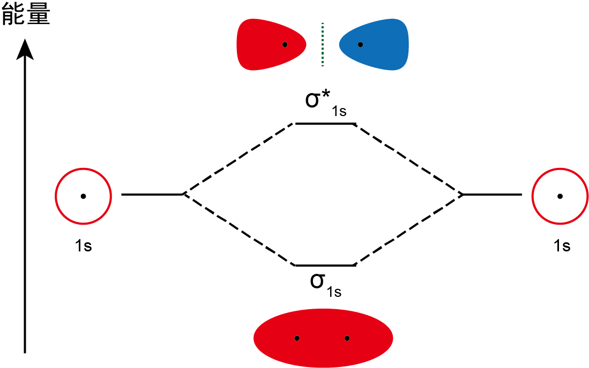
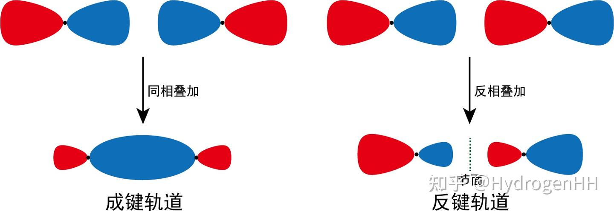
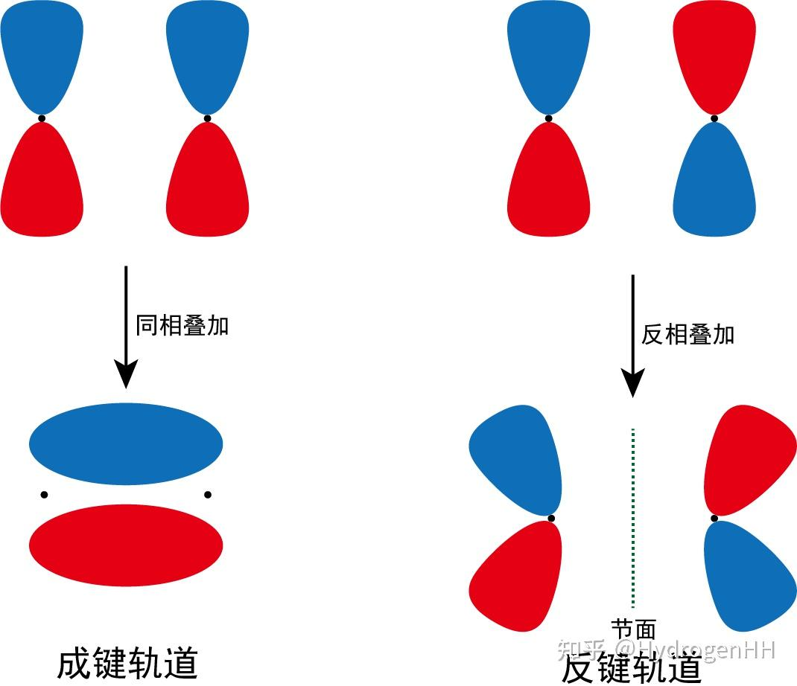
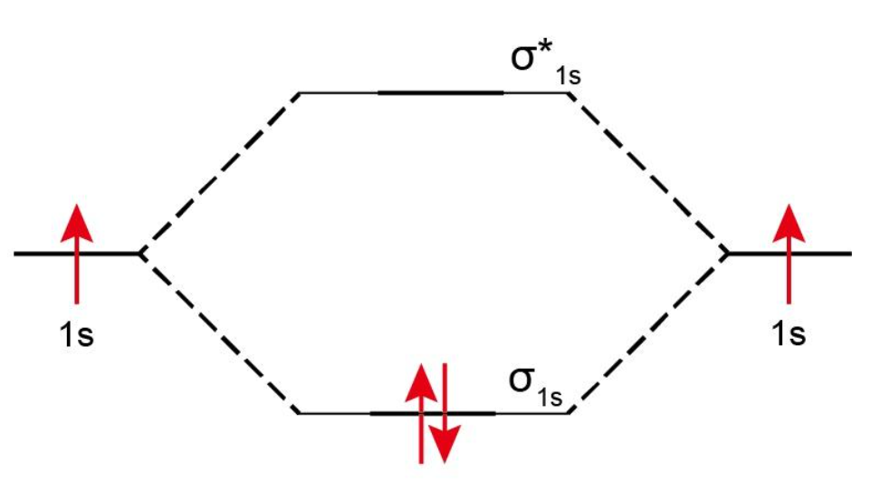
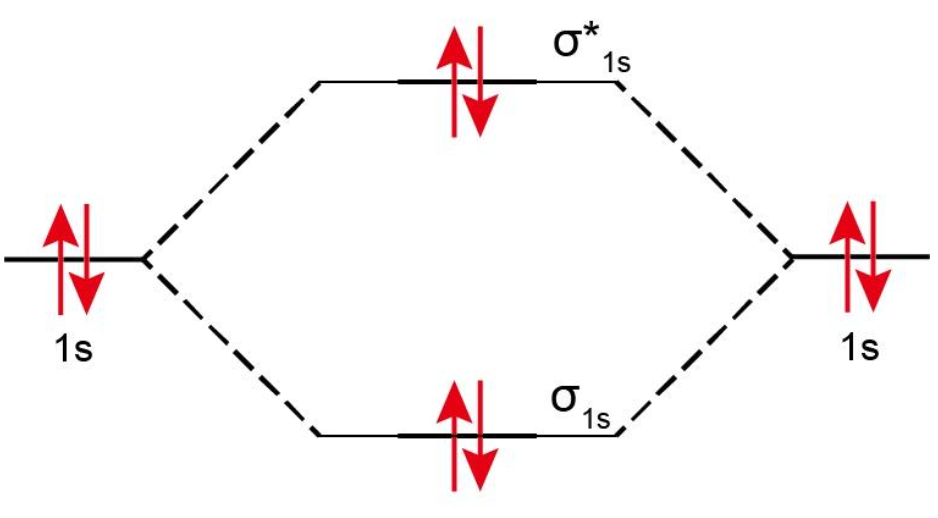
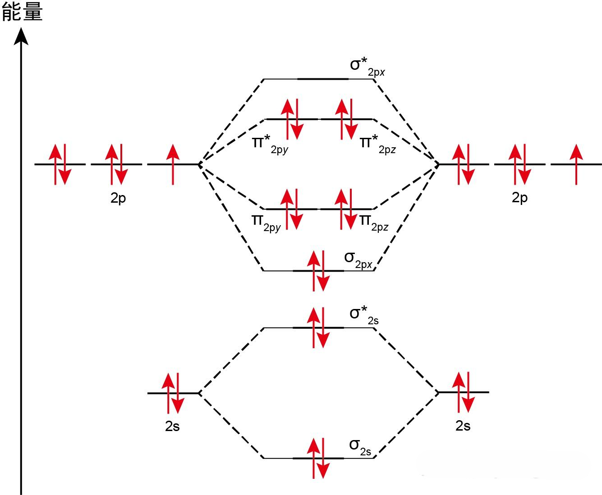

# 分子轨道

> 分子轨道是指分子中电子的轨道，是电子云的轨道。分子轨道由组成分子的原子的原子轨道(AO)线性组合而成。组合得到的分子轨道数目等于参与组合的原子轨道数目。

如下图所示，由 2 个原子轨道叠加形成的分子轨道示意

> [!TIP] 提示：基本规则
> 在分子轨道中填充电子时仍然需要遵循原子轨道填充电子的基本规则：
>
> - **能量最低原理：** 填充时尽量让分子的总能量最低；
> - **泡利不相容原理：** 一个分子轨道中最多填充 2 个电子，并且它们的自旋方向相反；
> - **洪特规则：** 有多个能量相同的分子轨道时，电子总是先单独分占，且自旋平行。

**分子轨道能级顺序：** σ 成键轨道＞ π 成键轨道＞ σ 反键轨道＞ π 反键轨道

**磁性：** 顺磁性指分子中存在未成对电子，会被磁场吸引（如 O₂）；抗磁性指分子中所有电子都已配对，会被磁场排斥（如 N₂）。

## 成键与反键轨道

- 成键分子轨道 (Bonding MO)：由同相（波函数符号相同）的原子轨道组合而成。能量低于参与组合的原子轨道能量之和。电子占据成键轨道使分子稳定。

- 反键分子轨道 (Antibonding MO)：由异相（波函数符号相反）的原子轨道组合而成。能量高于参与组合的原子轨道能量之和。电子占据反键轨道使分子不稳定。反键轨道通常用星号(\*)标注（如 σ\*、π\*）。

## 分子轨道类型

- σ 轨道：沿键轴呈圆柱形对称。可由 s-s, s-p, px-px(头碰头) 组合形成。包括 σ 和 σ\*。

- π 轨道：包含垂直于键轴的节面。可由 pz-pz 或 py-py (肩并肩) 组合形成。包括 π 和 π\*。

## 示例

1. $H_2$ 分子中有 2 个电子，每个电子的轨道都是 $1s$ 轨道。根据基本规则，每个 $H$ 原子中的 1 个电子只能占据 $1s$ 轨道。因此，$H_2$ 分子的分子轨道图如下所示：

2. $He$ 是一种单原子分子，不存在$He_2$形式的分子存在，假设存在$He_2$分子，根据基本规则，每个 $He$ 原子中的 2 个电子只能 $1s$ 轨道。因此，$He_2$ 分子的分子轨道图如下所示：

假想的 $He_2$ 分子的电子排布是$(σ_{1s})^2(σ_{1s}^*)^2$，反键轨道中的两个电子能量高，抵消了电子填充在成键轨道中使分子能量降低的效果，因此$He_2$分子不能存在，而是会重新变成$He$原子。

3. $O_2$ 分子的分子轨道图如下所示：

4. $F_2$ 分子的分子轨道图如下所示：

> [!TIP] 键级说明
> 键级越大，键越强、越稳定。键级为 0 表示不能形成稳定分子。
>
> **键级 = (成键轨道中的电子数目 - 反键轨道中的电子数目) / 2**
>
> **示例：** 根据上述所举例的$H_2$、$He_2$分子，其键级为如下
>
> - $H_2$分子的键级 = $\frac{2-0}{2}$ = 1，它是一根单键；
> - $He_2$分子的键级 = $\frac{2-2}{2}$ = 0，它不形成化学键。

> [!WARNING] 名词说明
>
> - **HOMO：** 同一分子中，在占有电子的各个分子轨道中，能量最高的分子轨道称之为最高占有轨道，用 HOMO 表示；
> - **LUMO：** 同一分子中，在未被电子占有的各个分子轨道中，能量最低的分子轨道称之为最低未占有轨道，用 LUMO 表示；
> - **SOMO：** 在观察烯丙基自由基的 分子轨道核戊二烯基自由基的分子轨道中只有一个 п 电子，这种只占有一个电子的轨道称之为单占轨道，用 SOMO 表示。SOMO 即使 HOMO 又是 SOMO。
> - **节点：** 图中奇数碳原子的分子的分子轨道示意图均出现的红色实心点，该点表示节点，即裸露的碳原子，该碳原子外没有 п 电子云包裹，属于奇数碳原子分子特有。
