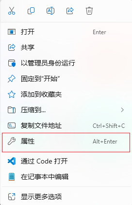
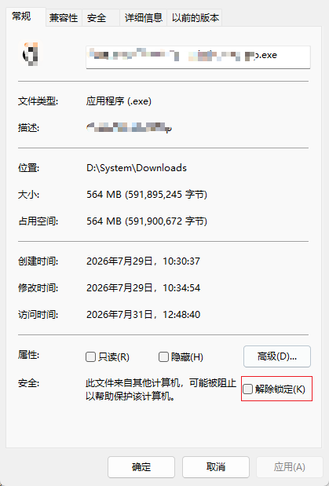
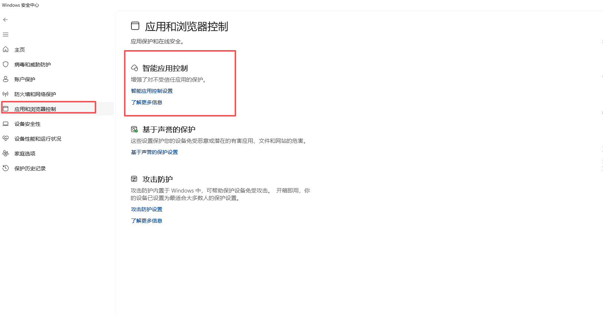
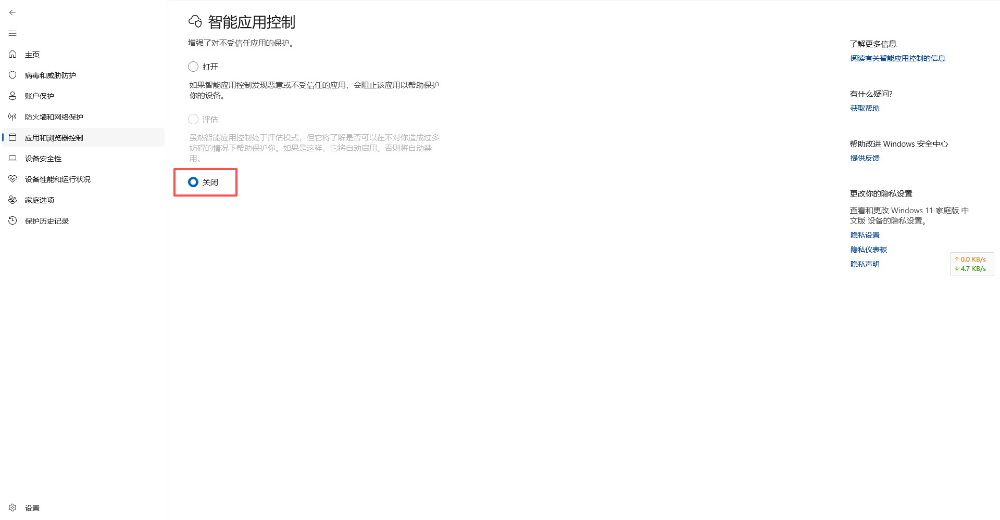
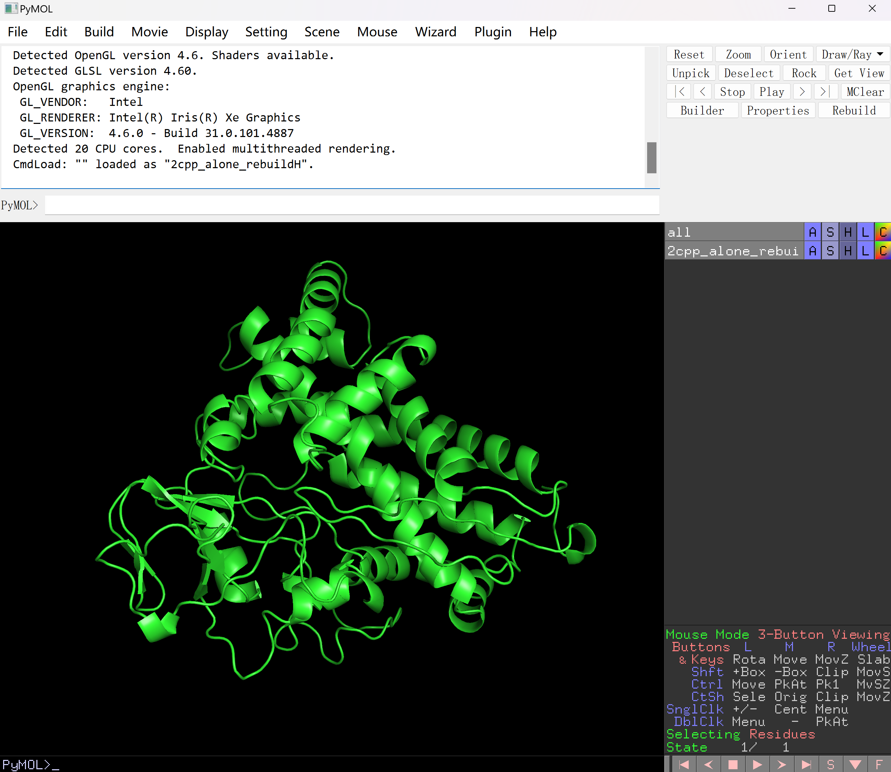

# PyMOL 安装教程（Windows 11）

> 本教程基于 MiniConda + conda-forge 开源版 PyMOL，覆盖 Win11 特有的 Smart App Control 拦截问题。

## 安装 miniConda

1. 下载安装包：[MiniConda Windows GUI](https://www.anaconda.com/docs/getting-started/miniconda/install/windows-gui-install)（需登录后下载）
2. 下载完成后，**右键安装包 → 属性 → 勾选「解除锁定(Unblock)」**，避免被 SmartScreen 拦截
3. 双击安装：
   - 安装范围：**Just Me**
   - 安装路径：默认 `C:\Users\用户名\miniconda3`
   - 是否加入 PATH：可选，推荐后续统一用 **Anaconda PowerShell Prompt** 操作

:::tip
额外配置：
在正式安装前可先进行如下配置：

解除软件锁定
- 点击安装包，鼠标右键选择属性


- 在属性面板中点击 “解除锁定” 按钮。

:::

下载完成后点击安装包进行安装即可，安装用户为当前登录用户，安装路径为 `C:\Users\用户名\miniconda3`。

## 安装 PyMol

miniConda 安装完成后，点击 Window 键， 在应用列表中启动 **Anaconda PowerShell Prompt** ，会弹出一个 shell 窗口，等待初始化完成。

输入命令 `conda install -c conda-forge pymol-open-source` ，等待安装完成，如果出现如下错误则安装解决方案执行即可。

::: danger
如果出现如下报错：

**应用程序控制策略已阻止此文件**

```bash
Error while loading conda entry point: anaconda-auth (DLL load failed while importing _rust: 应用程序控制策略已阻止此文件。)
Error while loading conda entry point: anaconda-channel-guide (DLL load failed while importing _rust: 应用程序控制策略已阻止此文件。)
Error while loading conda entry point: conda-content-trust (DLL load failed while importing _rust: 应用程序控制策略已阻止此文件。)
Error while loading conda entry point: conda-libmamba-solver (DLL load failed while importing bindings: 应用程序控制策略已阻止此文件。)
```

**解决方案：**

> 💡 顺手建议：临时关闭 Defender「实时保护 + 篡改保护」，避免 Conda 下载的包被静默删除，装完再开回来。

进入 Windows 安全中心，点击 “应用和浏览器控制”。



进入 “智能应用控制” 页面，点击 “关闭” 按钮。



然后重新上述命令安装即可。
:::

## 启动 PyMol

PyMol 安装完成后，会在路径 `C:\Users\用户名\miniconda3\Scripts\` 文件夹中生成 `pymol.bat` 文件，双击即可启动 PyMol。

::: danger
如果出现如下报错：

**找不到 _cmd 模块**

```bash
pymol
Traceback (most recent call last):
  File "\\?\C:\Users\用户名\miniconda3\Scripts\pymol-script.py", line 33, in <module>
    sys.exit(load_entry_point('pymol==3.1.0', 'console_scripts', 'pymol')())
             ~~~~~~~~~~~~~~~~^^^^^^^^^^^^^^^^^^^^^^^^^^^^^^^^^^^^^^^^^^^^
  File "\\?\C:\Users\用户名\miniconda3\Scripts\pymol-script.py", line 25, in importlib_load_entry_point
    return next(matches).load()
           ~~~~~~~~~~~~~~~~~~^^
  File "C:\Users\用户名\miniconda3\Lib\importlib\metadata\__init__.py", line 179, in load
    module = import_module(match.group('module'))
  File "C:\Users\用户名\miniconda3\Lib\importlib\__init__.py", line 88, in import_module
    return _bootstrap._gcd_import(name[level:], package, level)
           ~~~~~~~~~~~~~~~~~~~~~~^^^^^^^^^^^^^^^^^^^^^^^^^^^^^^
  File "<frozen importlib._bootstrap>", line 1406, in _gcd_import
  File "<frozen importlib._bootstrap>", line 1371, in _find_and_load
  File "<frozen importlib._bootstrap>", line 1342, in _find_and_load_unlocked
  File "<frozen importlib._bootstrap>", line 938, in _load_unlocked
  File "<frozen importlib._bootstrap_external>", line 759, in exec_module
  File "<frozen importlib._bootstrap>", line 491, in _call_with_frames_removed
  File "C:\Users\用户名\miniconda3\Lib\site-packages\pymol\__init__.py", line 558, in <module>
    import pymol._cmd
ImportError: DLL load failed while importing _cmd: 找不到指定的模块。
```

**解决方案：**

_cmd.pyd 依赖 **VC++ 2015-2022** 运行时 +conda 的 Library/bin DLL + OpenGL。

按下面两种方案解决：

1. 安装 **Microsoft Visual C++ Redistributable (x64)** 

下载 [https://aka.ms/vs/17/release/vc_redist.x64.exe](https://aka.ms/vs/17/release/vc_redist.x64.exe) 安装包，然后点击安装即可。

2. 用 conda 补全 PyMOL 依赖（别用 pip 进行安装）

在 **Anaconda PowerShell Prompt（base）**​ 中运行如下命令：

```bash
conda install -c conda-forge glew freeglut libpng freetype msvc_runtime -y
```

即可重新启动 pymol
:::

## 验证安装

启动后弹出 PyMOL GUI 窗口即成功，可直接拖入 PDB 文件查看三维结构。



## 关键避坑总结

| 问题 | 原因 | 解决方案 |
|------|------|----------|
| Conda 报 `_rust` / `bindings` 被阻止 | Smart App Control 拦截未签名 DLL | 关 SAC + 重启 |
| `_cmd` 导入失败 | 缺 VC++ 运行时或 Conda 原生库 | 装 VC++ x64 + `conda install glew freeglut ...` |
| 装完又莫名被删 | Defender 实时防护 / Tamper Protection | 临时关闭，加排除项 |
| pip 装完启动报错 | pip 轮子与 Conda C 库冲突 | 只用 `conda-forge` 源 |

> 🔔 **装完后记得把 Defender 实时防护、Smart App Control 重新开启，保持系统安全。**
