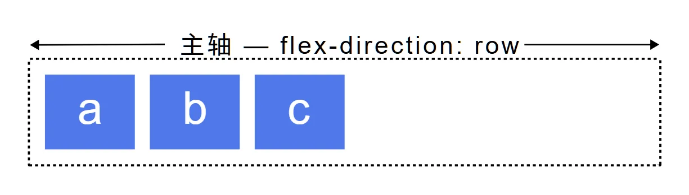
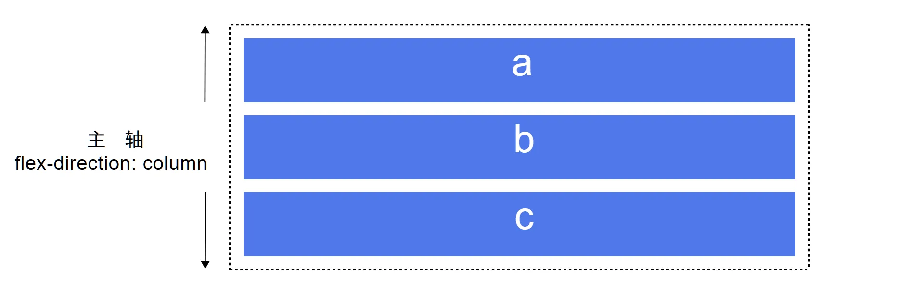
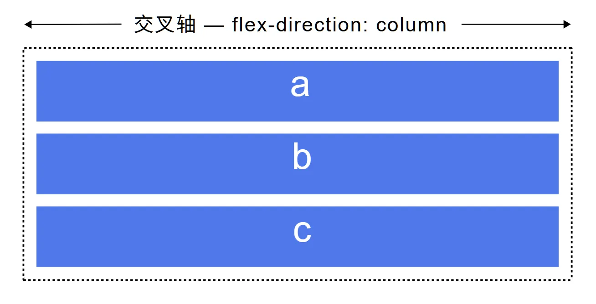
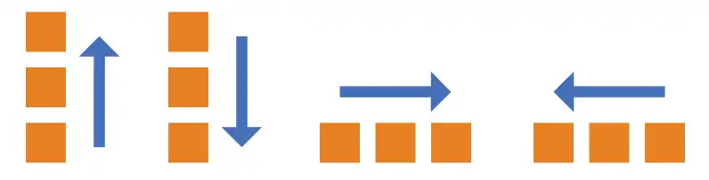
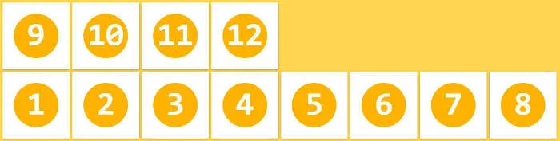
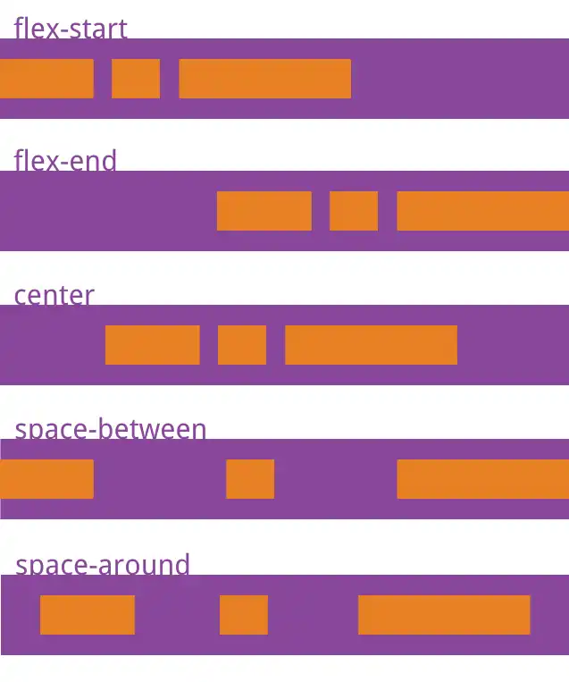
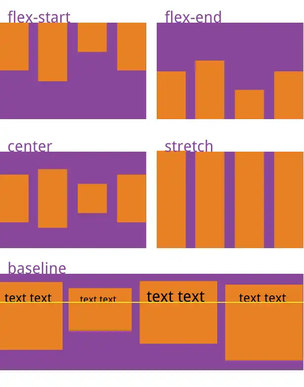
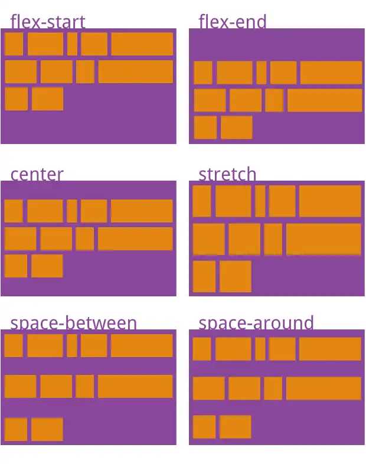

# Flex 布局

> Flexible Box 模型，通常被称为 flexbox，是一种一维的布局模型。我们常说 flexbox 是一种一维的布局，是因为一个 flexbox 一次只能处理一个维度上的元素布局，一行或者一列。作为对比的是另外一个二维布局 CSS Grid Layout，可以同时处理行和列上的布局。

## Flex 容器

文档中采用了 flexbox 的区域就叫做 flex 容器。为了创建 flex 容器，我们把一个容器的 display 属性值改为 flex 或者 inline-flex。完成这一步之后，容器中的直系子元素就会变为 flex 元素。由于所有 CSS 属性都会有一个初始值，所以 flex 容器中的所有 flex 元素都会有下列行为：

- 元素排列为一行（flex-direction 属性的初始值是 row）。
- 元素从主轴的起始线开始。
- 元素不会在主维度方向拉伸，但是可以缩小。
- 元素被拉伸来填充交叉轴大小。
- flex-basis 属性为 auto。
- flex-wrap 属性为 nowrap。

这会让你的元素呈线形排列，并且把自己的大小作为主轴上的大小。如果有太多元素超出容器，它们会溢出而不会换行。如果一些元素比其他元素高，那么元素会沿交叉轴被拉伸来填满它的大小。

## 开启 Flex 布局

::: code-group

```css:no-line-numbers [容器]
.box {
  display: flex;
}
```

```css:no-line-numbers [行内元素]
.box {
  display: inline-flex;
}
```

```css:no-line-numbers [Webkit 内核]
.box {
  display: -webkit-flex; /* Safari */
}
```

:::

::: danger ⚠️ 注意
设为 Flex 布局以后，子元素的 `float`、`clear` 和 `vertical-align` 属性将失效。
:::

## 主轴 （flex-direction）

主轴由 `flex-direction` 定义，可以取 4 个值：`row`、`row-reverse`、`column`、`column-reverse` 如果你选择了 `row` 或者 `row-reverse`，你的主轴将沿着行向（横向）延伸，反之则主轴将沿着列向（纵向）延伸，如下图所示。





## 交叉轴

交叉轴垂直于主轴，所以如果你的 `flex-direction`（主轴）设成了 `row` 或者 `row-reverse` 的话，交叉轴的方向就是沿着上下方向延伸的，如下图所示。


如果主轴方向设成了 `column` 或者 `column-reverse`，交叉轴就是水平方向，如下图所示。



## 主轴-交叉轴 总结

```css:no-line-numbers
.box {
  display: flex;
  flex-direction: row | row-reverse | column | column-reverse;
}
```



上图中的四种情况对应如下

- `column-reverse`：主轴为垂直方向，起点在下沿。
- `column`：主轴为垂直方向，起点在上沿。
- `row`（默认值）：主轴为水平方向，起点在左端。
- `row-reverse`：主轴为水平方向，起点在右端。

## flex-wrap

在 flex 布局中，在使用 `flex-direction: row | row-reverse;` 的情况下，当内容超出 div 范围时不会产生换行的效果，而是会溢出显示，所以这个时候就需要 `flex-wrap` 来进行控制是否允许换行了，具体如下图。


`felx-wrap` 属性有如下三种取值：

- `nowrap`（默认）：不换行。
- `wrap`：换行，第一行在上方。


- `wrap-reverse`：换行，第一行在下方。



## 简写属性 (flex-flow)

你可以将两个属性 `flex-direction` 和 `flex-wrap` 组合为简写属性 `flex-flow`。第一个指定的值为 `flex-direction`，第二个指定的值为 `flex-wrap`。

```css:no-line-numbers {3-4,5}
.box {
  display: flex;
  flex-direction: row;
  flex-wrap: wrap;
  flex-flow: row wrap; // 这一行的效果与上面两行的效果一致，两种情况仅写一次即可
}
```

## justify-content

`justify-content` 属性用来使元素在主轴方向上对齐，主轴方向是通过 `flex-direction` 设置的方向。

```css:no-line-numbers
.box {
  justify-content: flex-start | flex-end | center | space-between | space-around;
}
```

- `flex-start`（默认值）：元素从容器的起始线排列。
- `flex-end`：从终止线开始排列。
- `center` ：在中间排列。
- `space-between` ：把元素排列好之后的剩余空间拿出来，平均分配到元素之间，所以元素之间间隔相等。
- `space-around` ：使每个元素的左右空间相等。



## align-items

`align-items` 属性用来使元素在交叉轴方向上对齐，主轴方向是通过 `flex-direction` 设置的方向。

```css:no-line-numbers
.box {
  align-items: flex-start | flex-end | center | baseline | stretch;
}
```

- `stretch`（默认值）：如果项目未设置高度或设为 auto，将占满整个容器的高度。
- `flex-start`：交叉轴的起点对齐。
- `flex-end`：交叉轴的终点对齐。
- `center`：交叉轴的中点对齐。
- `baseline`: 项目的第一行文字的基线对齐。



## align-content

`align-content` 属性用来使元素在（多根）主轴方向上对齐，如果只有一根轴线，该属性不起作用，主轴方向是通过 `flex-direction` 设置的方向。

```css:no-line-numbers
.box {
  align-content: flex-start | flex-end | center | space-between | space-around | stretch;
}
```

- `stretch`（默认值）：轴线占满整个交叉轴。
- `flex-start`：与交叉轴的起点对齐。
- `flex-end`：与交叉轴的终点对齐。
- `center`：与交叉轴的中点对齐。
- `space-between`：与交叉轴两端对齐，轴线之间的间隔平均分布。
- `space-around`：每根轴线两侧的间隔都相等。所以，轴线之间的间隔比轴线与边框的间隔大一倍。



## 文章引用

1. [Flex 布局教程：语法篇 - 阮一峰的网络日志](https://www.ruanyifeng.com/blog/2015/07/flex-grammar.html)
2. [MDN - flex 布局的基本概念](https://developer.mozilla.org/zh-CN/docs/Web/CSS/CSS_flexible_box_layout/Basic_concepts_of_flexbox)
