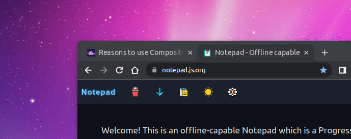

# 切换浏览器选项卡时更改favicon

```javascript
const favicon = document.querySelector('link[rel="icon"]')
document.addEventListener("visibilitychange", () => {
    const hidden = document.hidden
    favicon.setAttribute(
        "href", 
        `/favicon${hidden ? "-hidden" : ""}.ico`
    )
})
```

效果如下：

