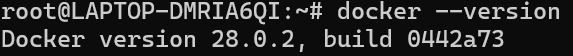
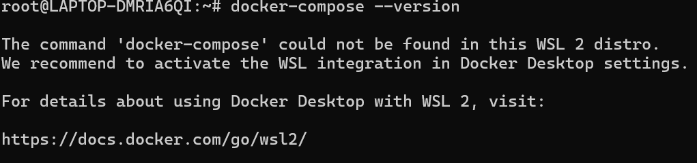

# docker 文档


## 安装

1. 前置执行

```bash:no-line-numbers
  sudo apt update
  sudo apt upgrade -y
```

> [!TIP] 提示
> 如果已安装过 docker 请先卸载原本已经安装的 docker
> ```bash:no-line-numbers
> $ sudo apt-get remove docker docker-engine docker.io containerd runc
> ```


2. 安装 docker 的前置依赖

```bash:no-line-numbers
$  sudo apt-get install -y apt-transport-https ca-certificates curl software-properties-common lsb-release
```

3. 添加Docker官方GPG密钥：
使用curl命令添加Docker的GPG密钥，确保软件包的合法性。

```bash:no-line-numbers
$ curl -fsSL https://download.docker.com/linux/ubuntu/gpg | sudo gpg --dearmor -o /usr/share/keyrings/docker-archive-keyring.gpg
```

4. 设置Docker APT存储库：
添加Docker的APT存储库到系统的源列表中。这里推荐使用阿里云镜像加速下载。
```bash:no-line-numbers
$ echo "deb [arch=amd64 signed-by=/usr/share/keyrings/docker-archive-keyring.gpg] https://mirrors.aliyun.com/docker-ce/linux/ubuntu $(lsb_release -cs) stable" | sudo tee /etc/apt/sources.list.d/docker.list > /dev/null
```

5. 更新APT包索引：
再次更新软件包索引，以包含Docker存储库中的新包。

```bash:no-line-numbers
$ sudo apt-get update
```

6. 安装Docker Engine和Docker Compose：
使用以下命令安装Docker CE（社区版）和Docker Compose插件。

```bash:no-line-numbers
$ sudo apt-get install -y docker-ce docker-ce-cli containerd.io docker-compose-plugin
```

7. 启动Docker服务：
安装完成后，启动Docker服务并设置为开机自启。

```bash:no-line-numbers
$ sudo systemctl start docker
$ sudo systemctl enable docker
```

## 验证
通过运行 `docker --version` 和 `docker-compose --version` 命令验证Docker和Docker Compose是否安装成功。如果显示版本信息，则表示安装成功。

```bash:no-line-numbers
$ docker --version
$ docker-compose --version
```



