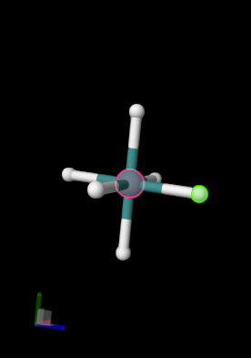

# 设置原子只能单选

设置场景中用户使用鼠标左键只能选中一个原子，不允许用户多选！

效果如下：



## 1：场景只支持单选原子的情况

```typescript{3,5,9}
const SPEC = {
    behaviors: [
        PluginSpec.Behavior(PluginBehaviors.Representation.HighlightLoci, { preferAtoms: true }), // 原子优先，即不选中键连
        PluginSpec.Behavior(PluginBehaviors.Representation.SelectLoci, {
            preferAtoms: true, // 原子优先，即不选中键连
            bindings: {
                clickSelect: Binding.Empty,
                clickToggleExtend: Binding.Empty,
                clickSelectOnly: Binding([Trigger(B.Flag.Primary, M.create())], 'SelectOnly', 'SelectOnly element using ${triggers}'), // 配置仅支持单选
                clickToggle: Binding.Empty,
                clickDeselect: Binding.Empty,
                clickDeselectAllOnEmpty: Binding.Empty,
            }
        }),
    ]
};

// 场景初始化
const spec: PluginSpec = Object.assign({ behaviors: [] }, SPEC, props.spec);
this.plugin = new PluginContext(spec);
```

## 2. 在官方默认的案例中设置单选

1. 首先设置为选中模式
```typescript:no-line-numbers
this.plugin.selectionMode = true;
```

2. 更新PluginBehaviors参数
```typescript{7}
const state = this.plugin.state.behaviors;
const update = state.build();
const highlightLoci = state.select(StateSelection.Generators.ofTransformer(PluginBehaviors.Representation.HighlightLoci));
const selectLoci = state.select(StateSelection.Generators.ofTransformer(PluginBehaviors.Representation.SelectLoci));
const selections = [...highlightLoci, ...selectLoci];
for (const selection of selections) {
    update.to(selection).update({ ...selection.params?.values, preferAtoms: true });
}
PluginCommands.State.Update(this.plugin, { state, tree: update, options: { doNotLogTiming: true } });
```

2. 更新interactivity层级为element
```typescript
this.plugin.managers.interactivity.setProps({ granularity: 'element' });
```
