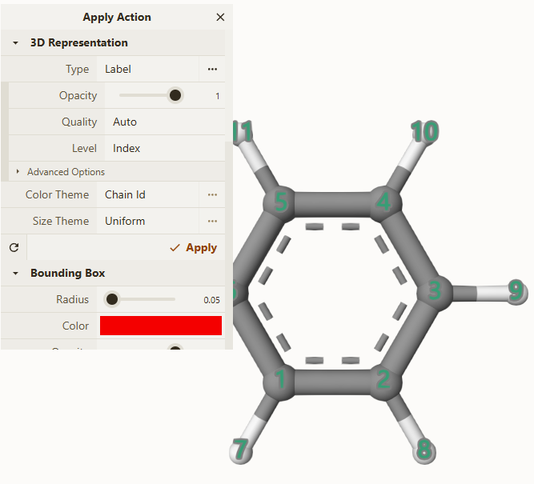

# 新增 Label Type

最终效果


新增原子index序号，新增原子在元素周期表中的序号也是类似如下的代码配置


文件位置：src\mol-repr\structure\visual\label-text.ts
```typescript
export const LabelTextParams = {
    ...ComplexTextParams,
    background: PD.Boolean(false),
    backgroundMargin: PD.Numeric(0, { min: 0, max: 1, step: 0.01 }),
    backgroundColor: PD.Color(ColorNames.black),
    backgroundOpacity: PD.Numeric(0.5, { min: 0, max: 1, step: 0.01 }),
    borderWidth: PD.Numeric(0.25, { min: 0, max: 0.5, step: 0.01 }),
    level: PD.Select('residue', [['index', 'Index']] as const, { isEssential: true }), // 新增['index', 'Index']这个选择
    ignoreHydrogens: PD.Boolean(false),
    ignoreHydrogensVariant: PD.Select('all', PD.arrayToOptions(['all', 'non-polar'] as const)),
    indexScale: PD.Numeric(0.5, { min: 0, max: 20, step: 0.1 }), // 新增缩放值
};

export type LabelTextParams = typeof LabelTextParams
export type LabelTextProps = PD.Values<LabelTextParams>
export type LabelLevels = LabelTextProps['level']

export function LabelTextVisual(materialId: number): ComplexVisual<LabelTextParams> {
    return ComplexTextVisual<LabelTextParams>({
        defaultProps: PD.getDefaultValues(LabelTextParams),
        createGeometry: createLabelText,
        createLocationIterator: ElementIterator.fromStructure,
        getLoci: getSerialElementLoci,
        eachLocation: eachSerialElement,
        setUpdateState: (state: VisualUpdateState, newProps: PD.Values<LabelTextParams>, currentProps: PD.Values<LabelTextParams>) => {
            state.createGeometry = (
                newProps.level !== currentProps.level ||
                (newProps.level === 'index' && newProps.indexScale !== currentProps.indexScale) ||
                newProps.ignoreHydrogens !== currentProps.ignoreHydrogens ||
                newProps.ignoreHydrogensVariant !== currentProps.ignoreHydrogensVariant
            ); // 这里新增index的条件判定
        }
    }, materialId);
}

function createLabelText(ctx: VisualContext, structure: Structure, theme: Theme, props: LabelTextProps, text?: Text): Text {
    switch (props.level) {
        case 'index': return createIndexText(ctx, structure, theme, props, text); // 新增index的执行函数
    }
}

/**
 * @function 创建第几个原子的序号的文本
 * @returns
 */
function createIndexText(ctx: VisualContext, structure: Structure, theme: Theme, props: LabelTextProps, text?: Text): Text {
    const l = StructureElement.Location.create(structure);
    const { units, serialMapping } = structure;
    const { key } = StructureProperties.atom;
    const { cumulativeUnitElementCount } = serialMapping;

    const sizeTheme = theme.size;

    const count = structure.elementCount;
    const { indexScale } = props;
    const builder = TextBuilder.create(props, count, count / 2, text);

    for (let i = 0, il = units.length; i < il; ++i) {
        const unit = units[i];
        const c = unit.conformation;
        const { elements } = unit;
        l.unit = unit;

        const groupOffset = cumulativeUnitElementCount[i];
        const ignore = makeElementIgnoreTest(structure, unit, { ...props, traceOnly: false });

        for (let j = 0, _j = elements.length; j < _j; j++) {
            if (ignore && ignore(elements[j])) continue;

            l.element = elements[j];
            c.position(l.element, tmpVec);
            const elementNumber = key(l);
            const text = `${elementNumber + 1}`;
            builder.add(text, tmpVec[0], tmpVec[1], tmpVec[2], sizeTheme.size(l), indexScale, groupOffset + j);
        }
    }

    return builder.getText();
}
```
