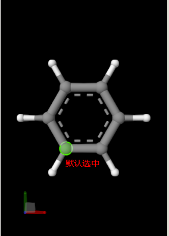

# 选中指定的原子序号

最终效果：


```typescript
/**
 * @function 选中所指定的原子序号
 */
function atomSelectionOfIndex (index: ElementIndex) {
    const atom = StructureSelectionQuery('Atom', MolScriptBuilder.struct.modifier.union([
        MolScriptBuilder.struct.generator.atomGroups({
            'atom-test': MolScriptBuilder.core.rel.eq([MolScriptBuilder.acp('sourceIndex'), index])
        })
    ]), { category: StructureSelectionCategory.Atom });
    plugin.managers.structure.selection.fromSelectionQuery('add', atom);
};
```