# 0.Qbics-MolStar 安装与使用教程 - 本地文件、PDB 与 SMILES 可视化

## 使用

使用 Qbics-MolStar 有两种方式：

- 直接在线访问链接：https://molstar.szbl.ac.cn/viewer
- 安装安装包：
  - 点击链接进入 Qbics-MolStar 网站界面：https://molstar.szbl.ac.cn/download/
  - 点击如图所示位置执行下载：
    

## 分子可视化：本地文件

当前支持文件格式包括：`.top`，`.cif`，`.gjf`，`.inp`，`.mol`，`.xyz`，`.pdb`，`.mwfn`，`.mol2`等等，具体介绍详见 https://molstar.szbl.ac.cn/docs/use/。

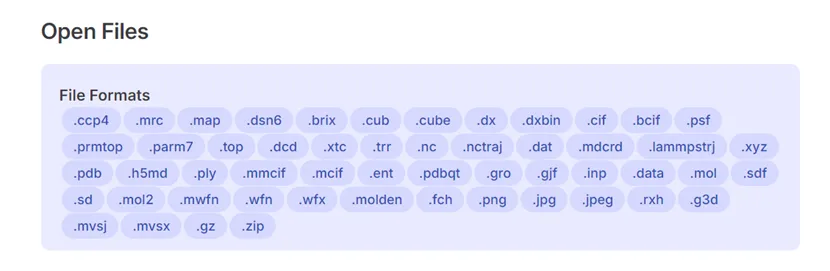

用户可以通过两种方式实现已知分子坐标的可视化（以.pdb 为例）：

- 直接拖拽文件至 Qbics-MolStar 界面，即可实现可视化：

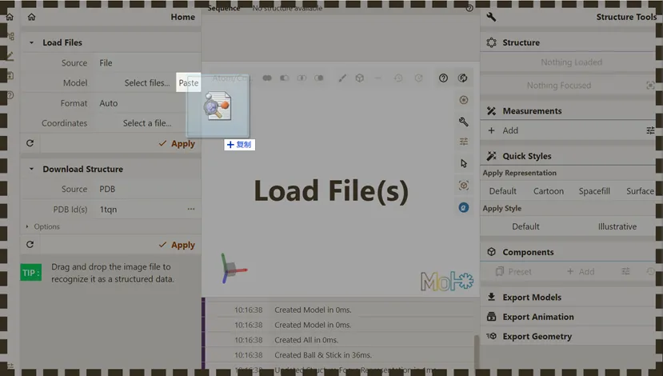

- 选择保存在本地的文件：

  1. 点击下方红框按钮，选择希望可视化的文件。

  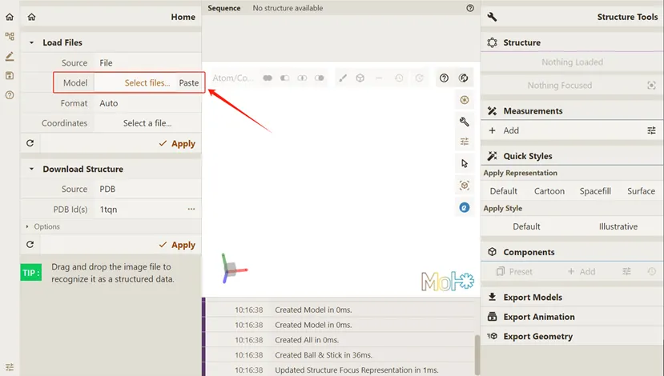

  2. 双击选中的文件（此处为 c60.pdb）使其加载至 Qbics-MolStar：

  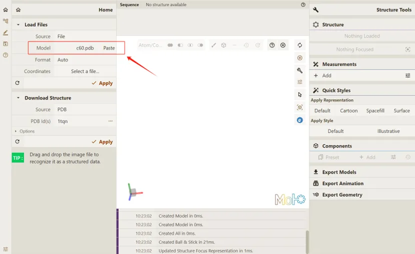

  3. 点击 **Apply**，使 Qbics-MolStar 开始渲染体系，实现可视化：

  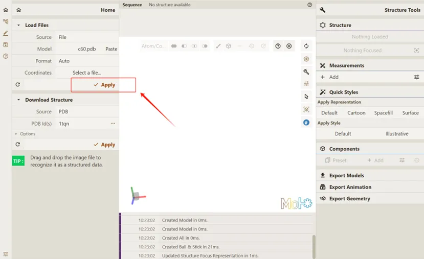

  4. 效果如下：

  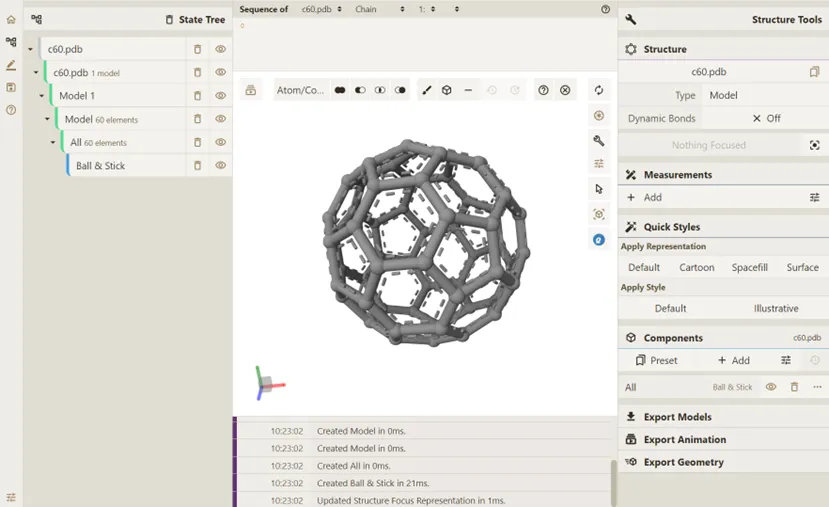

## 分子可视化：在线下载 PDB

Qbics-MolStar 可以从多种途径下载分子坐标并渲染可视化。以下以 PDB 为例。

1. 在 Qbics-MolStar 中键入 PDB Id，如 `6AP4`：

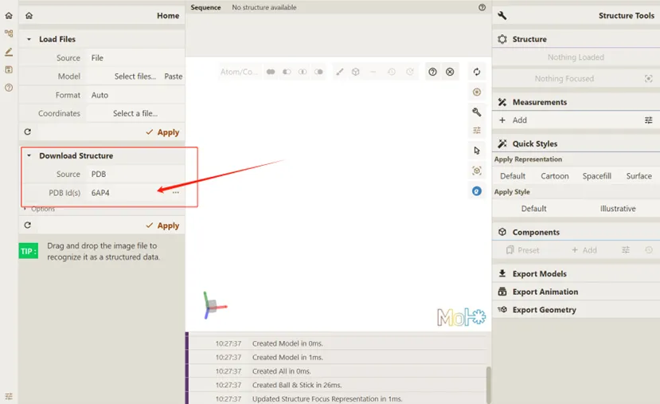

2. 点击 **Apply**，要求 Qbics-MolStar 实现可视化：

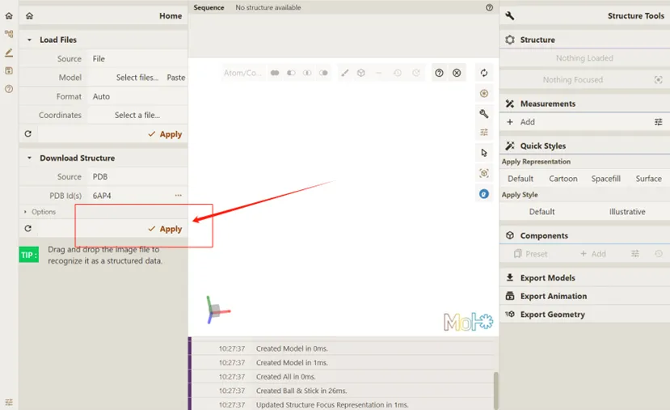

3. 效果如下：

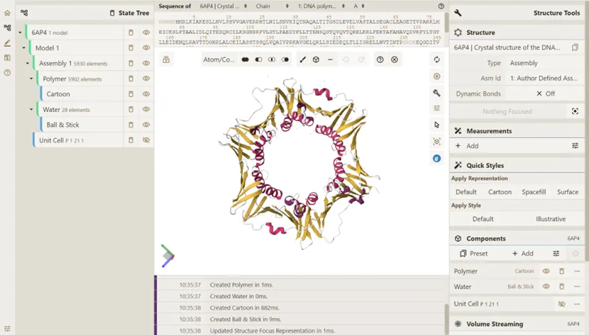

## 分子可视化：SMILES 代码

Qbics-MolStar 还可以根据 SMILES, PubChem 等导入数据。我们选择 SMILES 代码作为另一可视化示例。

1. 修改 Source 为 SMILES 而非默认 PDB：

2. 作为本次尝试的 SMILES 示例，键入要求填写 SMILES 的位置： `[H]C(=O)N1C(CNC2=CC=C(C=C2)C(=O)N[C@@H](CCC(O)=O)C(O)=O)CNC2=C1C(=O)NC(N)=N2`:

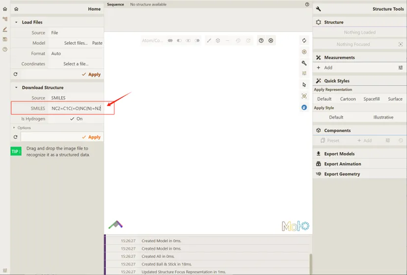

3. 点击 **Apply**，要求 Qbics-MolStar 实现可视化：

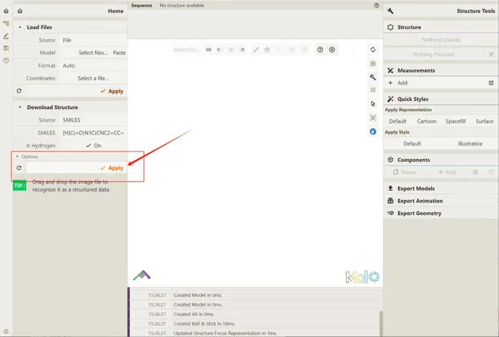

4. 效果如下：

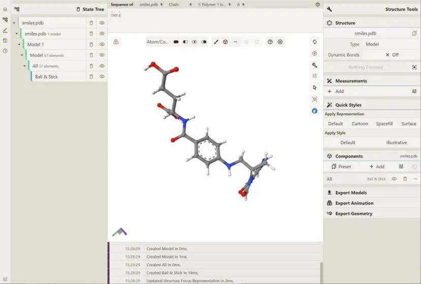
