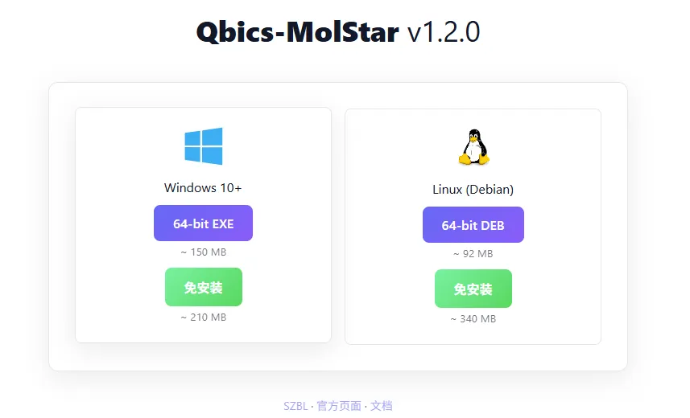
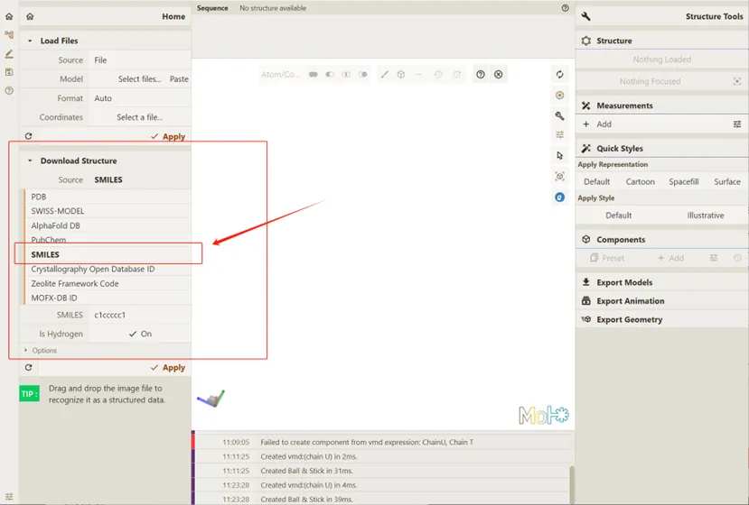

# 安装与简单使用

## 使用

使用Qbics-MolStar有两种方式：

- 直接在线访问链接：https://molstar.szbl.ac.cn/viewer
- 安装安装包：
  - 点击链接进入Qbics-MolStar网站界面：https://molstar.szbl.ac.cn/download/
  - 点击如图所示位置执行下载：
  

## 分子可视化：本地文件

当前支持文件格式包括：`.top`，`.cif`，`.gjf`，`.inp`，`.mol`，`.xyz`，`.pdb`，`.mwfn`，`.mol2`等等，具体介绍详见 https://molstar.szbl.ac.cn/docs/use/。

用户可以通过两种方式实现已知分子坐标的可视化（以.pdb为例）：

- 直接拖拽文件至Qbics-MolStar界面，即可实现可视化：

- 选择保存在本地的文件：

  1. 点击下方红框按钮，选择希望可视化的文件。
  
  

  2. 双击选中的文件（此处为c60.pdb）使其加载至Qbics-MolStar：
  
  

  3. 点击 **Apply**，使 Qbics-MolStar 开始渲染体系，实现可视化：
  
  

  4. 效果如下：
  
  

## 分子可视化：在线下载PDB

Qbics-MolStar可以从多种途径下载分子坐标并渲染可视化。以下以PDB为例。

1. 在Qbics-MolStar中键入PDB Id，如 `6AP4`：

2. 点击 **Apply**，要求Qbics-MolStar实现可视化：

3. 效果如下：

## 分子可视化：SMILES代码

Qbics-MolStar还可以根据SMILES, PubChem等导入数据。我们选择SMILES代码作为另一可视化示例。

1. 修改Source为SMILES而非默认PDB：

2. 作为本次尝试的SMILES示例，键入要求填写SMILES的位置： `[H]C(=O)N1C(CNC2=CC=C(C=C2)C(=O)N[C@@H](CCC(O)=O)C(O)=O)CNC2=C1C(=O)NC(N)=N2`:

3. 点击 **Apply**，要求Qbics-MolStar实现可视化：

4. 效果如下：

