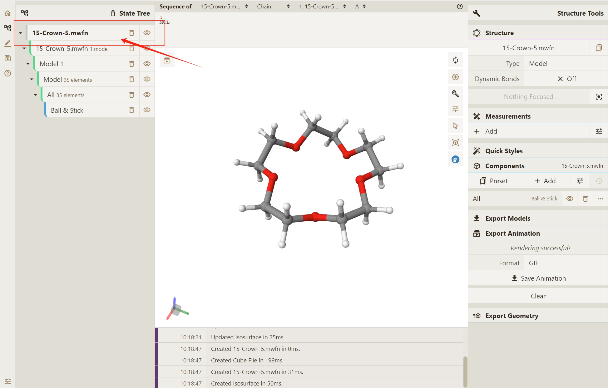
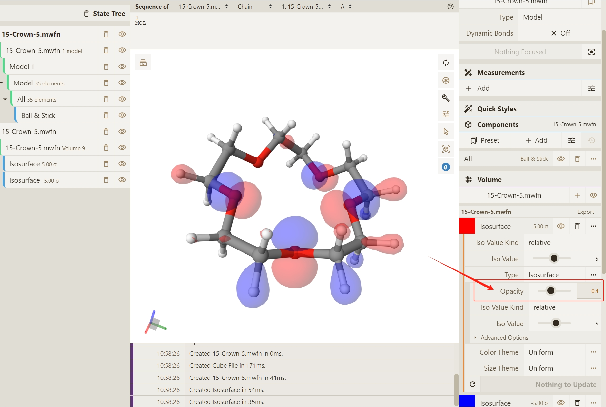
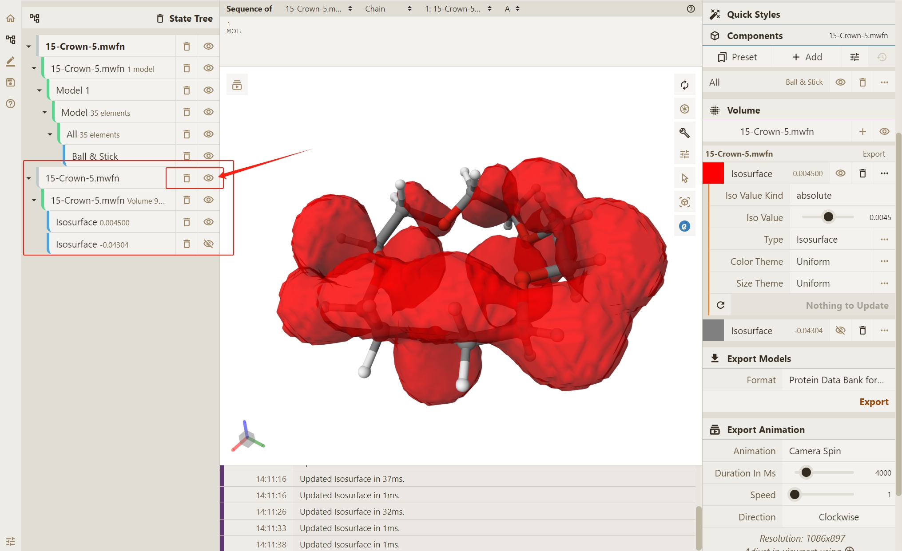
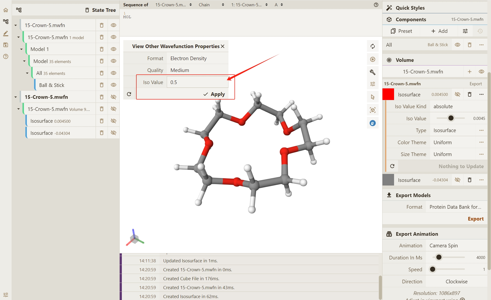

# 2.可视化电子结构

## 通过 `.mwfn` 实现电子结构可视化

1. 此处以 **15-冠醚-5** 闭壳层分子体系的单点能计算为例，通过 Qbics-MolStar 可视化其电子结构

2. 通过访问与安装，可视化文件或 **SMILES** 代码的两种方法（拖拽 / 选择文件）使 `.mwfn` 文件在 Qbics-MolStar 界面显示渲染。

3. 渲染结果如下：

   

4. 可以观察到，界面左侧会弹出当前渲染体系的文件名：**15-Crown-5.mwfn**

   

## 渲染体系的分子轨道

1. 渲染体系的分子轨道，鼠标移动至文件名所在位置，点击右键，选择 **View Molecular Orbitals** 以实现分子轨道渲染的准备工作。

   

2. 点击 **View Molecular Orbitals** 选项后，会提示当前分子体系的轨道序号。轨道序号越大，轨道的能量越高。同时，`occ` 表示当前轨道的占据数。

   - **occ=0**：表示未占据的虚轨道；
   - **occ=2**：表示完全占据的轨道；
   - **occ=1**：通常表示开壳层体系中的单占轨道；

3. 如下图展示，我们发现，轨道序号 **60** 为最高占据轨道 **HOMO**，为最后一个 **occ=2** 的轨道。轨道序号 **61** 为最低非占据轨道，为第一个 **occ=0** 的轨道。

   

4. 此处，我们点击轨道序号 **60**，以 **HOMO** 轨道为例进行轨道渲染。默认渲染结果如下：

   

## 调整分子轨道渲染样式

1. 调整分子轨道渲染的透明度

   - 点击右侧 Actions 按钮弹出渲染样式修改框，此处我们修改正相位轨道区域。

     

   - 默认 type 为 **Isosurface** 选项，除此选项之外，还包括 **Direct Volumn**, **Dot**, **Segment** 以及 **Slice**。

     

   - 在选中 **Isosurface** 的基础之上，点击右侧的 **Type Properties** 按钮以进一步获得样式修改选项。

     

   - 在 Opacity 一栏内，通过拖拽进度条或直接键入数字的方式，自定义轨道展示透明度。

     

   - 默认情况下 Opacity 的数值为 0.4。 此处，我们将 Opacity 调整至 0.8，为您演示分子轨道样式的改变。

     

2. 调整分子轨道渲染的颜色

   - 在当前界面右下角，点击色块以获得 **Select Color** 选项，此处我们修改负相位轨道区域。

     

   - 您可以有两种方式去调整分子轨道渲染的颜色

     - 直接选用 **Select Color** 下方默认的色块，如湖蓝色。
     - 在 RGB 选项 中，可以手动输入数值来指定渲染颜色，如 `RGB(199, 21, 133)`。

     
     

3. 调整分子轨道等值面的数值方式：

   - 在 **Iso Value Kind** 部分存在两种调整等值面的选项：

     - absolute：使用绝对数值来定义等值面
     - relative：使用相对比例来定义等值面（默认）

     

   - 若我们选取默认 relative 作为等值面定义的方式，其 **Iso Value** 数值默认为了 `±5`。 您可以通过拖拽进度条或直接键入数字的方式去修改 **Iso Value** 的数值。 在这里，我们以正相位轨道区域为例，分别为您提供了默认数值（`5`）下的分子轨道渲染以及手动修改（`0.45`）的分子轨道渲染结果。

     
     

   - 若我们选取 absolute 作为等值面定义的方式，您同样可以通过拖拽进度条或直接键入数字的方式去修改 **Iso Value** 的数值。在这里，我们同样以正相位轨道区域为例，分别为您提供了默认数值（`0.042789`）下的分子轨道渲染以及手动修改（`0.0045`）的分子轨道渲染结果。

     
     

## 渲染体系的其它电子性质

渲染体系的其它电子性质, 如 **Electron density**（电子密度）

- 点击删除或不可见按钮，以消除后续操作中分子轨道显示造成的影响。

  

- 与查看分子轨道的方式类似。 将鼠标移动至文件名所在位置，点击右键，选择 **View Other Wavefunction Properties**。

  

- 在弹出的窗口界面，Format 一栏选择 **Electron Density**，以实现电子密度的渲染。

  

- 点击 Apply，实现渲染操作。在这里，我们同时将 **Iso Value** 调整为 `0.5`，以便于显示观察。

  

- 渲染结果如下所示：

  
