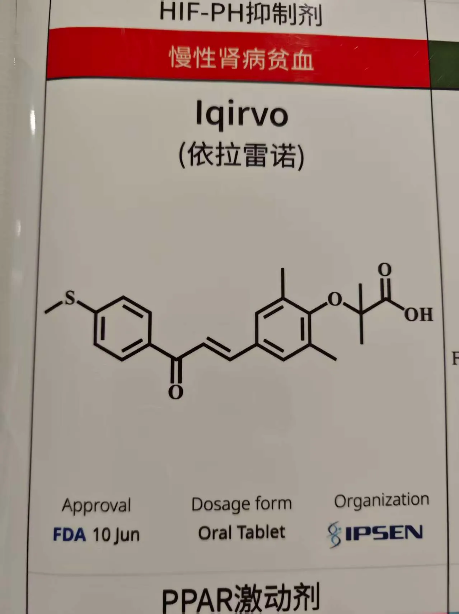
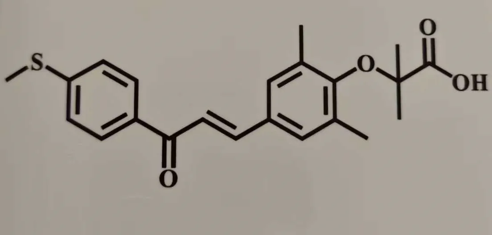
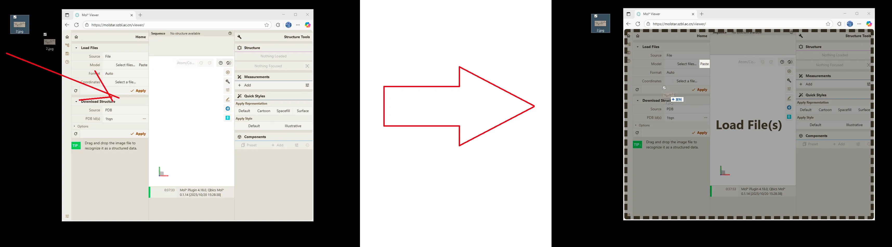
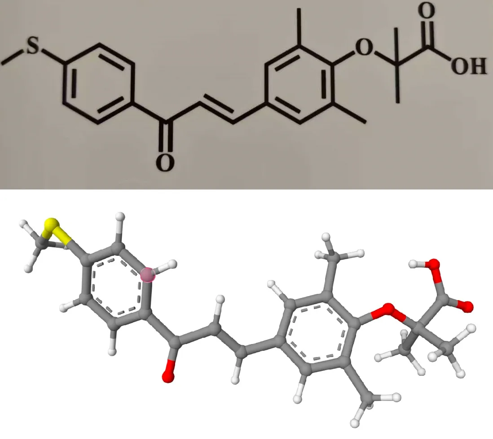

# 从图片直接导入分子

利用人工智能模型，Qbics-MolStar可以直接从图片识别出分子，转化为 **SMILES** 代码，并计算坐标。

假设你用手机拍摄了这么一张图片：

这张图片中包含一个分子。我们现在想把它在Qbics-MolStar中可视化出来。这张图片有很多其他元素，让我们把无用元素减裁掉，只保留分子。

现在开始识别。注意：图片分子识别功能不能在本地使用，只能在线使用。

请打开：https://molstar.szbl.ac.cn/viewer 网站，然后把图片拖入浏览器内：

稍等几秒，分子就被成功识别出来，对比如下：

之后，可以在 “磁盘” 面板中用 **Export Models** 下载结构。