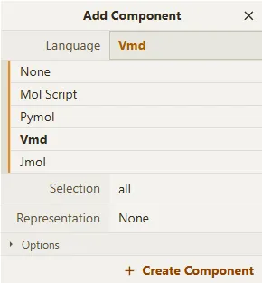

# 选择原子、显示编号、以及多种渲染方式

## 选择原子

Qbics-MolStar可以添加任意多个渲染方式，在有的软件中称为representation，在Qbics-MolStar中称为component。可以在分子中，选择一部分原子来进行渲染。

“选择原子”的方式在Qbics-MolStar中非常强大。在 **State Tree** 中点击右键，选择 **Add Component** ，你可以在 **Language** 中看到多种选择原子的方式：

- Mol Script
- Pymol
- Vmd
- Jmol

只要你会这四种软件的选择方法的任一种，就可以利用这方面的语法来选择原子。

::: tip 提示
选择原子的语法，可以参考：

  - Vmd: https://www.ks.uiuc.edu/Training/Tutorials/python/pymol/selection/
  - Pymol: https://pymol.org/2/select.html
  - Jmol: http://wiki.jmol.org/index.php/Selecting
  - Mol Script: https://pekrau.github.io/MolScript/selection.html
:::

下面展示：

1. 打开Qbics-MolStar，在 **Download Structure** 中选择 **PubChem**，输入 `2244`，点击 **Apply**，就可以从 **PubChem** 中下载`2244`号化合物的分子坐标：

2. 在状态中的 **All** 点击右键，选择 **Add Component** ，选择 **Vmd**，在 **Selection** 中输入 `element H`，就可以选中所有的氢原子，再在 **Representation** 中选择 **Spacefill**，点击 **Apply**，就可以把这些氢原子以 **Spacefill** 形式显示：

3. 如果想修改 Representation，可以右击 **Spacefill**，选择 **Update Decorator** 进行修改。

## 显示编号

显示出原子编号是个很方便的功能，在状态中点击右键，选择 **Add Component**，选择 **Vmd**，在 **Selection** 中输入 `all`，在 **Representation** 中选择 **Label** 点击 **Add Component**，就可以显示出原子编号：

当然，如果在 **Selection** 中输入其它选择原子的语法，就可以显示出所选原子的编号。

## 多种渲染方式

Qbics-MolStar可以添加任意多个渲染方式，下面以一个蛋白质为例。

  - 打开Qbics-MolStar，在 **Download Structure** 中选择 **PDB**，输入 `1tqn`，点击 **Apply**，就可以从 **PDB** 中下载`1tqn`号蛋白质的分子坐标：

  - 此时，Qbics-MolStar已经默认添加了很多合适的渲染方式。我们现在想选择残基编号为 **75-85** 的原子，使之用 **Ball and Stick** 方式显示，可以这样做：右键点击 **Assembly 1**，选择 **Add Component**，选择 **Vmd**，在 **Selection** 中输入 `resi 75 to 85`，在 **Representation** 中选择 **Ball & Stick**，点击 **Add Component**，就可以把这些原子以 **Ball and Stick** 方式显示：

  - 如果想只看这一部分，可以点击其 **Component** 上的眼睛按钮，使之不显示：

如果想删除，就可以点击垃圾桶按钮。

  - 如果想修改**Component**，可以右键点击**Component**，选择 **Update Decorator** 进行修改。点击三个点的图标，可以更加精细的修改显示方法，例如透明度等

