# 1.可视化轨迹并导出动画

## 以.xyz 文件为例查看轨迹并导出动画

1. 通过教程 1 的两种方法（拖拽 / 选择文件）使 .xyz 文件在 Qbics-MolStar 界面显示渲染。

2. 请注意，可查看轨迹的前提是当前您所选取的 .xyz 文件存在多帧信息。

3. 此处，我们开启 **Dynamic Bonds** 按钮，以动态观察键连的变化。

4. 点击图形界面左上角 Select Animation 按钮，选择不同的轨迹或场景动画演示方式。在此处，我们选择系统默认的 **Animate Trajectory** 方法（分子模拟轨迹）

5. 点击 Start 按钮，渲染轨迹动画。

5. 动画播放效果如下：

6. 点击 Qbics-MolStar 界面右下角 Export Animation 按钮实现轨迹导出功能（此处与 Select Animation 按钮下的选择情况一致）。

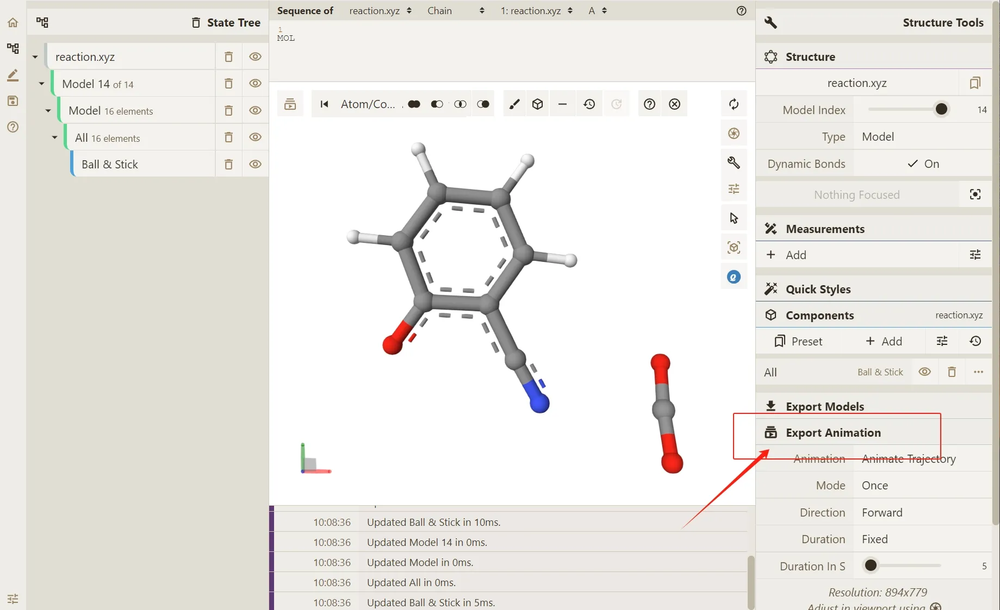

7. 点击 **Render** 按钮，使 Qbics-Molstar 进行轨迹处理。（若提示 Rendering successful 后，您希望更换当前的处理结果，可以点击下方的 Clear 做清除处理。）

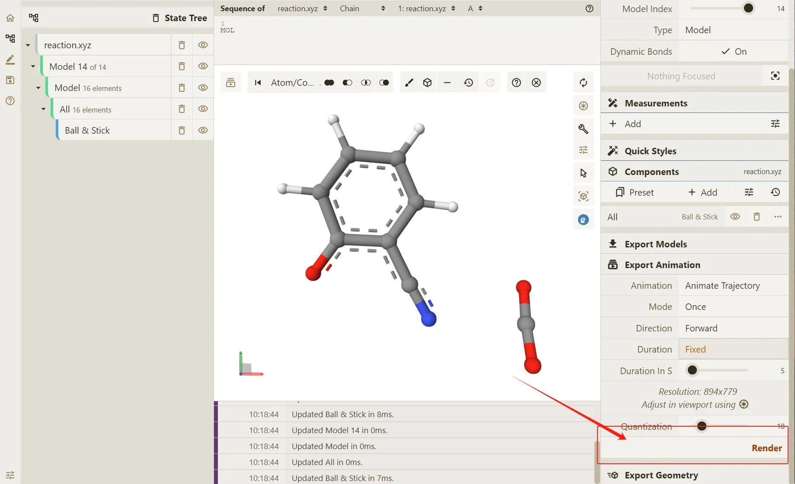

8. 存在 4 种文件类型可以导出：**MP4**，**AVI**，**GIF**，**MKV**。
   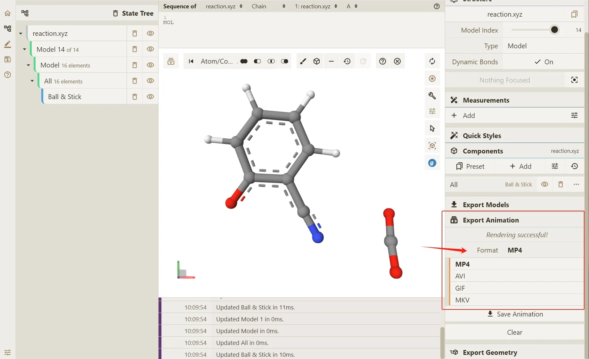

9. 确定希望导出的文件类型后，点击 Save Animation 导出结果。
   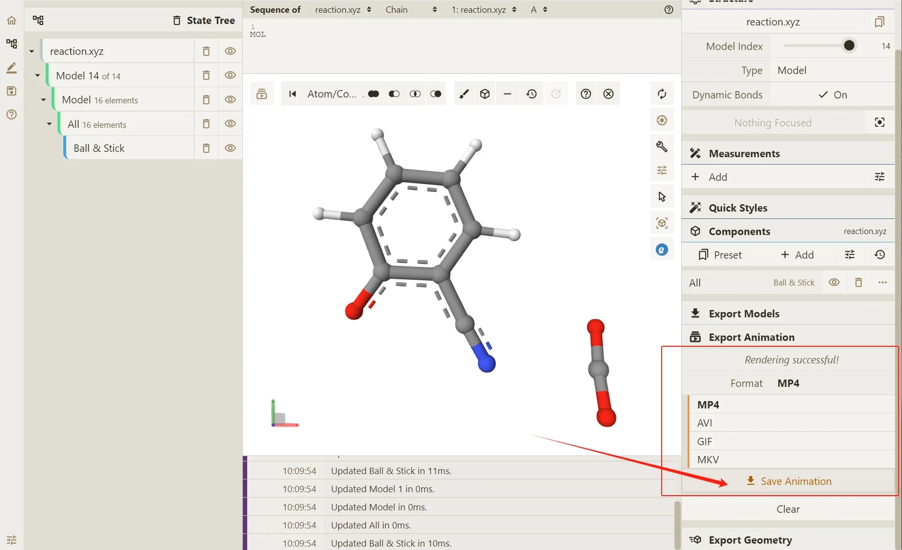

10. 此处作为示例，为您展示 **GIF** 的输出结果。

    - GIF 文件：

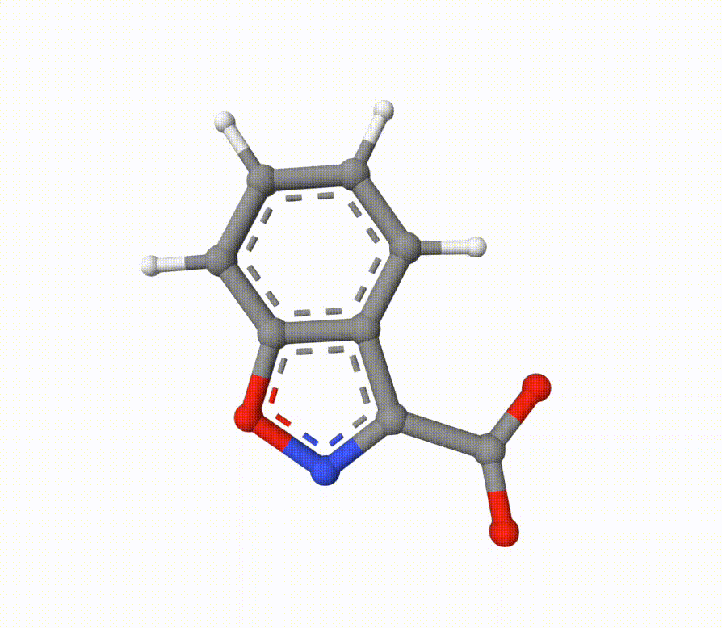

## 以 .gro + .xtc 文件为例查看轨迹并导出动画

---

1. 在 Load Files - Model 部分选择 .gro 文件作为体系的初始结构信息（选择文件的操作步骤详见教程 1）

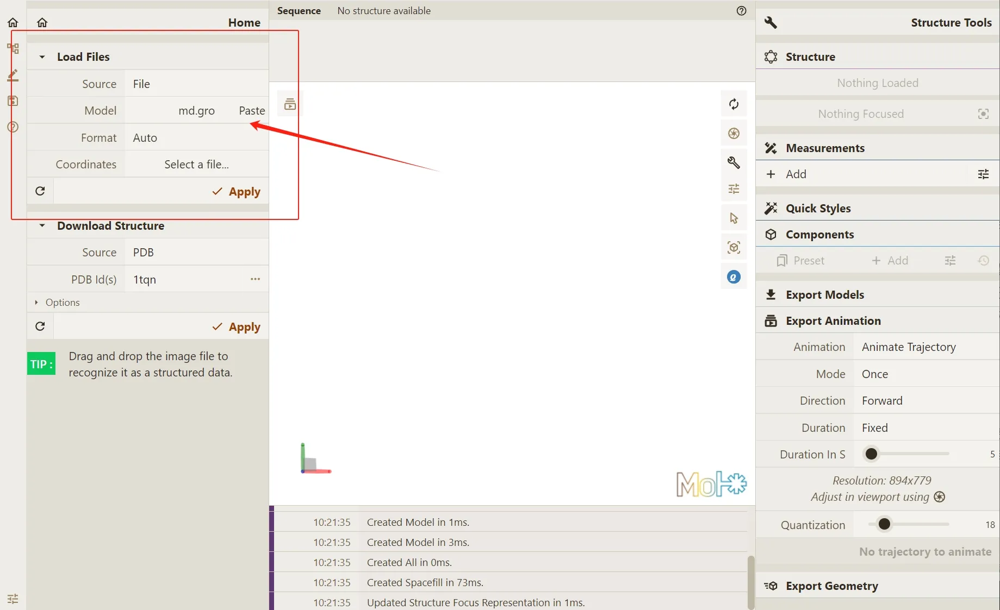

2. 在 Load Files - Coordinates 部分选择 .xtc 文件获取模拟过程中的轨迹坐标信息（选择文件的操作步骤详见教程 1）

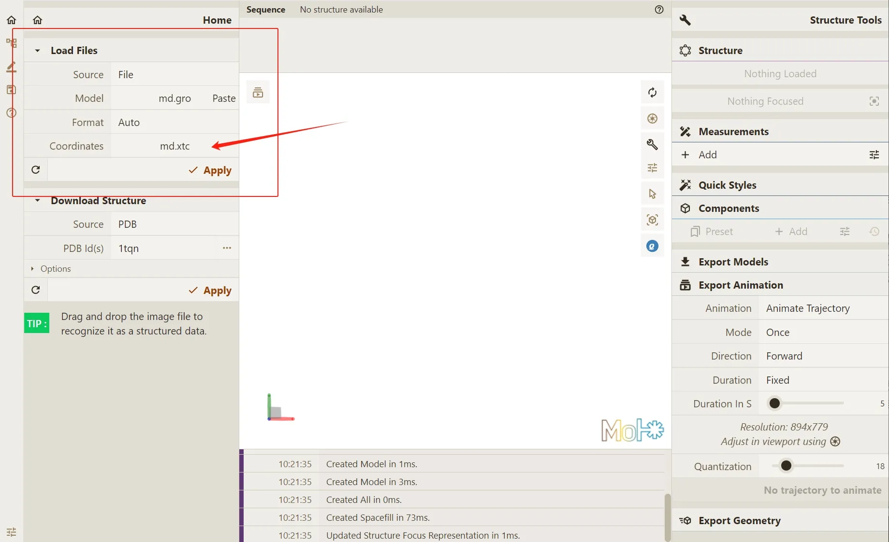

3. 点击 Apply 去命令 Qbics-MolStar 渲染轨迹

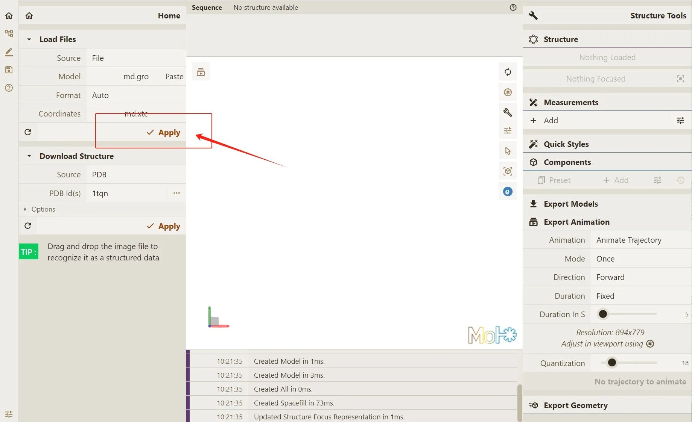

4. 渲染结果如下：

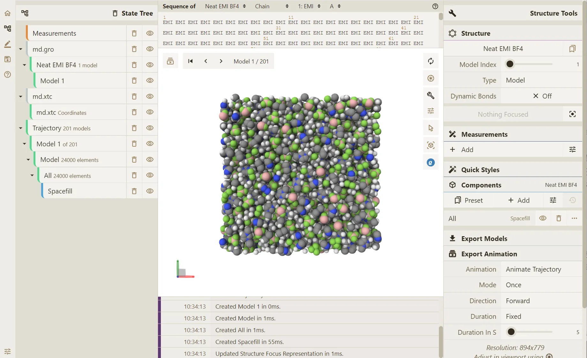

5. 重复本篇教程的上一示例中，关于导出动画的操作流程。

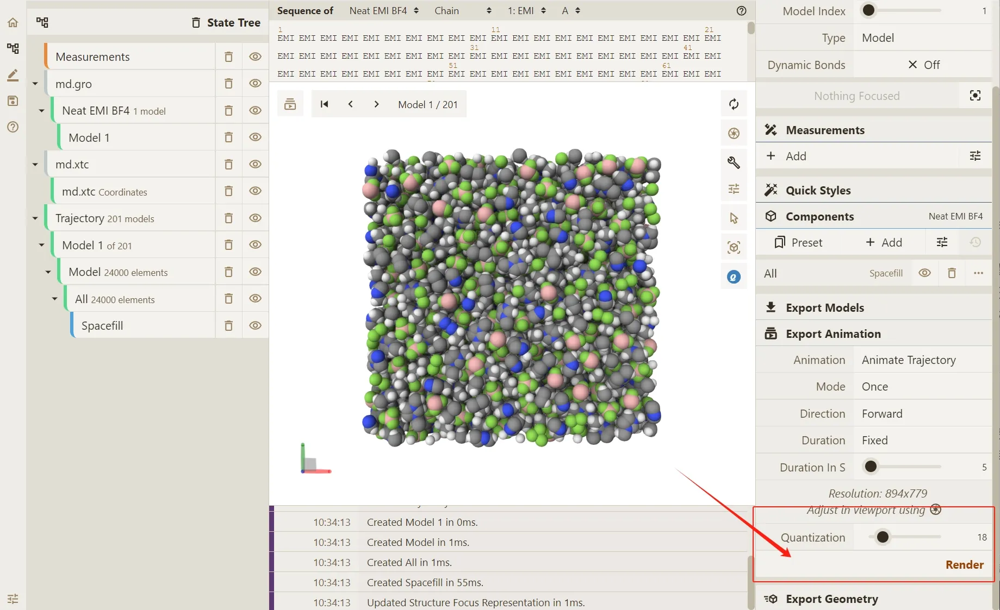

## 以蛋白质为例导出动画

1. 在此处我们以 **3KB0** 蛋白质为例。

2. 首先，我们在 PDB Id 位置键入 **3KB0**， 并点击 Apply 获取蛋白质文件。

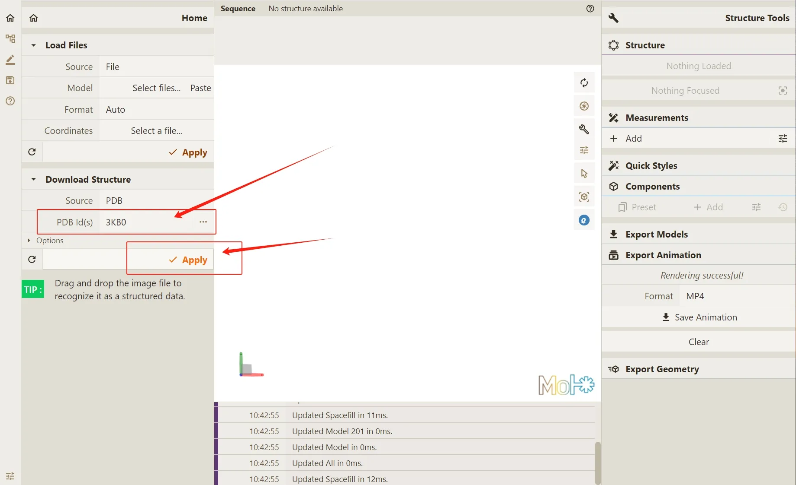

3. 渲染结果如下：

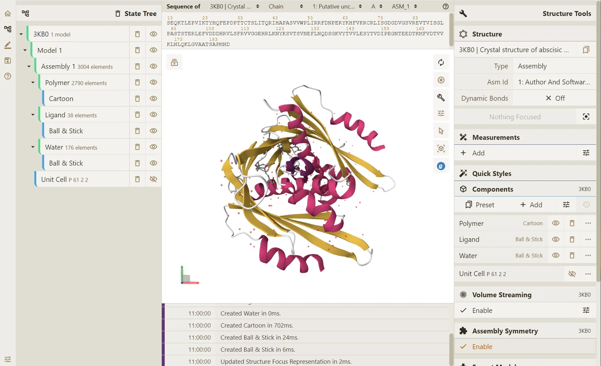

4. 针对蛋白质体系，我们在 **Animation** 选项中选择 **Camera Spin**（旋转相机视角）来进行动画演示

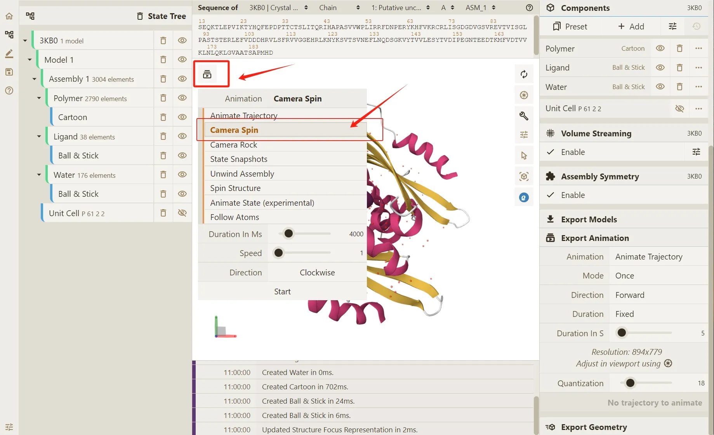

5. 在 **Export Animation** 部分，更改默认 **Animate Trajectory** 为 **Camera Spin**。

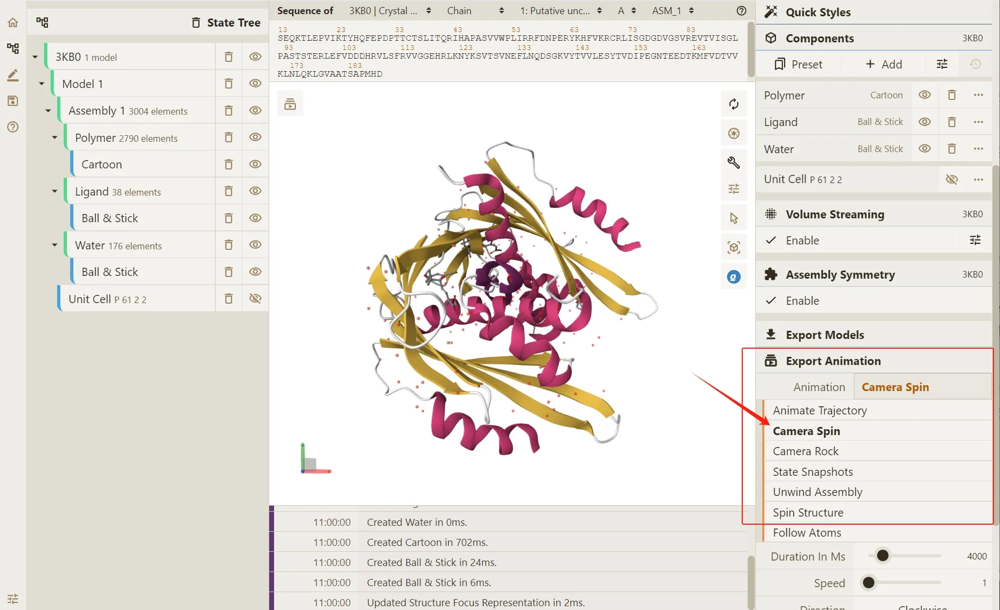

6. 点击 **Render** 按钮，使 **Qbics-Molstar** 实现轨迹渲染

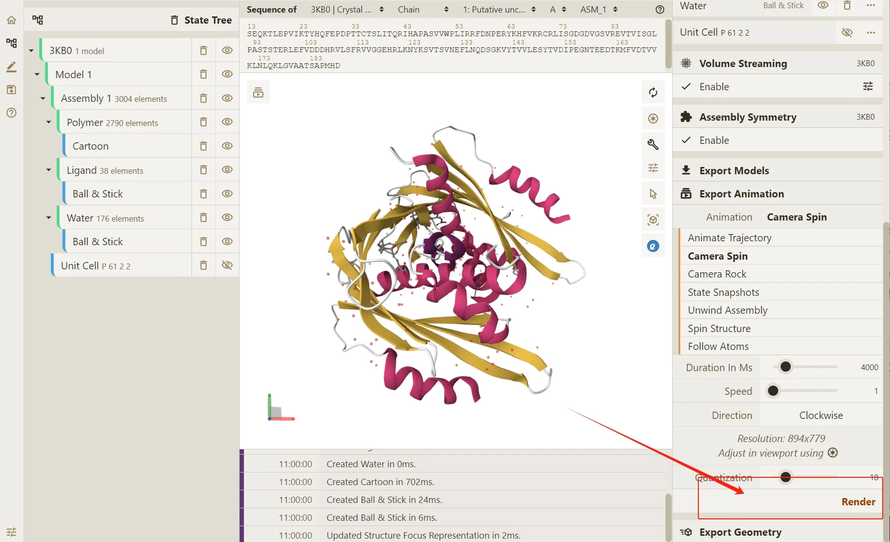

7. 根据需要选择对应的文件格式

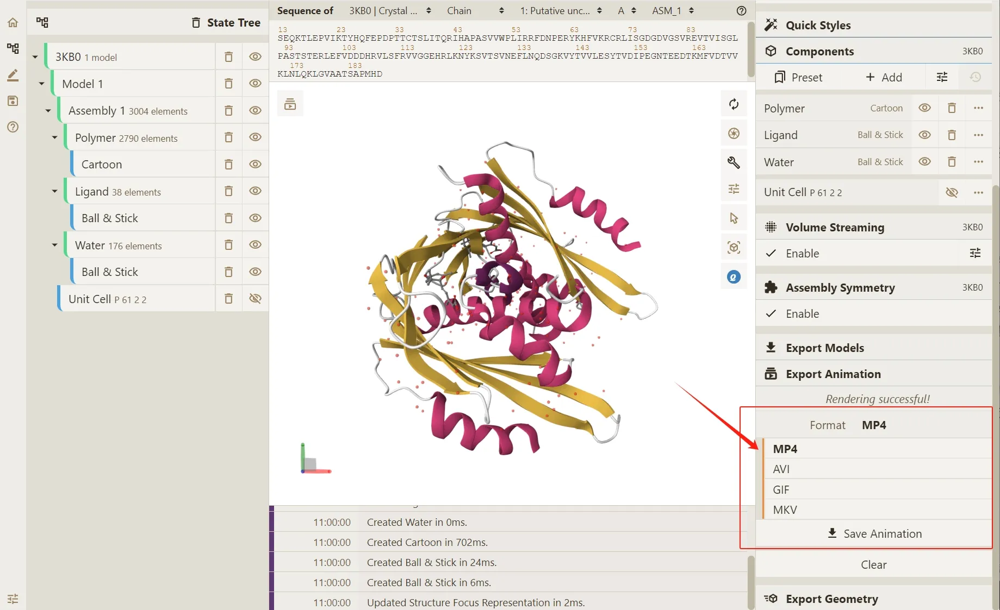
