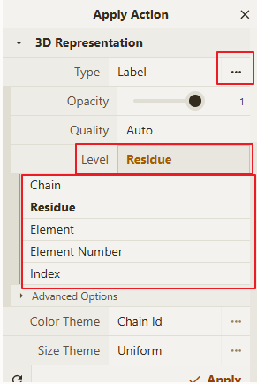
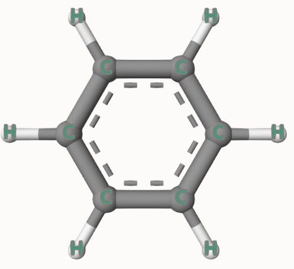
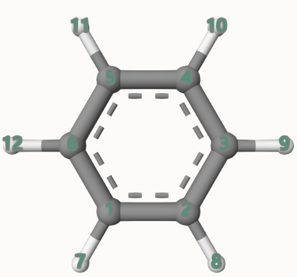

# 新建标签

进入 Action 功能模块

切换 `Type` 类型为 `Label`

点击 `Type` 后 `...` 扩展，点击 `Level` 选择不同的粒度 `Chain、Residue、Element、Element Index、Index`

选择完成后点击按钮 `Apply` 完成应用

## Chain 标签

## Residue 标签

## Element 标签

## Element Index 标签

## Index 标签

