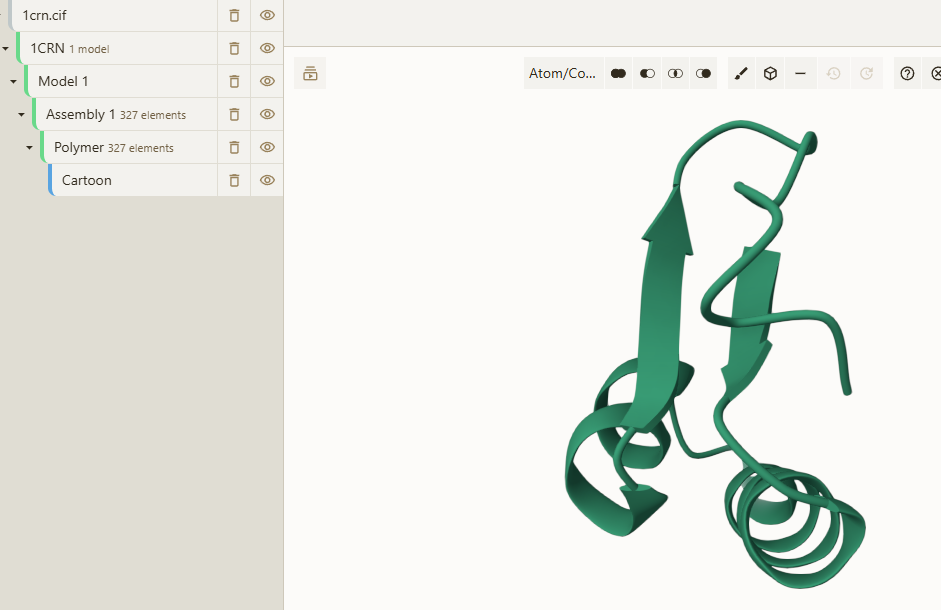
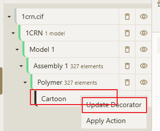
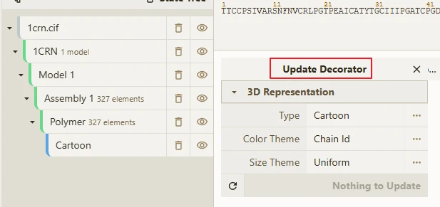
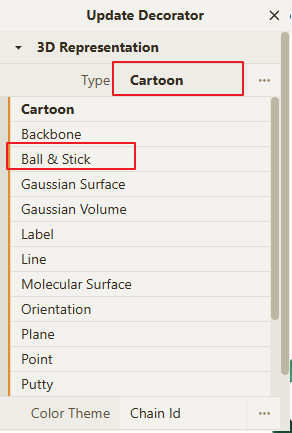
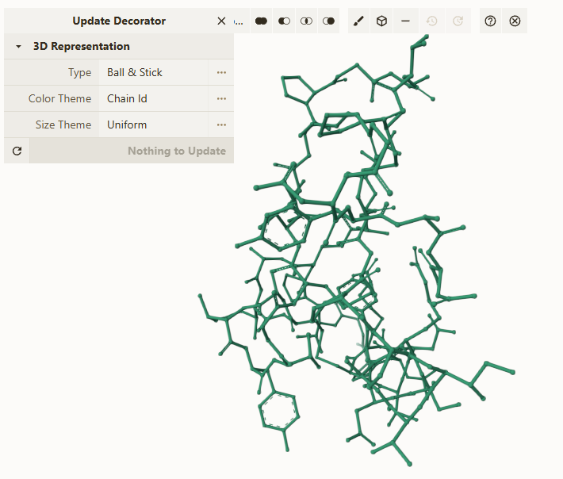
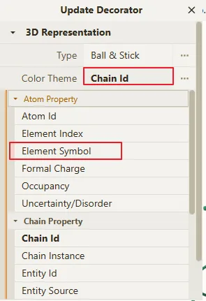
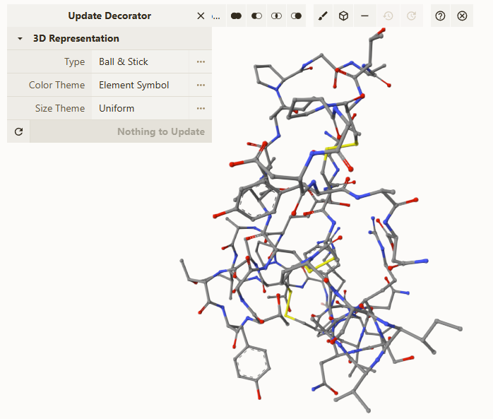
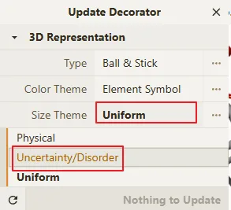
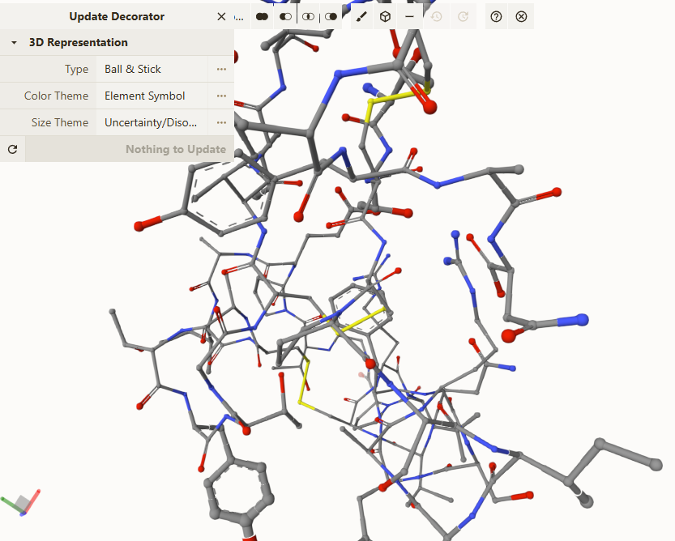

# 切换当前的 Representation

例如用户所打开的结构显示结果如下图所示，但是需要显示为 `棍棒模型/球棍模型` 时，可以如下的步骤实现切换。

鼠标移动到如下图所示的 `Cartoon`，然后点击鼠标右键，选择 `Update Decorator` 菜单，然后会有一个 `Update Decorator` 的弹窗出现。

:::tip
打开文件后，默认的 Representation 不一定为 `Cartoon`，用户需根据实际的情况进行调整。
:::

## 切换 Representation 的表现形式

点击 `Update Decorator` 弹窗内的 `3D Representation` 功能下的 `Type` 选项， 不是点击后面的三个点。

> 参数后面的三个点表示为扩展参数，有些高级功能可能需要使用到其中的参数，一般情况下可以忽略。

当选择完对应的表现形式后会自动更新主界面中的显示效果，如下图所示。

## 切换 Color 的表现形式

点击 `Update Decorator` 弹窗内的 `3D Representation` 功能下的 `Color Theme` 选项， 不是点击后面的三个点。

> 参数后面的三个点表示为扩展参数，有些高级功能可能需要使用到其中的参数，一般情况下可以忽略。

当选择完对应的表现形式后会自动更新主界面中的显示效果，如下图所示。

## 切换 Size 的表现形式

点击 `Update Decorator` 弹窗内的 `3D Representation` 功能下的 `Size Theme` 选项， 不是点击后面的三个点。

> 参数后面的三个点表示为扩展参数，有些高级功能可能需要使用到其中的参数，一般情况下可以忽略。

当选择完对应的表现形式后会自动更新主界面中的显示效果，如下图所示。

