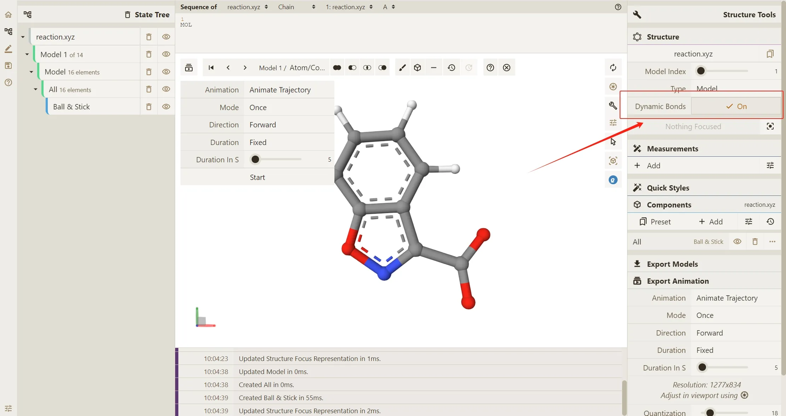
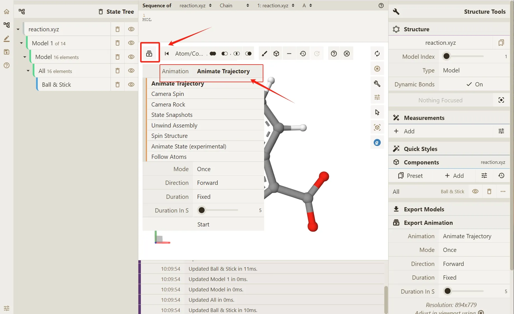
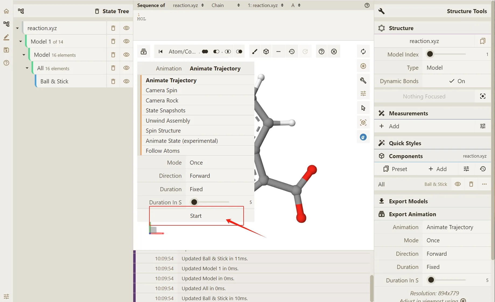

# Animate Trajectory

## 以.xyz 文件为例查看轨迹动画

1. 在 Qbics-MolStar 界面打开或拖入 .xyz 文件 显示渲染。

2. 请注意，可查看轨迹的前提是当前您所选取的 .xyz 文件存在多帧信息。

3. 此处，我们开启 **Dynamic Bonds** 按钮，以动态观察键连的变化。

4. 点击图形界面左上角 Select Animation 按钮，选择不同的轨迹或场景动画演示方式。在此处，我们选择系统默认的 **Animate Trajectory** 方法（分子模拟轨迹）

5. 点击 Start 按钮，渲染轨迹动画。

5. 动画播放效果如下：

