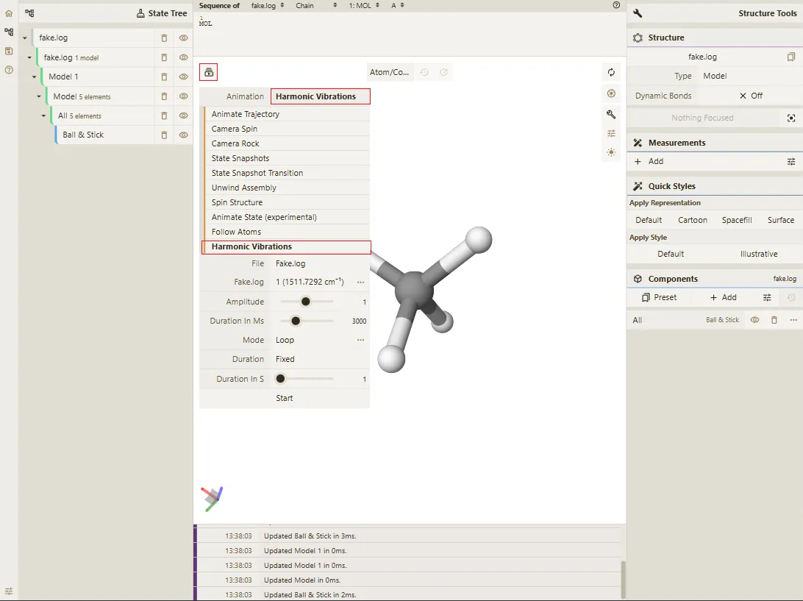
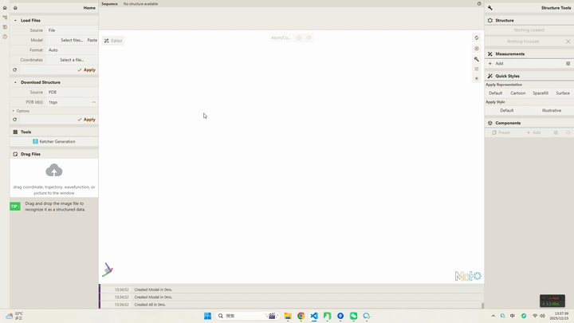

# Qbics-Molstar 振幅动画使用教程


## 前置条件

进入 [Qbics-Molstar 官方网站](https://molstar.szbl.ac.cn/viewer/) 或下载 [Qbics-Molstar 客户端](https://molstar.szbl.ac.cn/download/) 并运行 **Qbics-Molstar** 客户端。

## 打开本地文件

:::tip
 如需查看具体如何打开本地文件可查看文档 [安装与使用教程 - 本地文件、PDB 与 SMILES 可视化](../../../tutorial/access-installation.md)
:::
 
将下方的 **fake.log** 文本保存到本地的 **fake.log** 文件，打开 **Qbics-Molstar** 后使用 **Load Files** 功能加载本地的 **fake.log** 文件。

```txt [fake.log]
 Qbics
 
 GradGradGradGradGradGradGradGradGradGradGradGradGradGradGradGradGradGrad
 GradGradGradGradGradGradGradGradGradGradGradGradGradGradGradGradGradGrad

                          Input orientation:                          
 ---------------------------------------------------------------------
 Center     Atomic      Atomic             Coordinates (Angstroms)
 Number     Number       Type             X           Y           Z
 ---------------------------------------------------------------------
      1          6           0        0.020196    0.000003    0.000000
      2          1           0        1.089943    0.000003    0.000000
      3          1           0       -0.363042    1.027430    0.000000
      4          1           0       -0.363048   -0.513718   -0.889775
      5          1           0       -0.363048   -0.513718    0.889775
 ---------------------------------------------------------------------
 
    17 basis functions,    38 primitive gaussians,    17 cartesian basis functions
     5 alpha electrons        5 beta electrons
  
 Harmonic frequencies (cm**-1), IR intensities (KM/Mole), Raman scattering
 activities (A**4/AMU), depolarization ratios for plane and unpolarized
 incident light, reduced masses (AMU), force constants (mDyne/A),
 and normal coordinates:
                      1                      2                      3
                      A                      A                      A
 Frequencies --   1511.7292              1511.7373              1552.7826
 Red. masses --      1.1835                 1.1835                 1.1777
 Frc consts  --      1.5936                 1.5936                 1.6731
 IR Inten    --     19.9462                19.9459                20.0867
 Raman Activ --      2.4498                 2.4501                 4.5686
 Depolar (P) --      0.7500                 0.7500                 0.7439
 Depolar (U) --      0.8571                 0.8571                 0.8531
  Atom  AN      X      Y      Z        X      Y      Z        X      Y      Z
     1   6    -0.00  -0.00  -0.13    -0.00  -0.13   0.00    -0.12   0.00  -0.00
     2   1     0.00   0.00   0.66     0.01   0.66  -0.00    -0.09   0.00  -0.00
     3   1     0.00   0.00   0.56     0.24   0.01  -0.00     0.53   0.22  -0.00
     4   1    -0.21  -0.23   0.15    -0.12   0.42  -0.24     0.52  -0.12  -0.19
     5   1     0.21   0.23   0.15    -0.12   0.42   0.24     0.52  -0.12   0.19
                      4                      5                      6
                      A                      A                      A
 Frequencies --   1712.5137              1712.5192              3078.3830
 Red. masses --      1.0086                 1.0086                 1.0188
 Frc consts  --      1.7428                 1.7428                 5.6881
 IR Inten    --      0.1893                 0.1893                 5.1735
 Raman Activ --     40.5957                40.5960               141.3196
 Depolar (P) --      0.7500                 0.7500                 0.0245
 Depolar (U) --      0.8571                 0.8571                 0.0479
  Atom  AN      X      Y      Z        X      Y      Z        X      Y      Z
     1   6     0.00  -0.00  -0.01     0.00   0.01  -0.00     0.03  -0.00   0.00
     2   1     0.00  -0.00  -0.45     0.01   0.45  -0.00     0.19  -0.00   0.00
     3   1     0.00   0.00   0.54     0.46   0.17  -0.00    -0.18   0.54  -0.00
     4   1     0.39  -0.32   0.01    -0.23  -0.36   0.31    -0.19  -0.27  -0.46
     5   1    -0.39   0.32   0.01    -0.23  -0.36  -0.31    -0.19  -0.26   0.46
                      7                      8                      9
                      A                      A                      A
 Frequencies --   3154.5783              3154.6056              3401.8772
 Red. masses --      1.0967                 1.0967                 1.0900
 Frc consts  --      6.4300                 6.4301                 7.4319
 IR Inten    --     43.6160                43.6136                26.4713
 Raman Activ --     71.9988                71.9961                71.0938
 Depolar (P) --      0.7500                 0.7500                 0.4949
 Depolar (U) --      0.8571                 0.8571                 0.6621
  Atom  AN      X      Y      Z        X      Y      Z        X      Y      Z
     1   6    -0.00  -0.00  -0.09    -0.00  -0.09   0.00    -0.09   0.00  -0.00
     2   1    -0.00  -0.00  -0.03    -0.00  -0.03   0.00     0.98  -0.01   0.00
     3   1    -0.00   0.00  -0.03    -0.28   0.76  -0.00     0.01  -0.09   0.00
     4   1     0.26   0.34   0.56     0.15   0.17   0.34     0.02   0.04   0.08
     5   1    -0.26  -0.34   0.56     0.15   0.17  -0.34     0.02   0.04  -0.08

 -------------------
 - Thermochemistry -
 -------------------
 
 Normal termination of Gaussian 16 at Mon Jul 21 14:54:30 2025.
```


## 动画选择器

<div style="display: flex; gap: 0 8px; align-items: center;">击主界面中左上角的按钮，打开 <b>Qbics-Molstar</b> 的动画选择功能。</div>




选择 **harmonic-vibrations** 动画，点击 **Apply** 按钮后开始播放对应的振幅动画。

:::tip
在点击 **Apply** 播放动画前也可以查看对应文件的振幅数据与信息，也可以选择不同的振幅模式进行振幅动画播放。
:::

## 最终结果

使用振幅动画功能的操作过程与最终结果如下动图所示：

