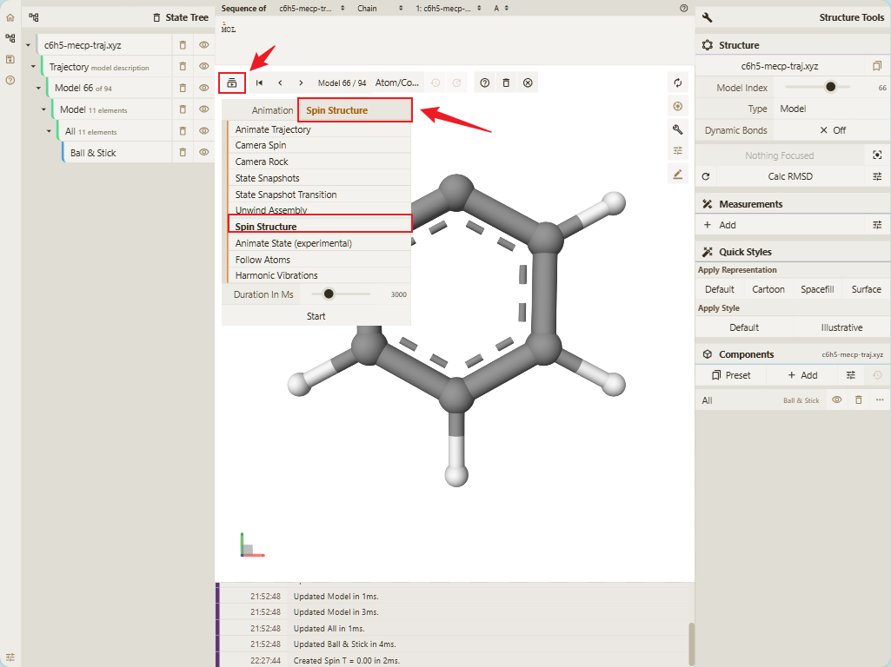
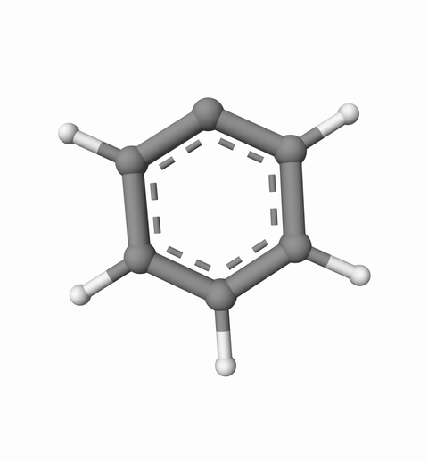

# Spin Structure

## 以.xyz 文件为例查看结构转圈动画

1. 首先打开 Qbics-MolStar 软件界面，通过两种便捷方式加载目标文件：

  一是点击界面指定区域的 “打开文件” 按钮选择本地.xyz 文件；
  
  二是直接将.xyz 文件拖拽至软件渲染窗口，系统会自动解析文件中的分子结构数据，快速完成初始渲染。渲染完成后，分子的原子、化学键等细节将清晰呈现，支持鼠标拖动缩放、平移视角，方便预先调整至合适的观察角度。

2. 在渲染界面的左上角，找到 “Select Animation” 功能按钮并点击，系统会弹出多种动画模式菜单，涵盖轨迹动画、摄像机动画、结构动画等不同类型。此时选择 “Spin Structure”（结构转圈动画）选项，该模式专为分子自身 360° 自动旋转设计，无需手动调整角度，即可全方位展示分子的空间构象细节，尤其适合突出分子的立体构型、取代基位置等关键信息。

3. 自定义动画参数（可选进阶操作）​

若需优化动画效果，可在选择动画模式后，通过界面下方的参数配置栏调整细节：支持设置动画持续时间（默认 5 秒，可按需延长或缩短）参数。默认参数已适配多数场景，无需额外调整即可生成流畅自然的旋转效果，新手可直接跳过此步骤。

4. 启动动画并查看效果​:

完成模式选择和参数设置后，点击界面的 “Start” 按钮启动动画。此时分子将按照预设参数自动进行 360° 匀速旋转，旋转过程中原子与化学键的连接关系清晰可见，能有效帮助观察者理解分子的空间对称性、官能团分布等关键特征。这种动态展示方式相比静态图片，能显著降低空间想象难度，尤其适合复杂分子结构的展示。

5. 动画播放效果如下：

