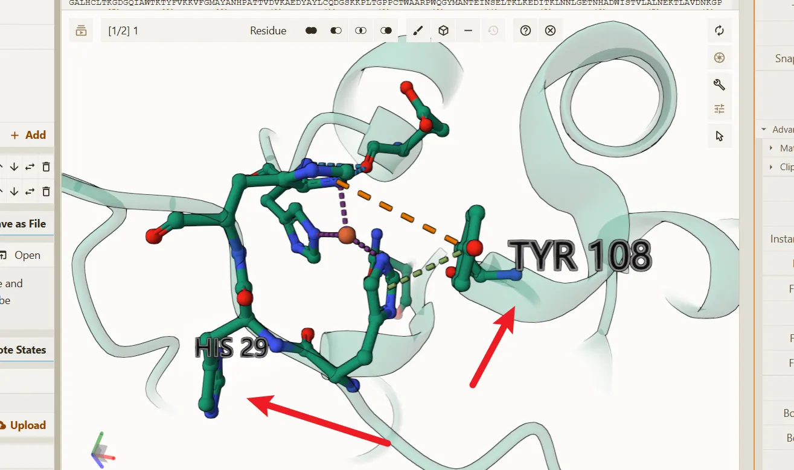
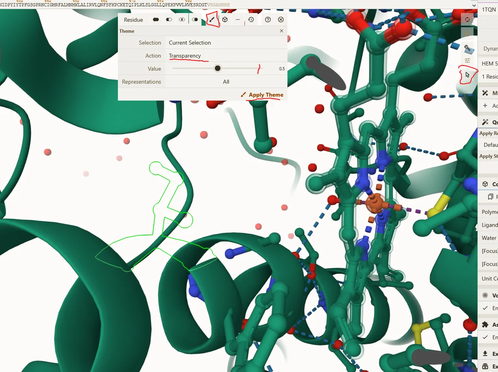

# 隐藏特定的 Structure 或者可选中的对象

已下图为例，我们需要隐藏掉氨基酸 `His29` 和 `Tyr108`。

## 操作步骤

1. 在"selection mode"（右侧工具栏中的指针图标）打开选择模式，在工具栏中选中对应的选择粒度，这里的话选择 **Residue**。

2. 当选择完粒度后在主界面窗口中选择对应要隐藏的 **Residue** `His29` 和 `Tyr108`。

3. 然后选择刷子图标，在 `Selection` 中选择"Current Selection"，表示要隐藏主界面中所选中的 **Residue** 。

4. 在 `Action` 中选择 `Transparency`，表示当时所选中的 **Residue** 需要实现透明功能，然后在下方的 `Value` 将 值调整为 **1** 。

按照上述步骤操作后，即可实现隐藏特定的 Structure 或者可选中的对象。

