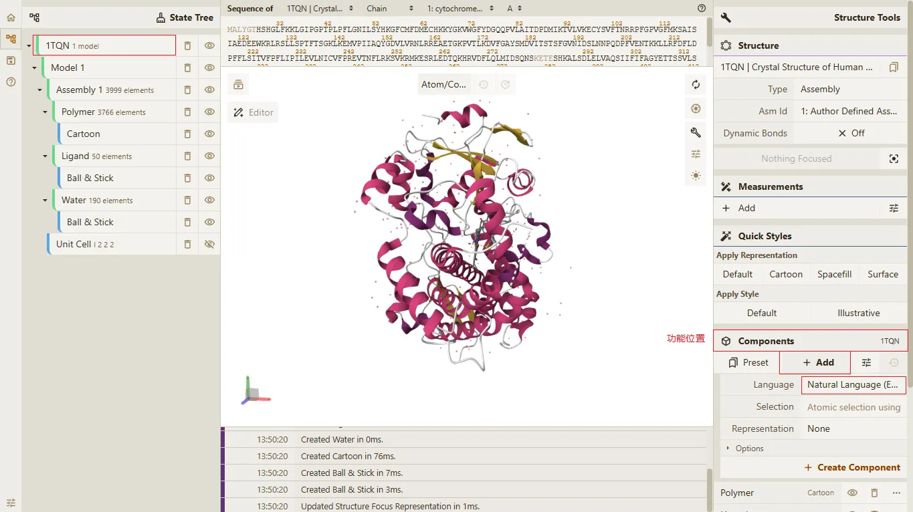
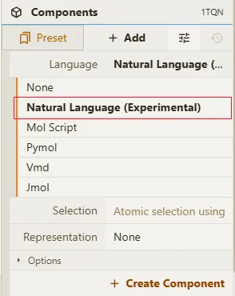
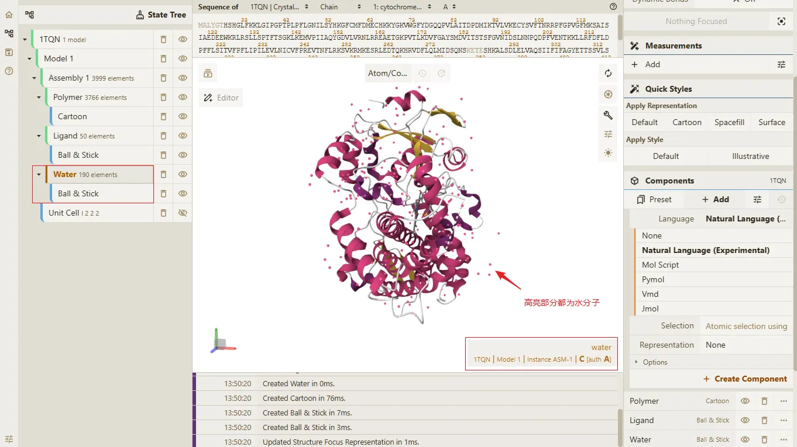
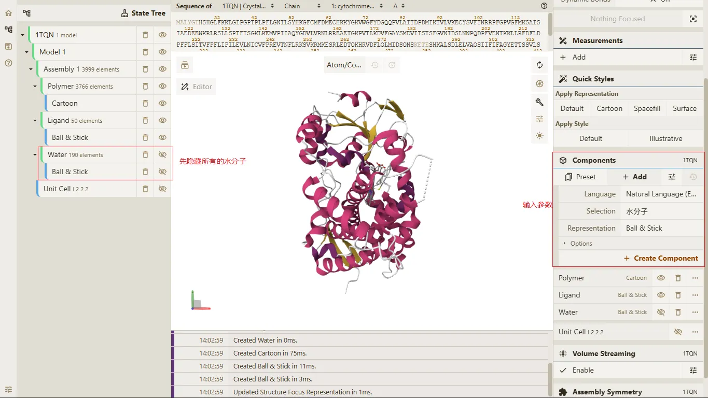
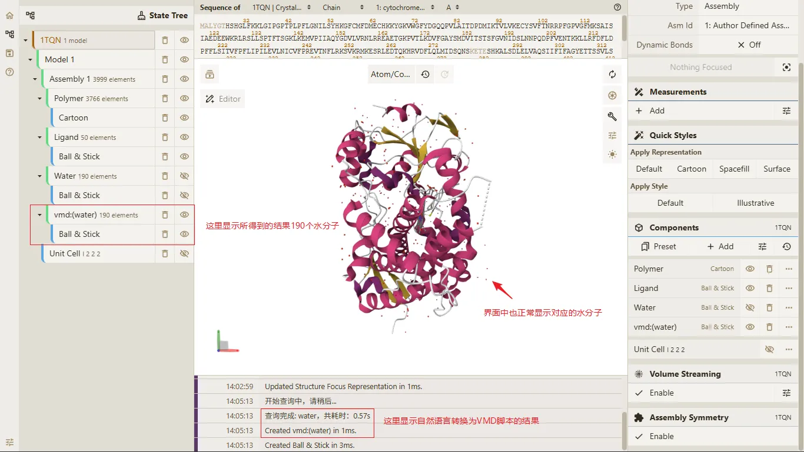
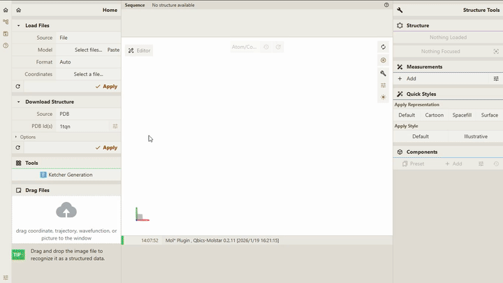

# 自然语言查询原子功能

## 前置条件

> - **Qbics-MolStar** 客户端支持的操作系统包括 **Windows**、**Linux** 和 **Android**。
> - **Qbics-MolStar** 客户端支持安装版本、绿色免安装版本 和 精简版本。
> - 提示: 请根据您的操作系统选择对应的版本进行下载安装。

1. 进入官网 [https://molstar.szbl.ac.cn/viewer/](https://molstar.szbl.ac.cn/viewer/)
2. 下载 **Qbics-MolStar** 客户端：[https://molstar.szbl.ac.cn/download/](https://molstar.szbl.ac.cn/download/)，安装客户端并双击打开客户端。
3. 如需教程/使用文档，请参考：
    - [Qbics-MolStar 教程](https://rxht.github.io/molstar/tutorial/)
    - [Qbics-MolStar 使用文档](https://rxht.github.io/molstar/use/)
    - [zhjun-sci Qbics-MolStar 教程](https://zhjun-sci.com/qbicsmolstar/doc/)

::: tip 提示
所有格式的轨迹文件均支持 RMSD 趋势功能，非轨迹文件不支持。
支持多文件同时展示 RMSD 趋势。
:::

## 操作步骤

1. 打开或下载结构文件，本案例使用 **Download Structure** 下载 `1tqn` 结构文件，如下图所示：

2. 在页面右侧的 **Components** 中点击 **Add** 按钮，选择 **Natural Language**，得到如下结果：

3. 在 `1tqn` 结构文件中，可以看到有 190 个水分子，如下图所示：

4. 在 **Natural Language** 组件中，输入 `水分子`，具体参数与结果如下：

参数（`水分子`）：

点击 **Create Component** 按钮，得到如下结果：

结果（`水分子`）：

## 自然语言进行原子选择功能动画如下

