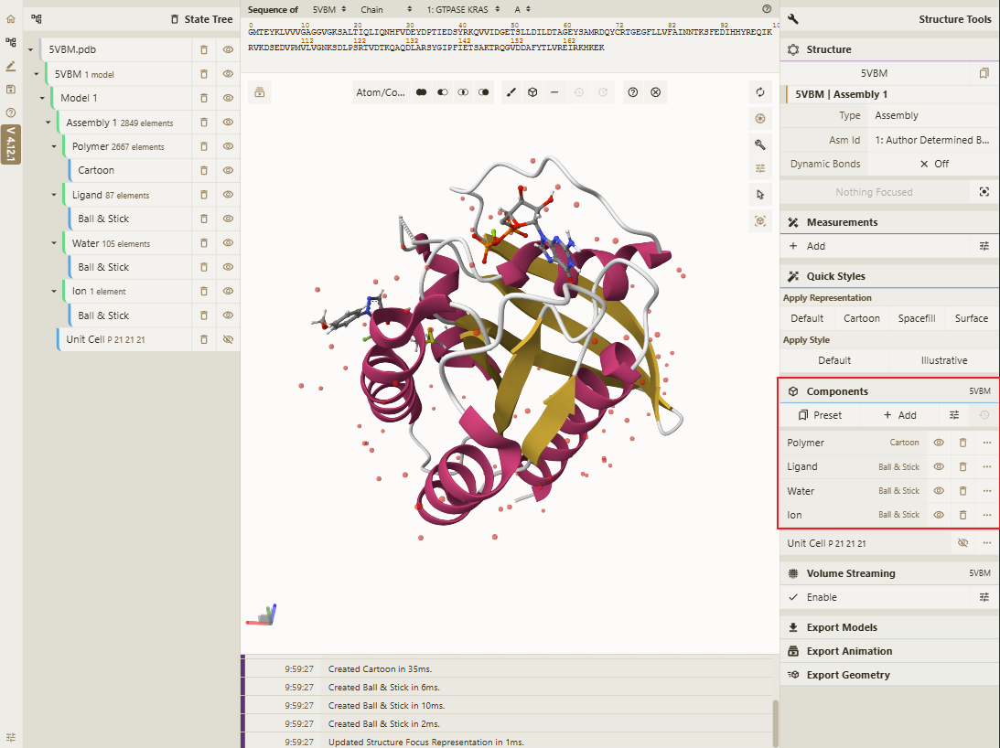
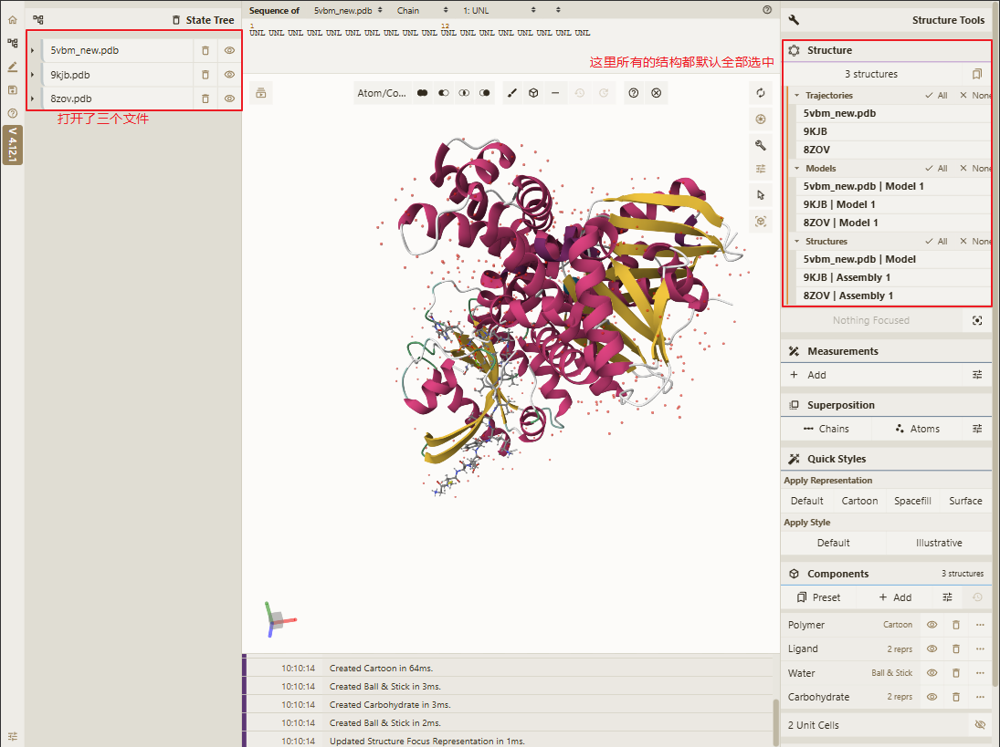
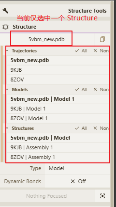
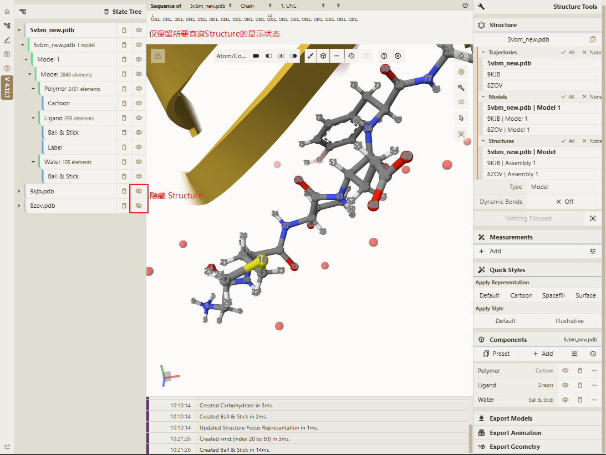
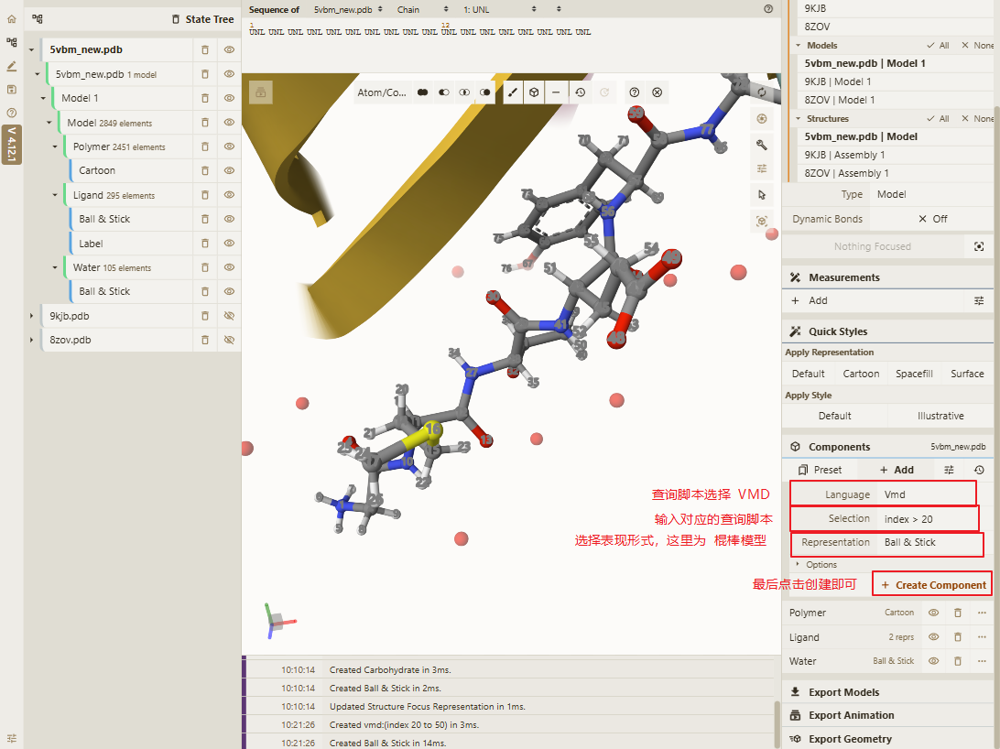
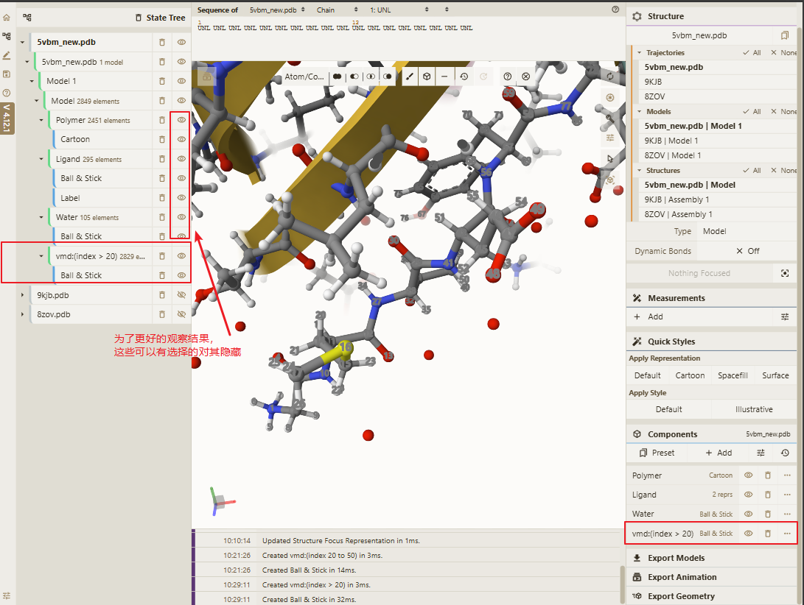
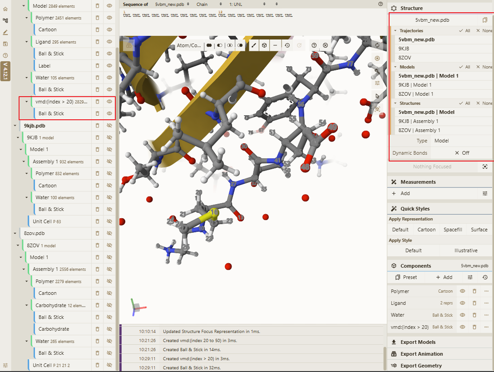

# 添加Components表现

> 此功能可以通过脚本查询方式添加Components，然后最终显示在界面上，现在所支持的脚本查询方案有 `MolScript` 、`Pymol`、`VMD`、`Jmol`，具体操作步骤如下，请根据实际情况选择对应的脚本查询方式。

## 主要功能界面

## 操作前准备

当打开多个文件时，需要在主界面右上方的 `Structure` 模块下，选择需要进行脚本查询的的结构（默认情况下或选中所有文件），如下图所示：

当我们只需要对其中的一个 `Structure` 或者部分 `Structure` 进行脚本查询时，可在 `Structure` 模块下，点击对应的 `Structure` 按钮进行取消选中（<b style="color:red">加粗字体</b>的为选中状态），如下图所示为仅对第一个 `Structure` 进行脚本查询的情况：

操作前准备完成后，执行后续的脚本查询操作就仅对选中的 `Structure` 进行查询操作。

::: warning 提示
为了更好的展示脚本查询的效果，可以在左侧的 `State Tree` 中关闭除了所要查询的 `Structure` 外的其他 `Structure` 的 `Show` 选项，如下图所示：

:::

## VMD脚本查询

1. 使用原子序号进行查询，例如: `index > 20` 、`index 20 to 50`等，如下图所示：使用 `index > 20` 脚本查询：

结果如下

::: warning 提示
 由于在 <b>操作前准备</b> 的步骤中仅选择了一个 `Structure`， 所以在最终的查询结果中，只显示了一个 `Structure` 的查询结果，如下图所示仅第一个 `Structure` 出现了查询的结果，第二个和第三个 `Structure` 中就没有出现我们所查询的结果。

:::

