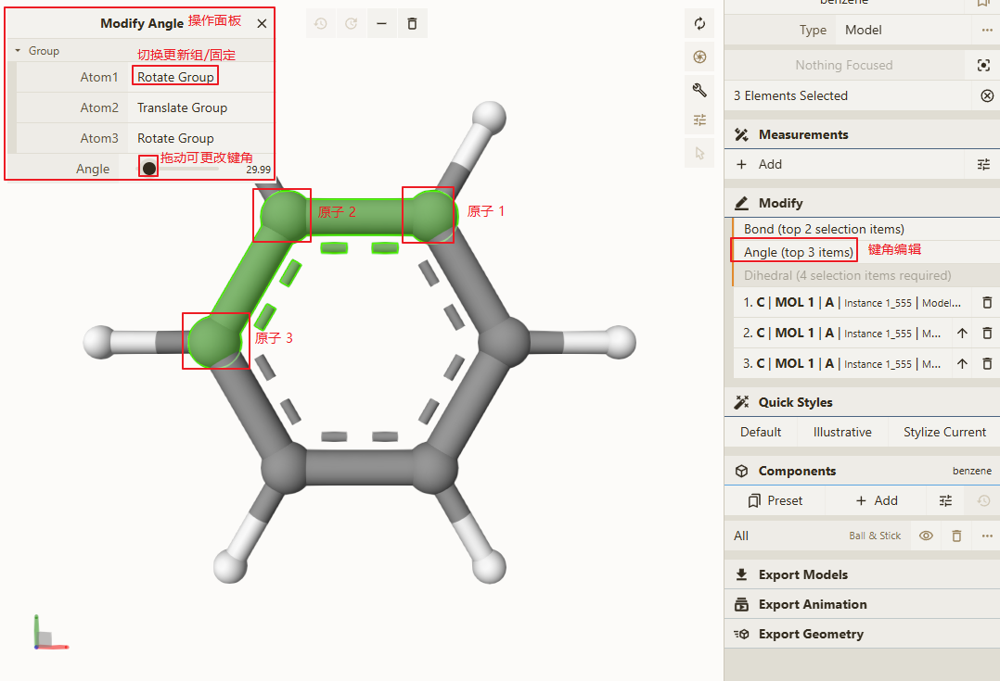

# 三个原子所构成的键角

## 主要功能界面

## 操作步骤

1. 选择任意的三个原子

2. 点击 <b>Modify</b> 模块下的 `Angle  (top 3 items)` 功能，在编辑区左上角新增 `Modify Angle` 弹窗

3. 可在弹框中更新两个原子的键角、以及更新是所需要同步更新的原子组

> 说明： 更新键角只需要用户操作即可完成实时更新，无需点击其他类似 `Apply` 的按钮

> 原子排序说明：在 <b>Modify</b> 模块下，可点击向上的箭头更新原子排序，点击删除按钮可删除原子的选中状态，编辑键连时所更新的为前 2 个原子，更新键角时所更新的为前 3 个原子，更新二面角时所更新的为前 4 个原子

