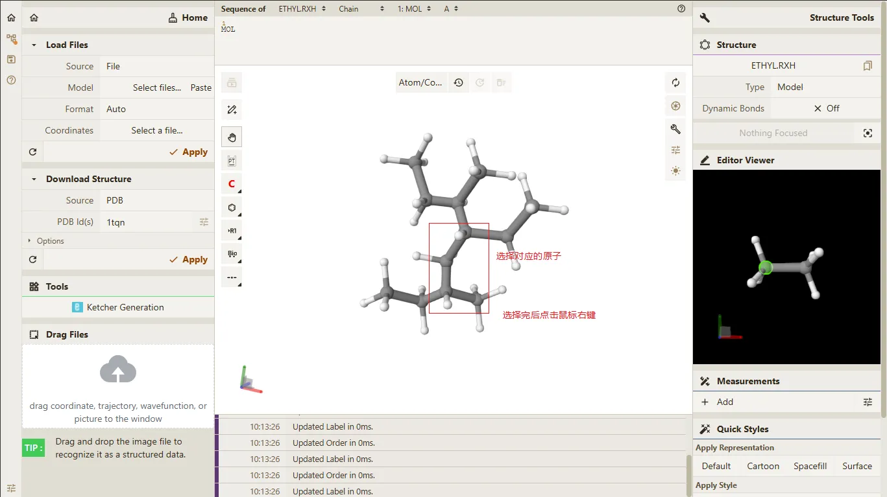
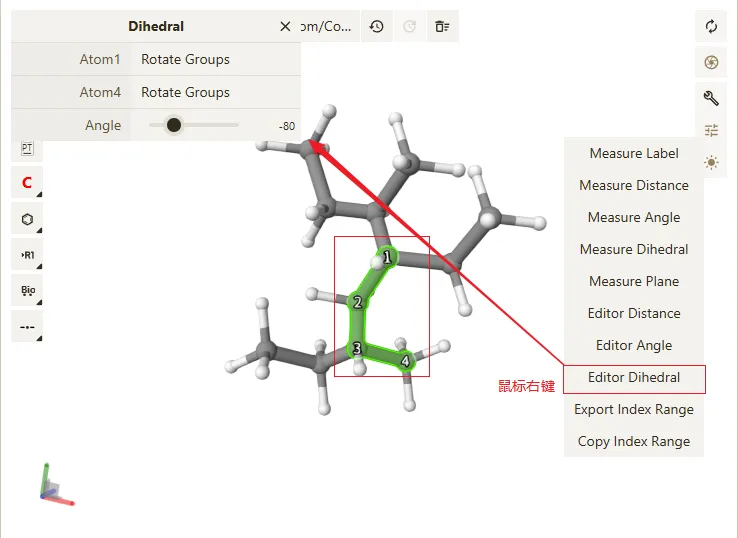

# 编辑键二面角信息

## 前置条件

> - **Qbics-MolStar** 客户端支持的操作系统包括 **Windows**、**Linux** 和 **Android**。
> - **Qbics-MolStar** 客户端支持安装版本、绿色免安装版本 和 精简版本。
> - 提示: 请根据您的操作系统选择对应的版本进行下载安装。

1. 进入官网 [https://molstar.szbl.ac.cn/viewer/](https://molstar.szbl.ac.cn/viewer/)
2. 下载 **Qbics-MolStar** 客户端：[https://molstar.szbl.ac.cn/download/](https://molstar.szbl.ac.cn/download/)，安装客户端并双击打开客户端。
3. 如需教程/使用文档，请参考：
    - [Qbics-MolStar 教程](https://rxht.github.io/molstar/tutorial/)
    - [Qbics-MolStar 使用文档](https://rxht.github.io/molstar/use/)
    - [zhjun-sci Qbics-MolStar 教程](https://zhjun-sci.com/qbicsmolstar/doc/)

::: tip 温馨提示
1. 在编辑功能中，您可以点击快捷键 **Ctrl + Z** 或 **Ctrl + Y** 来撤销或重做最近的编辑操作。
2. 在编辑功能中，您可以点击 **Shift** + 鼠标左键 来框选多个原子，实现批量选中原子的功能。
3. 在编辑功能中，您选择完原子后，点击快捷键 **Delete** 即可删除选中的原子。
:::

## 开始编辑

点击页面左上角的 "Editor" 按钮，进入编辑功能界面。

执行 [编辑功能文档](../index.md) 的操作步骤，得到如下的结果：

在主界面中选择对应的的四个原子，然后在主界面中点击鼠标右键，弹出菜单选项选择 "Edit Dihedral"。

- Atom1 的更新类型支持如下：
    - **Rotate Groups**：将 Atom1 所在的所有原子组整体旋转。
    - **Rotate Group**：将 Atom1 所在的原子组整体旋转。
    - **Rotate Atom**：将 Atom1 的位置进行旋转，所在原子组其余原子固定不动。
    - **Fixed**：Atom1 所在的原子组整体不进行任何移动。

- Atom4 的更新类型支持如下：
    - **Rotate Groups**：将 Atom4 所在的所有原子组整体旋转。
    - **Rotate Group**：将 Atom4 所在的原子组整体旋转。
    - **Rotate Atom**：将 Atom4 的位置进行旋转，所在原子组其余原子固定不动。
    - **Fixed**：Atom4 所在的原子组整体不进行任何移动。

在弹出的对话框中输入新的键二面角值，即可修改键二面角信息。

> 提示: 请根据您的需求输入新的键二面角值。

编辑键角功能的主要操作步骤如上所示。

编辑完成后点击 "Editor" 按钮，即可退出编辑功能界面。

## 编辑键二面角动画如下

