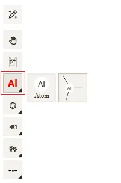
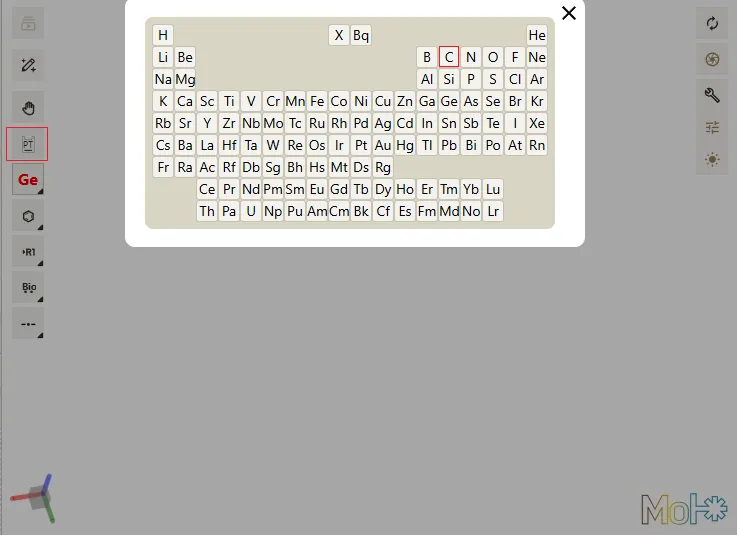
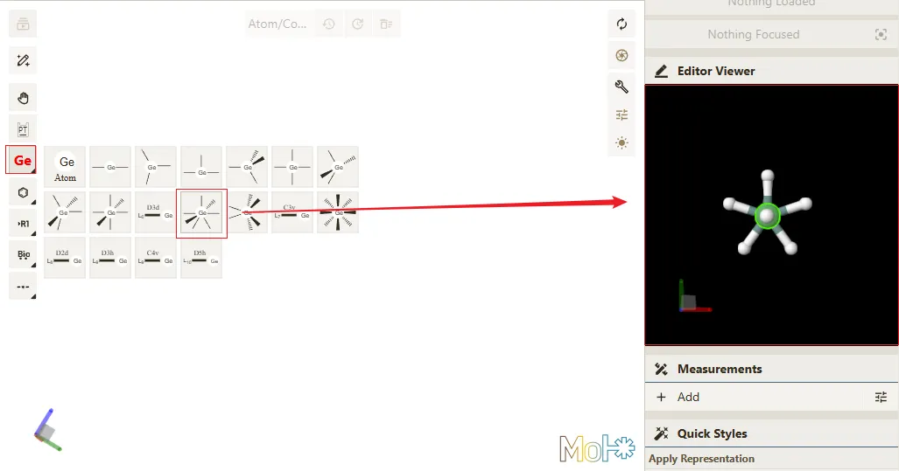
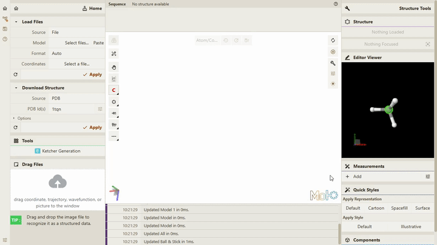

# 编辑元素类型信息

## 前置条件

> - **Qbics-MolStar** 客户端支持的操作系统包括 **Windows**、**Linux** 和 **Android**。
> - **Qbics-MolStar** 客户端支持安装版本、绿色免安装版本 和 精简版本。
> - 提示: 请根据您的操作系统选择对应的版本进行下载安装。

1. 进入官网 [https://molstar.szbl.ac.cn/viewer/](https://molstar.szbl.ac.cn/viewer/)
2. 下载 **Qbics-MolStar** 客户端：[https://molstar.szbl.ac.cn/download/](https://molstar.szbl.ac.cn/download/)，安装客户端并双击打开客户端。
3. 如需教程/使用文档，请参考：
    - [Qbics-MolStar 教程](https://rxht.github.io/molstar/tutorial/)
    - [Qbics-MolStar 使用文档](https://rxht.github.io/molstar/use/)
    - [zhjun-sci Qbics-MolStar 教程](https://zhjun-sci.com/qbicsmolstar/doc/)

::: tip 温馨提示
1. 在编辑功能中，您可以点击快捷键 **Ctrl + Z** 或 **Ctrl + Y** 来撤销或重做最近的编辑操作。
2. 在编辑功能中，您可以点击 **Shift** + 鼠标左键 来框选多个原子，实现批量选中原子的功能。
3. 在编辑功能中，您选择完原子后，点击快捷键 **Delete** 即可删除选中的原子。
:::

## 开始编辑

点击页面左上角的 "Editor" 按钮，进入编辑功能界面。

点击编辑工具栏中的**元素图标**，即可切换元素的对应分子片段模板，例如以下两个案例。

Al（铝）

Ge（锗）

点击编辑工具栏中的**元素周期表图标**，即可切换不同的元素类型，例如切换为 Ge（锗） 、C（碳） 等元素。

选择好对应的元素以及分子片段模板后，即可在界面右侧的 **Editor Viewer** 中查看对应的分子片段 3D 模型。

同时可以在主界面中点击空白位置或点击原子即可完成一次编辑功能。

编辑完成后点击 "Editor" 按钮，即可退出编辑功能界面。

## 编辑功能修改元素类型动画如下

