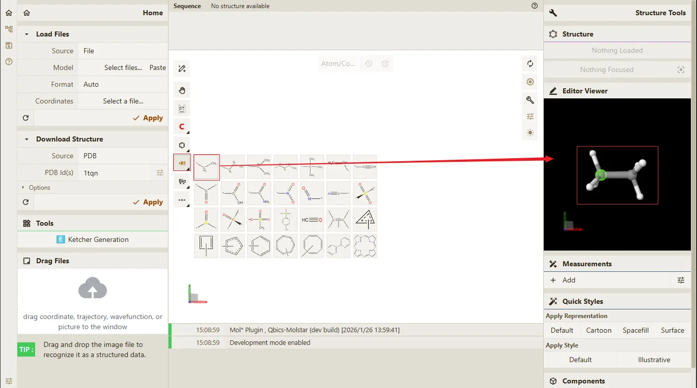
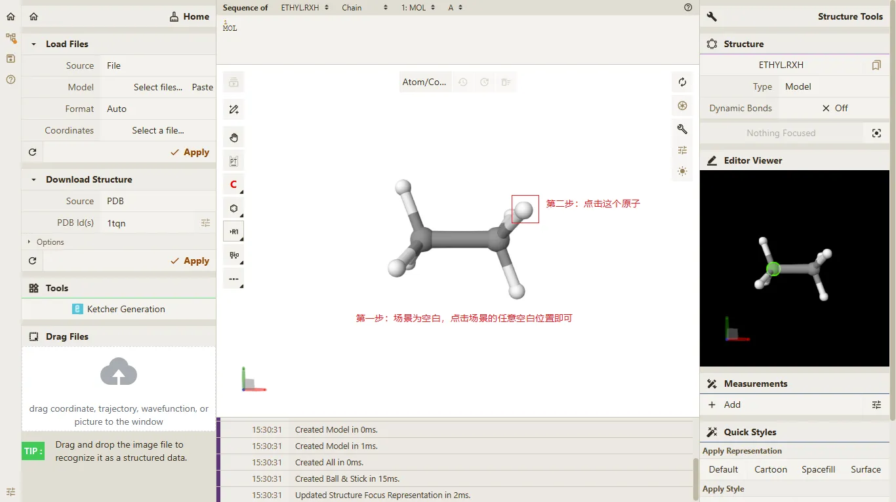
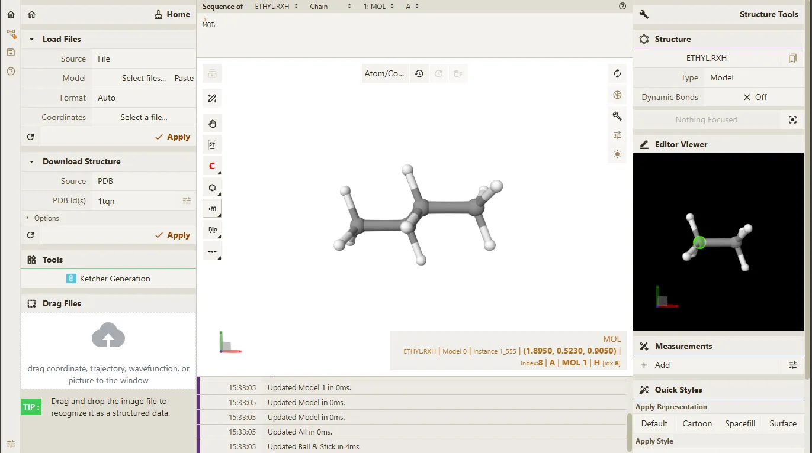
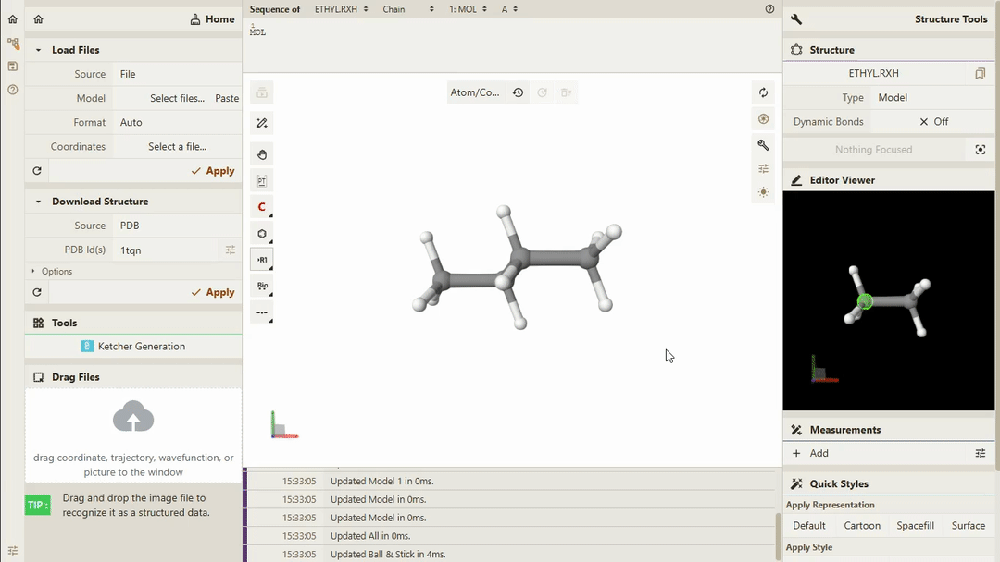

# 编辑功能

## 前置条件

> - **Qbics-MolStar** 客户端支持的操作系统包括 **Windows**、**Linux** 和 **Android**。
> - **Qbics-MolStar** 客户端支持安装版本、绿色免安装版本 和 精简版本。
> - 提示: 请根据您的操作系统选择对应的版本进行下载安装。

1. 进入官网 [https://molstar.szbl.ac.cn/viewer/](https://molstar.szbl.ac.cn/viewer/)
2. 下载 **Qbics-MolStar** 客户端：[https://molstar.szbl.ac.cn/download/](https://molstar.szbl.ac.cn/download/)，安装客户端并双击打开客户端。
3. 如需教程/使用文档，请参考：
    - [Qbics-MolStar 教程](https://rxht.github.io/molstar/tutorial/)
    - [Qbics-MolStar 使用文档](https://rxht.github.io/molstar/use/)
    - [zhjun-sci Qbics-MolStar 教程](https://zhjun-sci.com/qbicsmolstar/doc/)

## 编辑器的主要功能界面如下：

## 开始编辑

点击页面左上角的 "Editor" 按钮，进入编辑功能界面。

点击左侧的 "Editor" 不同分子片段按钮，在右侧的 "Editor Viewer" 区域即可显示对应的分子片段 3D 模型。

点击空白区域，即可完成第一步操作，如下所示。

按照上一步图片中的提示点击对应的原子，即可完成第二步操作，如下所示。

编辑功能的主要操作步骤如上所示。

编辑完成后点击 "Editor" 按钮，即可退出编辑功能界面。

## 编辑功能动画如下

