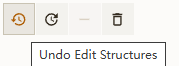

# 编辑功能

## 编辑器的主要功能界面如下：

## 开始编辑

1：在编辑的界面中选择对应的片段模板，并点击空白位置。

2：再次选择片段模板（可在模板中更换标记原子），同时在主窗口中选择对应的目标原子并进行点击即可完成两个片段模板的分子的对接。

3： 完成一次编辑功能，结果如下：

> 提示：如需撤销，可以点击快捷键 `Ctrl + z` 或者点击 **<mark>撤销按钮</mark>** 可进行编辑撤销！

> 反之，可以点击快捷键 `Ctrl + y` 或者点击 **<mark>重做按钮</mark>** 可进行编辑重做！ 

> 提示：如需清空当前的所有数据可点击快捷键 `Ctrl + Delete` 或者点击 **<mark>删除</mark>** 

4：在编辑过程中可使用快捷键 `Shift + 鼠标左键拖动` 进行原子多选！或者鼠标移动到指定的原子上进行点击选择！

5：原子选择完后 删除按钮 ，将删除当前选择的所有原子

