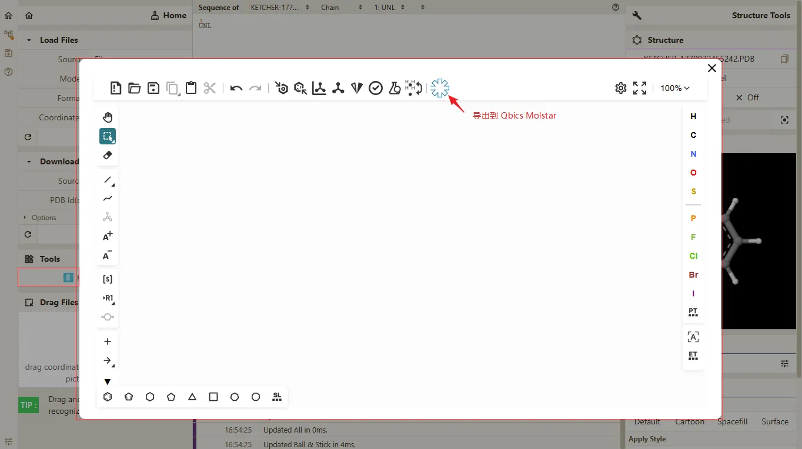
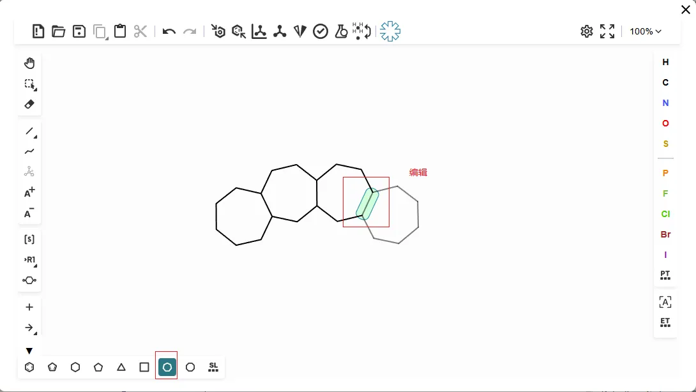
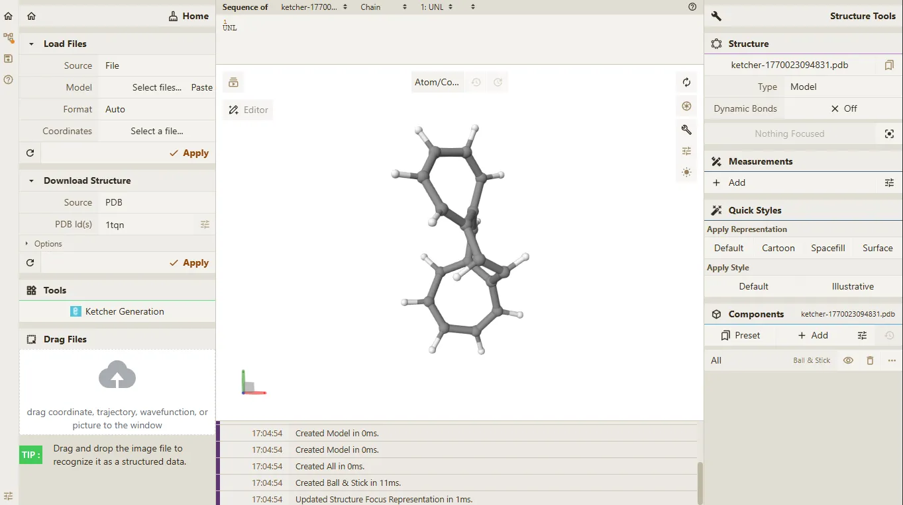
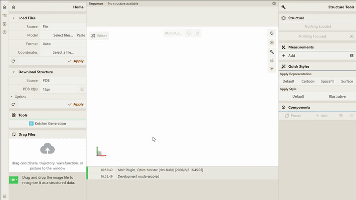

# Ketcher 导出到 Qbics Molstar

## 前置条件

> - **Qbics-MolStar** 客户端支持的操作系统包括 **Windows**、**Linux** 和 **Android**。
> - **Qbics-MolStar** 客户端支持安装版本、绿色免安装版本 和 精简版本。
> - 提示: 请根据您的操作系统选择对应的版本进行下载安装。

1. 进入官网 [https://molstar.szbl.ac.cn/viewer/](https://molstar.szbl.ac.cn/viewer/)
2. 下载 **Qbics-MolStar** 客户端：[https://molstar.szbl.ac.cn/download/](https://molstar.szbl.ac.cn/download/)，安装客户端并双击打开客户端。
3. 如需教程/使用文档，请参考：
    - [Qbics-MolStar 教程](https://rxht.github.io/molstar/tutorial/)
    - [Qbics-MolStar 使用文档](https://rxht.github.io/molstar/use/)
    - [zhjun-sci Qbics-MolStar 教程](https://zhjun-sci.com/qbicsmolstar/doc/)

## 开始编辑

在页面左侧面板 **Home** 中的 **Tools** 模块，点击 "Ketcher Generation" 按钮，弹出弹窗 Ketcher 编辑功能界面。

打开弹窗后开始进行化学结构编辑，如下图所示。

编辑完成后点击  工具栏中的 "Molstar" 按钮，导出化学结构到 Molstar。

如果编辑完成后可点击关闭弹窗即可退出 Ketcher 编辑功能界面。

导出的结果如下所示。

如果需要在导出的结果上进行3D模式的编辑可击页面左上角的 "Editor" 按钮，进入编辑功能界面。

具体操作请参考 [Qbics-MolStar 编辑功能实践教程](../index.md);

## 编辑功能动画如下

