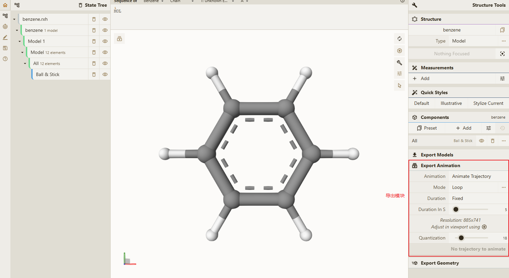
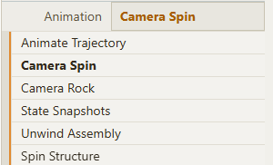
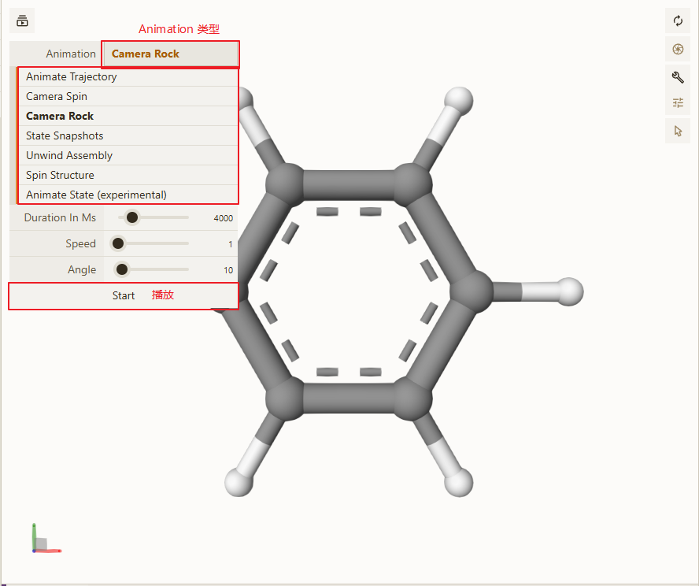
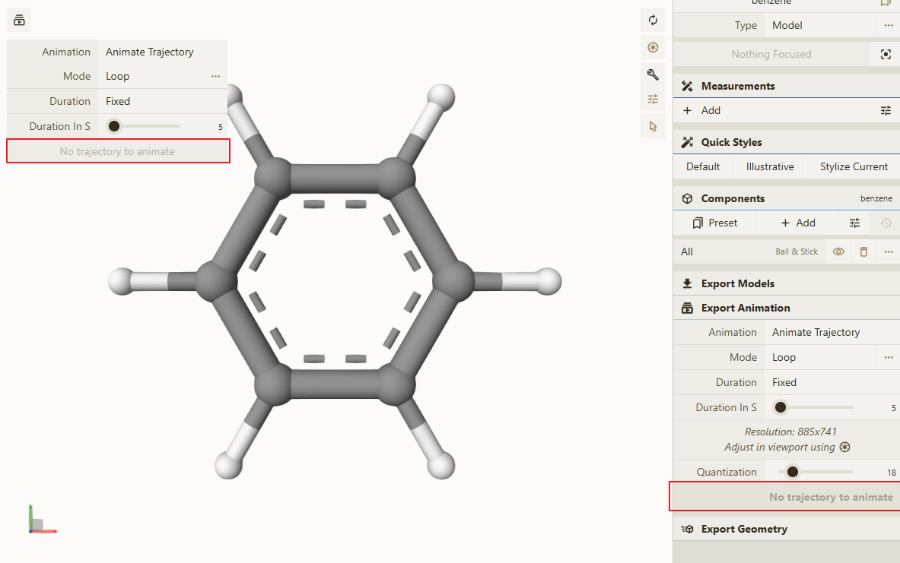
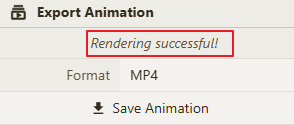

# 导出 Animation

导出功能主要模块

所支持的 `Animation` 类型如下

- Animate Trajectory （轨迹动画，可配置动画模式【往返、循环、一次】、持续时间、FPS）
- Camera Spin （旋转，可配置时长、速度、方向）
- Camera Rock （左右摇摆，可配置时长、速度、角度）
- State Snapshots
- Unwind Assembly
- Spin Structure （转圈，可配置时长）
- Animate State (experimental)

> <b>提示：</b>如果不清楚每个 `Animation` 类型的最终导出效果可以在主视图左上角的动画播放器中查看对应的 `Animation` 效果
> 

> <b><mark>注意：</mark></b>如果出现如下问题的话则表示当前的 `Model` 不存在 `Trajectory` 信息，无法使用 `Animate Trajectory`，请切换其他的 `Animation` 类型
> 

## 操作步骤

1. 选择所需的 `Animation` 类型，并设置对应的属性
2. 点击 `Render` 按钮，主界面中会提示所渲染的每一帧
3. 渲染完成会出现如下界面

4. 选择对应的输出格式【MP4、AVI、GIF、MKV】
5. 点击 `Save Animation` 按钮即可完成

> 提示：如果点击 `Clear` 按钮则会清空第 2 步所得到的渲染结果。
