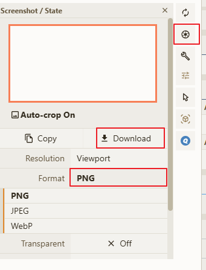
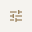
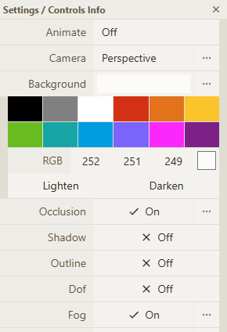

# 导出图片

> 所支持导出的图片格式为 **PNG** 、**JPEG**、**WebP**

导出图片功能主要模块

## 操作步骤

1. 加载对应的结构文件
2. 
点击主界面右上角的相机按钮 

3. 在弹窗中点击 `Format` 按钮可以选择所需要下载的图片格式
4. 点击 `Resolution` 按钮可以选择对应的下载图片尺寸，或者选择 `Custom` 来自定义图片尺寸
4. 点击 `Download` 按钮即可下载对应的图片数据

## 下载透明图片

在截图弹窗中点击 `Transparent` 按钮使其为 `on` ，即可剔除背景图片，下载图片时所得到的图片就不存在背景颜色

## 更改背景颜色

 更改背景颜色首先需要先点击 <code>Setting</code> 按钮 ，在设置弹窗中更新主界面的背景颜色。

设置完背景颜色后关闭设置弹窗，然后按照上述的 [操作步骤](#操作步骤) 即可完成图片下载