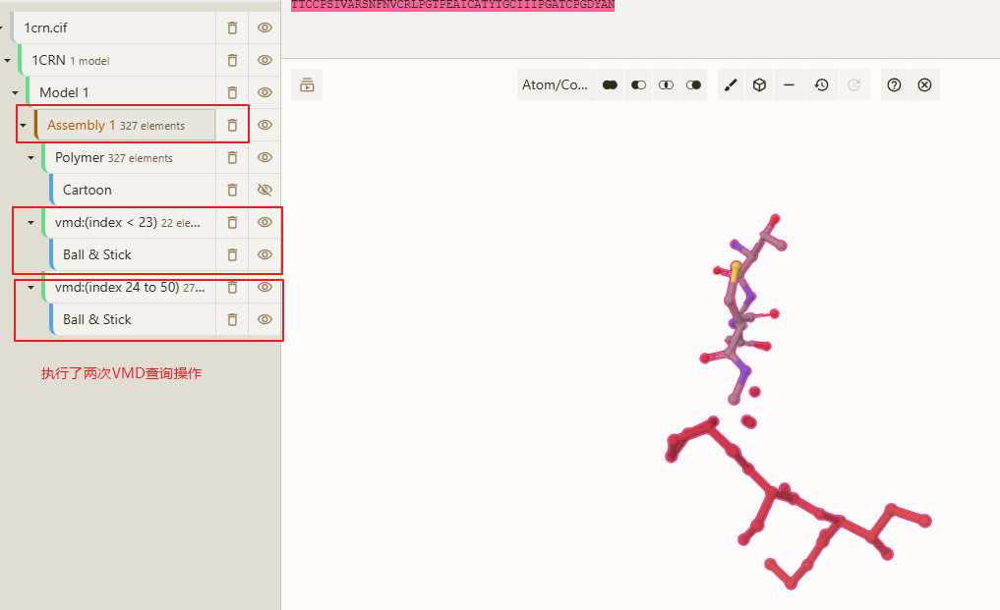
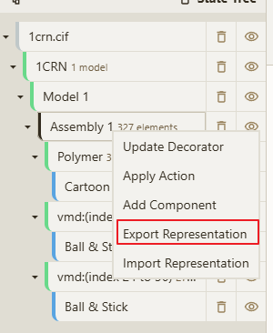
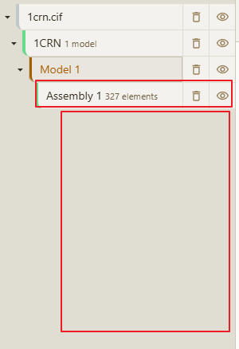
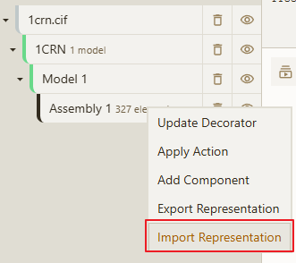
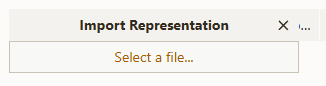
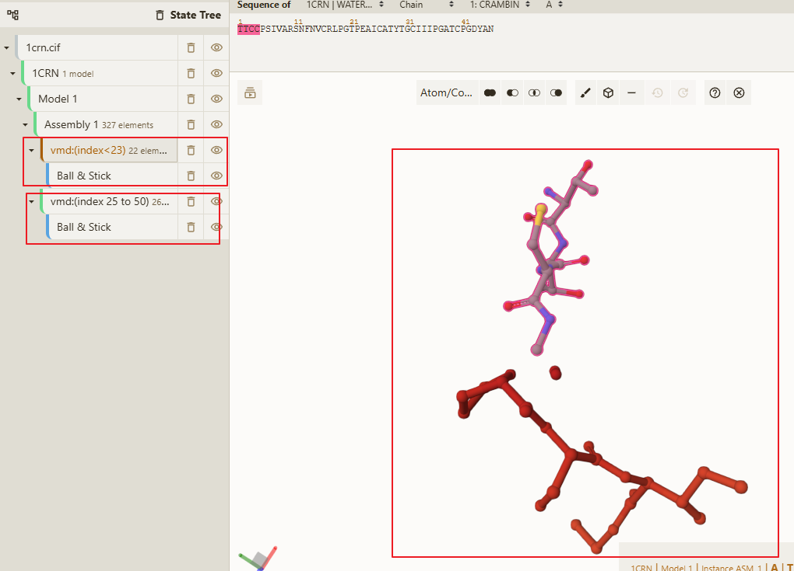

# 导入/导出 Representation 【渲染格式刷】

> 背景说明，当用户存在多个相同结构时，需要根据其中的一个结构中的显示情况，同步其他结构的显示。【渲染格式刷】

如下图所示，用户打开了结构数据后执行两次vmd的查询操作，得到了两个结构数据。

> tip：用户可能不止两次查询，这里只是为了方便展示。

## 导出渲染格式

导出渲染格式的列表，鼠标移动到Model上，然后点击鼠标右键，再弹出框中选择 `Export Representation` ，将会自动下载一个 `*.json` 的格式文件，这个文件就是结构渲染的参数信息。

## 导入渲染格式

打开一个新的结构数据，然后鼠标移动到Model上，然后点击鼠标右键，再弹出框中选择 `Import Representation` ，然后选择一个 `*.json` 的格式文件，将会自动导入结构渲染的参数信息。

如下图所示，打开一个新的结构后，我删除了所有的渲染格式。

鼠标右键选择 `Import Representation` 

在 Import Representation 弹出框中选择上一步所导出的 `*.json` 的格式文件。

然后就可以看到导入的渲染格式了。

