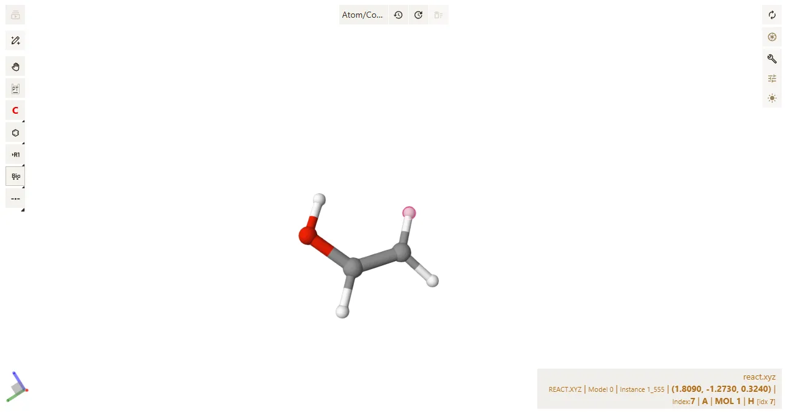
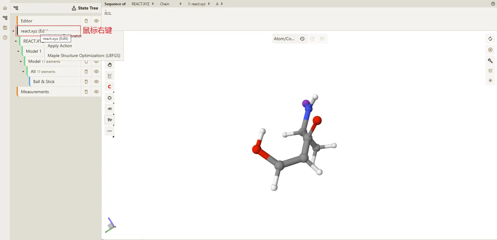
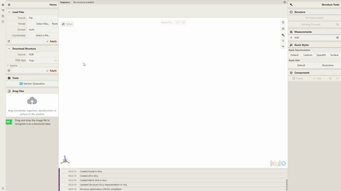

# Qbics-Molstar 结构优化: LBFGS

## 前置条件

进入 [Qbics-Molstar 官方网站](https://molstar.szbl.ac.cn/viewer/) 或下载 [Qbics-Molstar 客户端](https://molstar.szbl.ac.cn/download/) 并运行 **Qbics-Molstar** 客户端。

## 打开本地文件

:::tip
 如需查看具体如何打开本地文件可查看文档 [安装与使用教程 - 本地文件、PDB 与 SMILES 可视化](../../../tutorial/access-installation.md)
:::
 
将下方的 **react.xyz** 文本保存到本地的 **react.xyz** 文件，打开 **Qbics-Molstar** 后使用 **Load Files** 功能加载本地的 **react.xyz** 文件。

```txt [react.xyz]
7
OH
  C           0.82606574148010      0.55086039108041     -0.12617945891172
  H           0.45544459832603      1.24175134345121     -0.87843176681328
  O           0.56807530830522      1.02465144289647      1.11874348469907
  C           1.44110985840975     -0.58736037739486     -0.43636137324384
  H           0.90990913730383      0.39323174998265      1.76663207206389
  H           1.59168346964402     -0.85929296968553     -1.47418858923956
  H           1.80895345653104     -1.27347474033034      0.32372445144544
```

## 编辑结构

1. <div style="display: flex; gap: 0 8px; align-items: center;">击主界面中的按钮，打开 <b>Qbics-Molstar</b> 的编辑功能。</div>

2. <div style="display: flex; gap: 0 8px; align-items: center;">点击按钮切换到 <b>biological</b> 部分的结构片段，在主界面的右侧将会显示对应的 3D 模型</div>

3. 点击 **index** 为 2 的 **氢原子**，如下图所示：



4. <div style="display: flex; gap: 0 8px; align-items: center;">得到新的结构后点击按钮关闭 <b>Editor</b> 模式</div>

## 结构优化

1. 在左侧的 **State Tree** 面板中，在 **react.xyz** 树层级上点击鼠标右键，如下图：



2. 点击鼠标右键中的 **Structure Optimization: (LBFGS)** 选项，并在在弹窗中选择 **自动参数（默认）** 或 **手动修改参数**，最后点击 **Apply** 按钮，如下图所示：


:::tip
**Structure Optimization: (LBFGS)** 功能为异步功能，用户点击 **Apply** 后可进行其他操作，等待计算完成后将会自动加载并显示最终的结果。

**注意⚠️：** 不能删除原本的文件或清空内容，否则计算结果将会丢失。
:::

3. 等待计算完成后结果将会自动加载，可以使用动画功能查看轨迹帧的最后一帧，最后一帧即是优化的最终结果。

:::tip
 如需查看具体如何使用动画功能可查看文档 [可视化轨迹并导出动画](../../../tutorial/trajectory-visualization.md)
:::

## 最终结果

结构优化的操作过程与最终结果如下动图所示：

