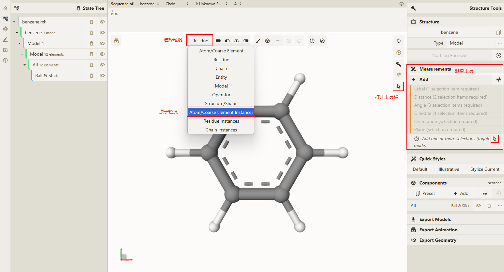
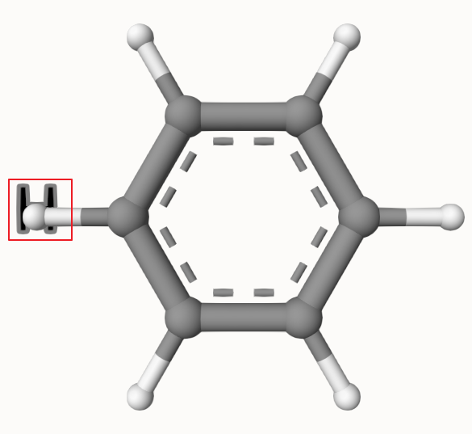
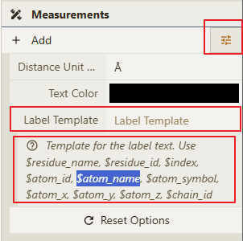

# 显示 Label

测量功能主界面

## 操作步骤

1. 点击打开工具栏按钮，在主视图中显示工具栏
2. 在工具栏中最左侧功能 **粒度选择** 点击下拉，并选择对应的 **粒度** 此处选择 **Atom/Coarse Element Instances** 这个选项
3. 选择主视图中任意的一个原子
4. 点击**Measurements** 模块下的 `+ Add` 按钮
5. 点击 **Measurements** 模块下的 `Label  (1 selection item required)` 功能

## 结果如下

## 自定义模板

用户可以点击 点击**Measurements** 模块下的 `+ Add` 后面的配置按钮，如下图所示，在 **Label Template** 中输入自定义的模板，自定义模板输入完后会立即生效，无需点击确认按钮，编辑完模板后点击 `+ Add` 按钮后即可按照 **操作步骤** 文档即可显示自定义的Label模板。

模板示例：`5VBM.PDB`
- `$residue_name$index:$atom_id` => `92V2705:2707`
- `$residue_name$index:$atom_name` => `SER966:N`

现在所支持的模板变量如下：
- `$residue_name` 残基的名称
- `$residue_id` 残基的ID
- `$index` 原子的序号
- `$atom_id` 原子的ID
- `$atom_name` 原子的名称
- `$atom_symbol` 原子的符号
- `$atom_x` 原子的x坐标
- `$atom_y` 原子的y坐标
- `$atom_z` 原子的z坐标
- `$chain_id` 原子所在的链的ID
         

