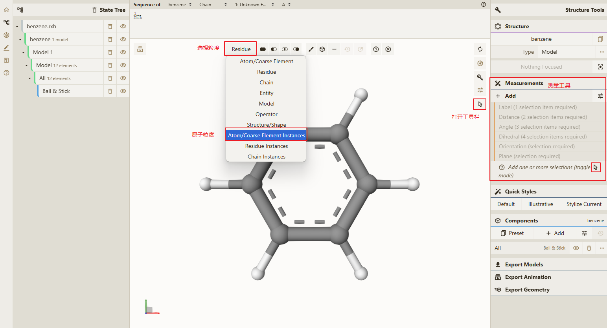
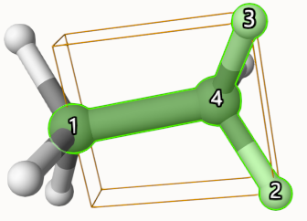

# 显示 Orientations

测量功能主界面

## 操作步骤

1. 点击打开工具栏按钮，在主视图中显示工具栏
2. 在工具栏中最左侧功能 **粒度选择** 点击下拉，并选择对应的 **粒度** 此处选择 **Atom/Coarse Element Instances** 这个选项
3. 选择主视图中任意原子
4. 点击**Measurements** 模块下的 `+ Add` 按钮
5. 点击 **Measurements** 模块下的 `Orientation  (current selection)` 功能

## 结果如下

