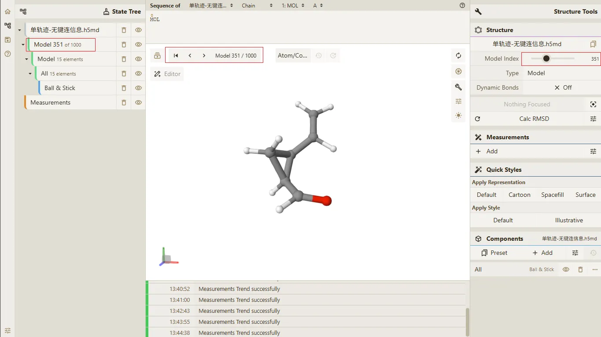
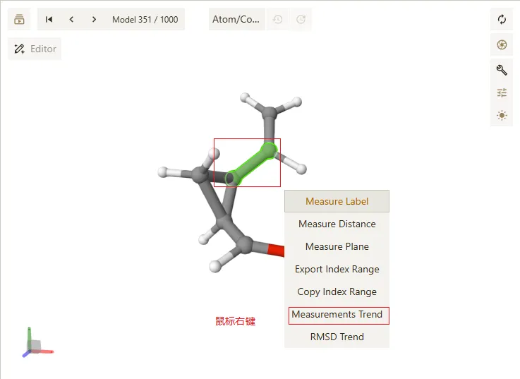
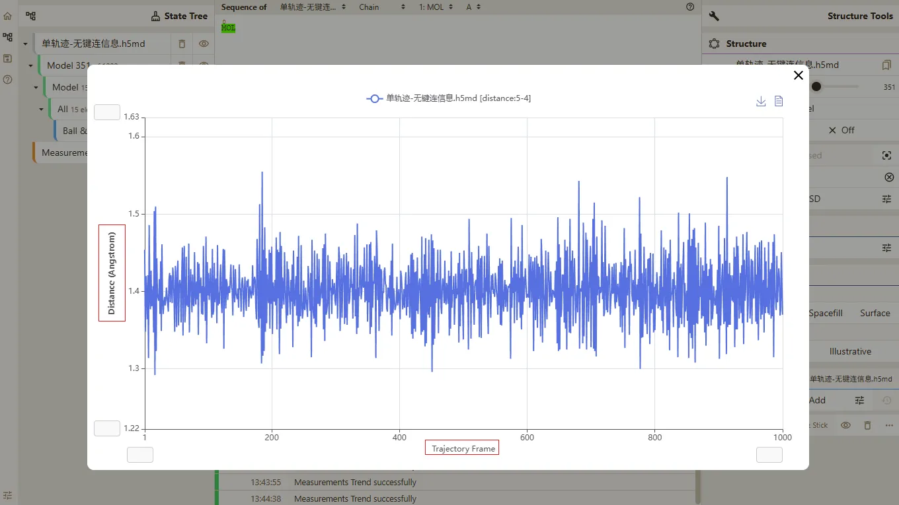
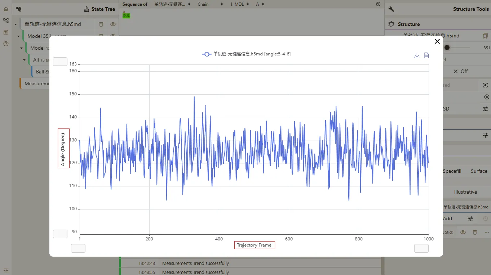
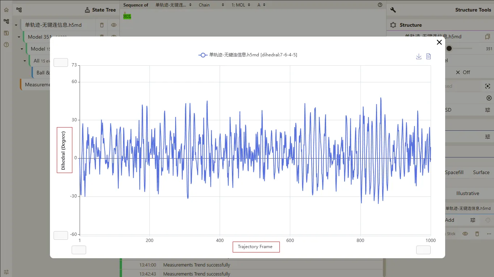

# 显示测量趋势

## 前置条件

> - **Qbics-MolStar** 客户端支持的操作系统包括 **Windows**、**Linux** 和 **Android**。
> - **Qbics-MolStar** 客户端支持安装版本、绿色免安装版本 和 精简版本。
> - 提示: 请根据您的操作系统选择对应的版本进行下载安装。

1. 进入官网 [https://molstar.szbl.ac.cn/viewer/](https://molstar.szbl.ac.cn/viewer/)
2. 下载 **Qbics-MolStar** 客户端：[https://molstar.szbl.ac.cn/download/](https://molstar.szbl.ac.cn/download/)，安装客户端并双击打开客户端。
3. 如需教程/使用文档，请参考：
    - [Qbics-MolStar 教程](https://rxht.github.io/molstar/tutorial/)
    - [Qbics-MolStar 使用文档](https://rxht.github.io/molstar/use/)
    - [zhjun-sci Qbics-MolStar 教程](https://zhjun-sci.com/qbicsmolstar/doc/)

::: tip 提示
所有格式的轨迹文件均支持测量趋势功能，非轨迹文件不支持。
支持多文件同时展示测量趋势，每个文件只能显示一种测量趋势（原子间距离、原子间角度、原子间二面角）。
:::

## 操作步骤

1. 打开或加载轨迹文件，如下图所示：

2. 在主界面中选择指定的数量的原子，对应的测量趋势如下：

- 当选择的原子数为 2 时，展示的是原子间距离趋势
- 当选择的原子数为 3 时，展示的是原子间角度趋势
- 当选择的原子数为 4 时，展示的是原子间 二面角 趋势

3. 在主场景中的空白位置点击鼠标右键，选择 `Measurements Trend`，得到如下结果：

3. 在 `Measurements Trend` 弹窗中，展示所对应文件的测量趋势，如下结果：

原子间距离（distance）

原子间角度（angle）

原子间二面角（dihedral）

::: tip 提示
在 `Measurements Trend` 弹窗中，可以修改如下参数：
- X 轴最小值
- X 轴最大值
- Y 轴最小值（对应测量趋势值的最小）
- Y 轴最大值（对应测量趋势值的最大）
:::

## 测量趋势功能动画如下

