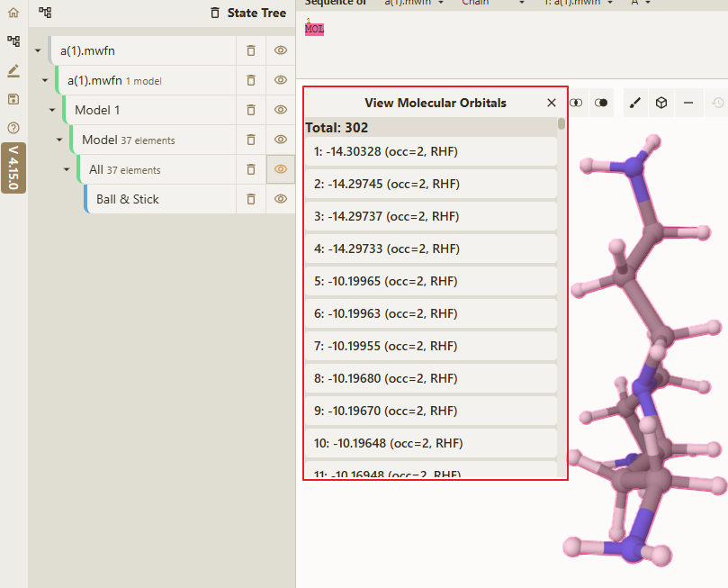
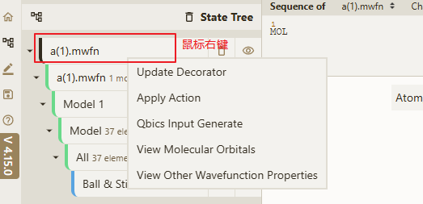
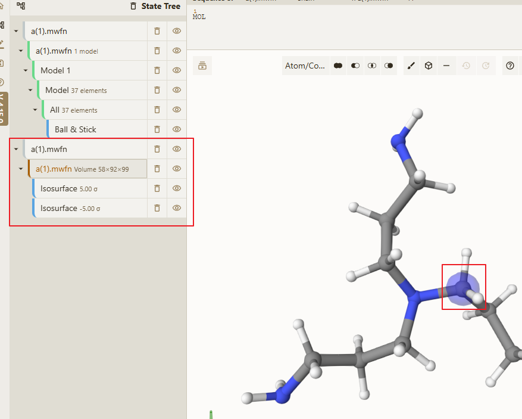

# 显示分子轨道

> [!TIP]
> 分子轨道所支持的文件格式为 **mwfn**、**fch**、**fchk**

分子轨道主界面如下

## 操作步骤

1. 打开所支持格式的对应文件

2. 在 `State Tree` 页面中，在对应的文件上进行鼠标右键操作，得到如下结果：

3. 点击 `View Molecular Orbitals` 按钮，就可以得到上述的 **分子轨道主界面**

4. 然后点击所需要展示的分子轨道即可得到如下结果

