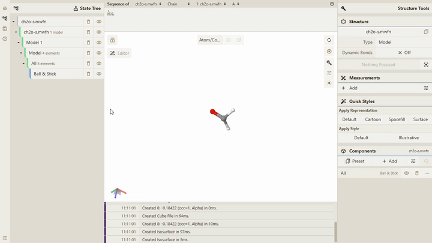

# 显示分子轨道

## 前置条件

> - **Qbics-MolStar** 客户端支持的操作系统包括 **Windows**、**Linux** 和 **Android**。
> - **Qbics-MolStar** 客户端支持安装版本、绿色免安装版本 和 精简版本。
> - 提示: 请根据您的操作系统选择对应的版本进行下载安装。

1. 进入官网 [https://molstar.szbl.ac.cn/viewer/](https://molstar.szbl.ac.cn/viewer/)
2. 下载 **Qbics-MolStar** 客户端：[https://molstar.szbl.ac.cn/download/](https://molstar.szbl.ac.cn/download/)，安装客户端并双击打开客户端。
3. 如需教程/使用文档，请参考：
    - [Qbics-MolStar 教程](https://rxht.github.io/molstar/tutorial/)
    - [Qbics-MolStar 使用文档](https://rxht.github.io/molstar/use/)
    - [zhjun-sci Qbics-MolStar 教程](https://zhjun-sci.com/qbicsmolstar/doc/)

> [!TIP]
> 分子轨道所支持的文件格式为 **mwfn**、**fch**、**fchk**

分子轨道主界面如下

## 操作步骤

1. 打开所支持格式的对应文件

2. 在 `State Tree` 页面中，在对应的文件上进行鼠标右键操作，得到如下结果：

3. 点击 `View Molecular Orbitals` 按钮，就可以得到上述的 **分子轨道主界面**

4. 然后点击所需要展示的分子轨道即可得到如下结果

## 分子轨道功能动画如下

