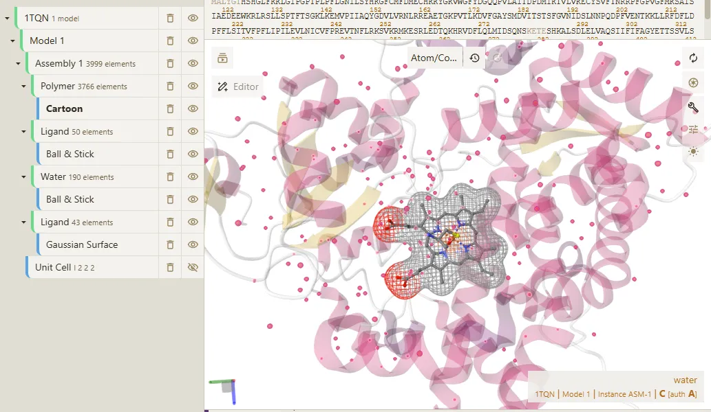
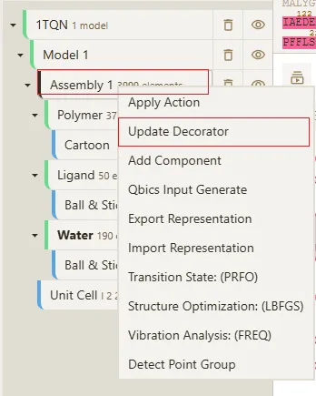
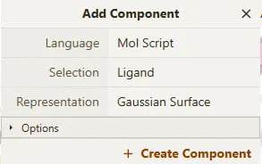
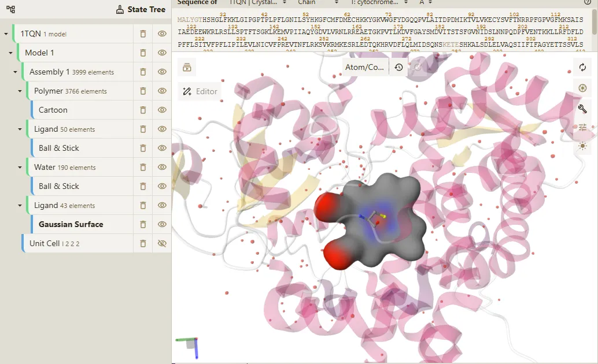
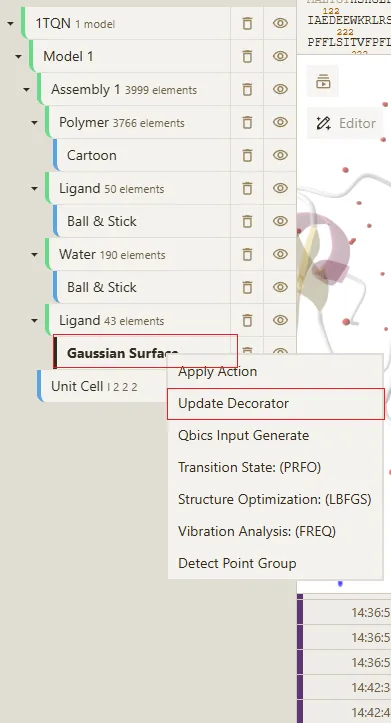
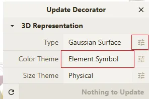
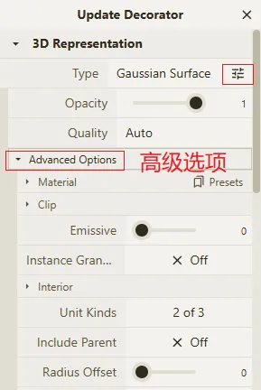
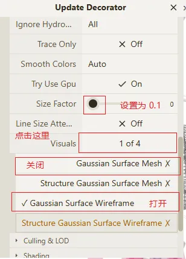

# wireframe 线框

> 表面线框是指在模型表面绘制的线框，用于可视化模型的结构。

最终效果如下：

## 操作步骤

1. 打开一个文件或下载结构文件，例如 `1tqn.pdb`

2. 新增 **Ligand Components**， 在 **Assembly** 上进行鼠标右键，选择 `Add Component`。

选择参数如下：

效果如下：

3. 修改 **Ligand Components** 的显示方式为 `Surface Wireframe`

在 **Update Decorator** 弹窗中，点击 **Type** 的扩展按钮，修改 **Color Theme** 的颜色为 `Element Symbol`。具体如下：

打开 **Advanced Options** 扩展

修改 **Wireframe** 的参数如下：

根据如上步骤操作，即可得到最终效果。

