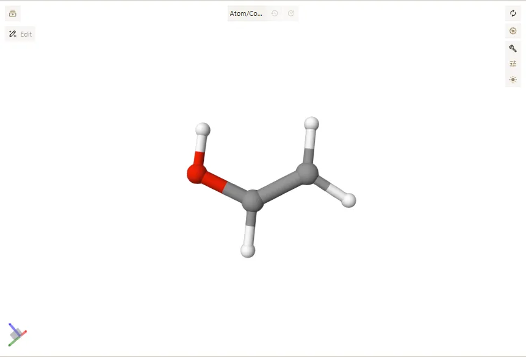
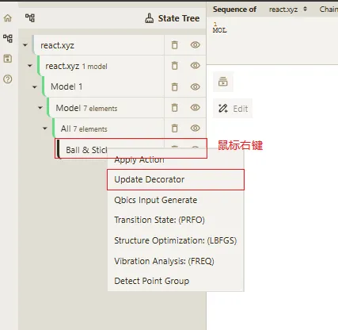
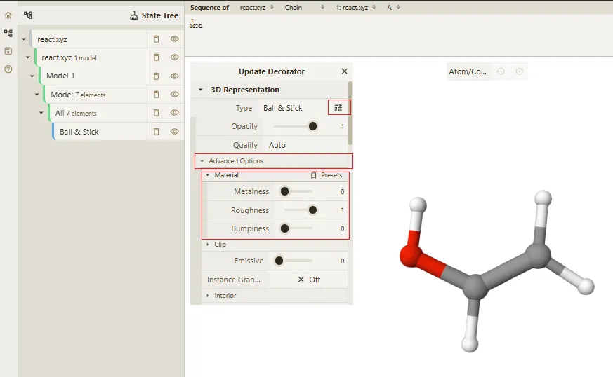
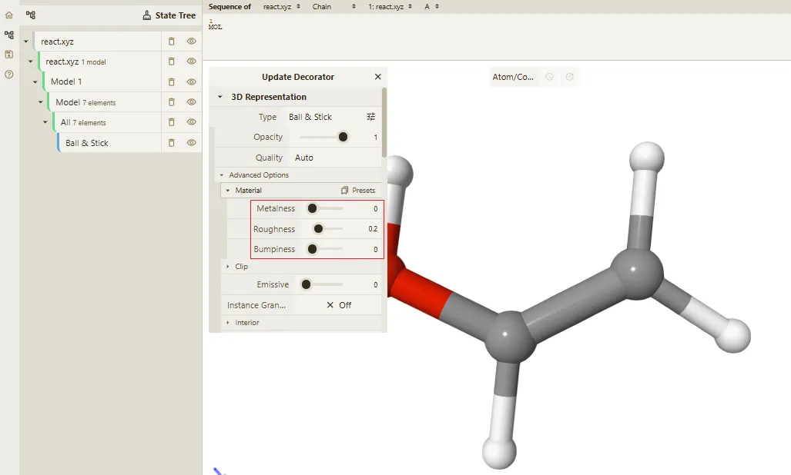

# 切换显示材质

用户打开一个文件后，默认显示的是模型的材质。用户可以在编辑器中切换显示不同的材质，以如下 `react.xyz` 为例。

```text [react.xyz]
7
OH
  C           0.82606574148010      0.55086039108041     -0.12617945891172
  H           0.45544459832603      1.24175134345121     -0.87843176681328
  O           0.56807530830522      1.02465144289647      1.11874348469907
  C           1.44110985840975     -0.58736037739486     -0.43636137324384
  H           0.90990913730383      0.39323174998265      1.76663207206389
  H           1.59168346964402     -0.85929296968553     -1.47418858923956
  H           1.80895345653104     -1.27347474033034      0.32372445144544
```

显示默认材质如下：



1. 在State Tree 面板中找到最底层的显示样式 **Ball & Stick** 层级，点击鼠标右键触发右键菜单弹窗显示，选择 **Update Decorator** 选项。



2. 在 **Update decorator** 弹窗中，用户点击「Type」右侧的「...」扩展按钮，展开标签精细化设置面板。
   
3. 点击 **Advanced Options** 按钮，打开高级选项面板。  
   
4. 在高级选项面板中，用户可以在 **Material** 选项中选择不同的材质显示样式。
   - 使用 **Presets** 选项，用户可以快速切换到不同的材质显示样式。
   - 使用 **Custom** 选项，用户可以通过拖动不同参数来自定义材质显示样式。



5. 调整完材质参数后会自动更新模型显示，无需手动刷新。

