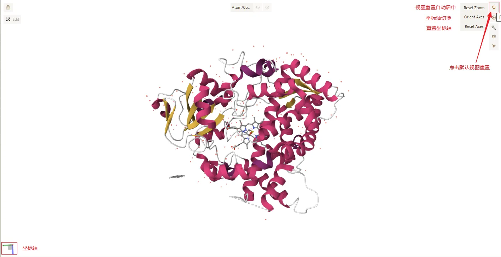
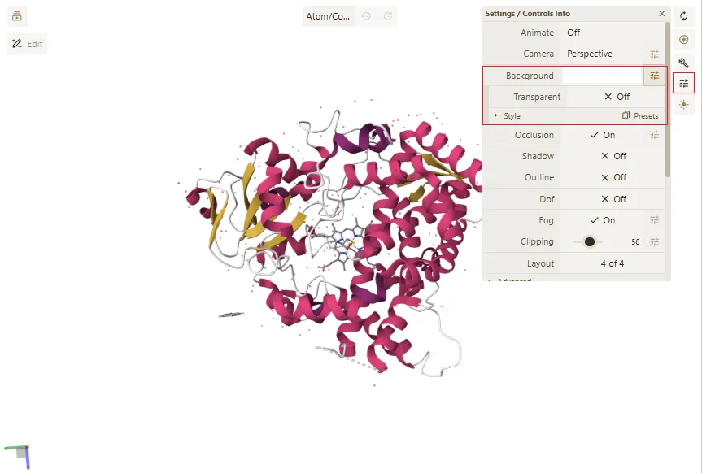

# 四、3D 视图基础操作

> **Qbics-Molstar 分子可视化平台用户手册**
>
> 官方网站：[https://molstar.szbl.ac.cn/viewer](https://molstar.szbl.ac.cn/viewer)
> 
> 官方文档：[https://molstar.szbl.ac.cn/docs](https://molstar.szbl.ac.cn/docs)
> 
> 第三方文档：[https://rxht.github.io/molstar/](https://rxht.github.io/molstar/)

3D视图基础操作是科研人员观察分子结构的核心技能，平台支持鼠标、键盘双重操作，操作简洁直观，同时提供多种视图控制功能，适配不同的科研观察需求（如整体观察、局部放大、内部结构观察）。以下详细介绍各基础操作的方法、科研应用场景及注意事项：

## 1. 旋转、平移、缩放操作

旋转、平移、缩放是最基础的视图操作，用于调整分子结构的观察角度与显示大小，便于科研人员从不同视角观察结构细节，操作方法如下：

- 旋转：鼠标左键点击3D视图区，按住并拖拽，即可旋转分子结构，拖拽方向对应结构旋转方向（水平拖拽左右旋转，垂直拖拽上下旋转）；科研应用场景：观察分子的空间构象、不同方向的结构特征（如配体与受体的结合界面）；

- 平移：鼠标右键点击3D视图区，按住并拖拽，即可平移分子结构，调整结构在视图区的位置；科研应用场景：将关注的结构片段（如关键残基、配体）移动至视图中心，便于观察；

- 缩放：鼠标滚轮向上滚动，放大视图（聚焦局部结构，如原子细节、氢键作用）；鼠标滚轮向下滚动，缩小视图（观察分子整体结构）；也可通过顶部工具栏“缩放”按钮进行精准缩放。

科研注意事项：

- 旋转、平移操作时，建议保持鼠标拖拽平稳，避免快速拖拽导致视图晃动，影响观察精度；

- 观察微小结构（如小分子配体、单个残基）时，可通过缩放功能放大视图，同时配合旋转操作，全面观察结构细节；

- 若操作失误导致视图混乱，可通过“重置视图”按钮恢复默认视图，无需重新加载结构。

## 2. 居中、重置视图

居中、重置视图功能用于快速调整视图状态，确保科研人员能够快速聚焦关注的结构，或恢复默认视图，操作方法如下：

- 方法1：点击主界面中右上角的 “更新” 图标，可将当前加载的所有结构居中显示在3D视图区中心；

- 方法2：鼠标移入主场景右上角的 “更新” 图标，即可显示视图重置的选择菜单，可选择如下选项：
    - **Reset Zoom**：默认选项，将当前加载的所有结构居中显示在3D视图区中心；
    - **Orient Axis**：将视图恢复至默认视角，方便观察整体结构。
    - **Reset Axis**：将以坐标轴为参考，循环切换对应的坐标轴朝向相机方向，方便观察不同方向的结构特征；

s

## 3. 背景、颜色主题切换

背景、颜色主题的切换主要用于科研成果展示（如论文配图、项目汇报），不同的背景与主题可提升结构展示的清晰度与专业性，适配不同展示场景的需求，以下为详细操作步骤及相关注意事项：

- 打开平台主界面，找到主场景右上角的全局工具栏，点击「显示设置」按钮（图标为齿轮或显示器样式）；

- 点击后弹出显示设置弹窗，在弹窗中找到「Background」（背景）下拉菜单；

- 点击下拉菜单，从选项中选择所需背景颜色，可选颜色包括白色、黑色、灰色、透明；

- 选择完成后，弹窗将自动关闭，中央3D视图区的背景将立即切换为所选颜色。

提示：白色、黑色背景最适合科研成果展示，其中白色背景适配论文印刷场景，黑色背景适配屏幕展示（如汇报、演示），可根据实际需求选择。

> **注意事项：**
> 
> - 论文配图时，建议优先选择白色或黑色背景，避免使用过于鲜艳的背景颜色，确保分子结构显示清晰、专业，符合期刊排版规范；
> 
> - 颜色主题的选择需结合分子结构类型，如展示小分子配体与受体复合物时，建议选择高对比度主题，便于清晰区分配体与受体结构；
> 
> - 切换背景与颜色主题后，可通过平台的「保存视角」功能保存当前显示状态，后续需要使用时可快速调用，无需重复设置；
> 
> - 若切换后出现结构显示模糊、颜色异常等问题，可刷新页面或重启平台，恢复正常显示状态。
> 
> 

