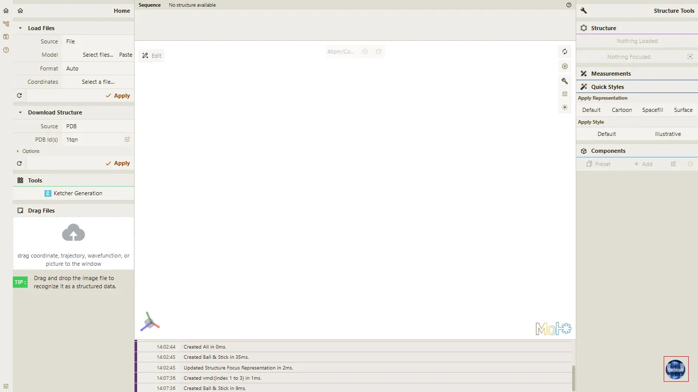
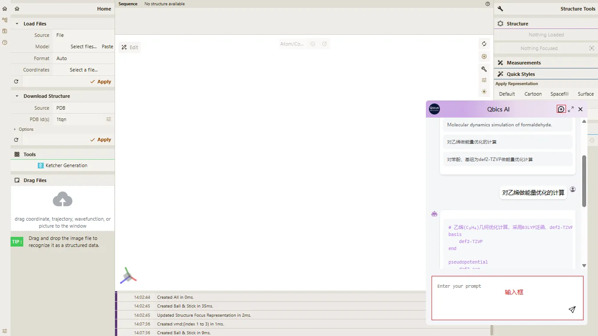
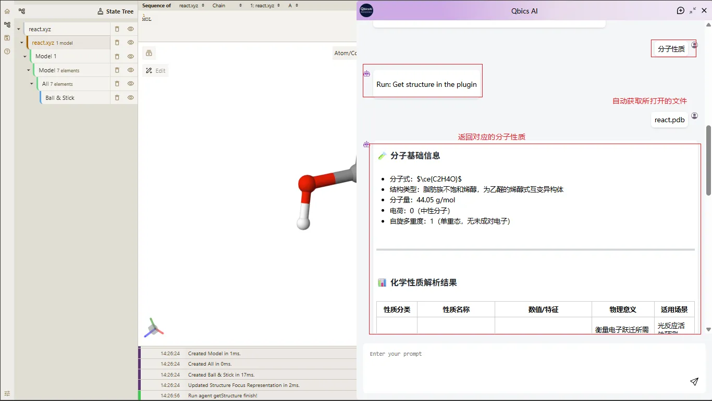
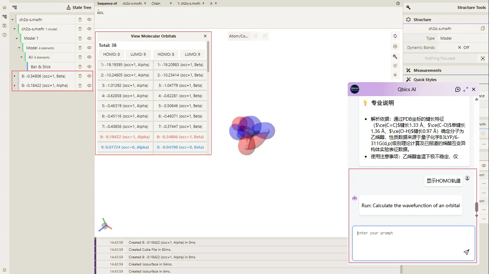
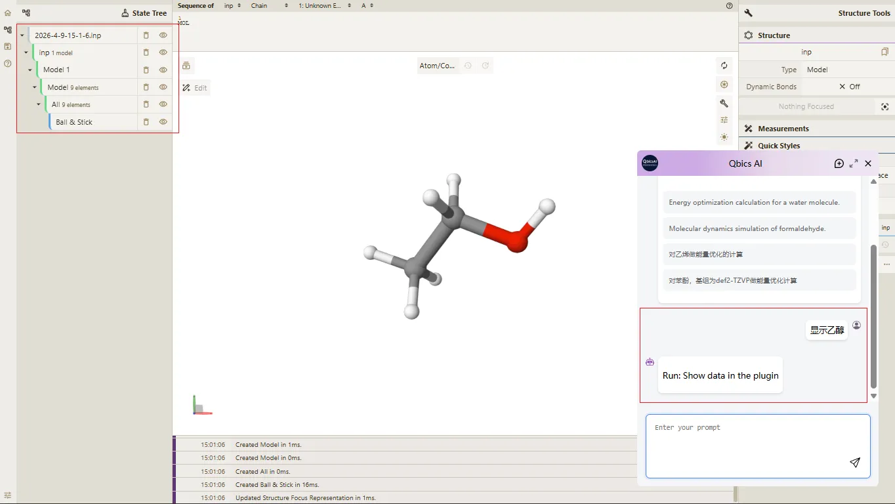
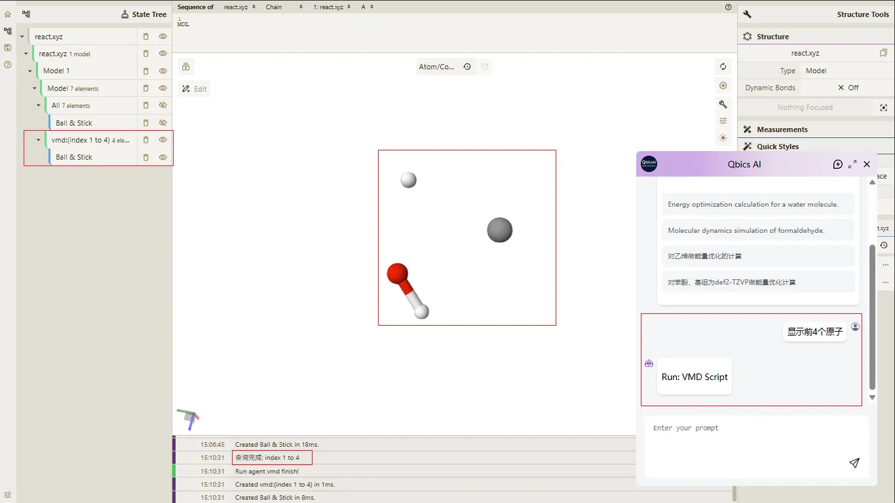

# 十、Qbics AI 功能与操作【实验功能】

> **Qbics-Molstar 分子可视化平台用户手册**
>
> 官方网站：[https://molstar.szbl.ac.cn/viewer](https://molstar.szbl.ac.cn/viewer)
> 
> 官方文档：[https://molstar.szbl.ac.cn/docs](https://molstar.szbl.ac.cn/docs)
> 
> 第三方文档：[https://rxht.github.io/molstar/](https://rxht.github.io/molstar/)

Qbics AI 是一个基于Molstar分子可视化平台的智能助手，可帮助用户更便捷地进行分子分析和可视化操作，无需手动编写复杂指令或脚本，大幅提升分子研究的便捷性与效率。其核心支持生成计算输入文件、获取分子性质、显示分子轨道三大核心功能，具体操作步骤如下：

## 1. 基础操作

Qbics AI 对话弹窗支持多项便捷操作，提升使用体验，具体说明如下：

- **新建对话**：点击弹窗右上角的 **「+」图标**，可清空当前对话历史，开启全新对话，避免历史对话内容干扰新指令的提交与回复；

- **全屏模式**：点击弹窗右上角的 **「全屏」图标**，可将对话弹窗放大至全屏，便于查看长文本回复、复杂的.inp文件内容；

- **关闭弹窗**  ：点击弹窗右上角的 **「×」图标**，可关闭Qbics AI对话弹窗，不影响Molstar平台的正常操作及分子结构的显示；

- **历史记录**：对话弹窗会自动保存当前对话历史，关闭弹窗后再次打开，可继续查看之前的指令与回复，无需重复输入。

> **注意事项**
> 
> - 若发送指令后，加载提示消失且无任何反应，可能是出现了 **对话不存在** 或 **网络问题**，请先检查网络连接是否正常，若网络正常，点击弹窗右上角的 **「+」图标** 创建新对话后，再次尝试发送指令；
> 
> - 若Qbics AI的回复中包含 错误信息，请检查输入的问题或指令是否准确（如分子名称、计算参数、指令表述是否清晰），修改后重新发送；若仍出现错误，可联系管理员处理；
> 
> - 该功能为【实验功能】，可能存在部分兼容性问题，若出现弹窗无法打开、指令无法发送等异常，可重启Molstar平台后重试；
> 
> - 获取分子性质，必须确保目标分子结构文件已正常加载并渲染，否则 Qbics AI 无法提取分子数据，将无法返回有效回复；
> 
> - 请勿频繁发送重复指令，避免导致系统卡顿或回复延迟，若指令发送后长时间无响应，可关闭弹窗重新打开后重试；
>
> - 生成的.inp文件建议下载后保存至指定路径，便于后续查找和使用，避免因清理对话历史导致文件丢失。

## 2. 生成Qbics的输入文件 *.inp

该功能可根据用户输入的计算需求，自动生成符合Qbics平台规范的.inp格式输入文件，适用于能量优化、分子动力学模拟等各类计算任务，无需用户手动编写复杂的计算参数脚本。

- 打开 Molstar 分子可视化平台，确保平台正常加载，无界面异常；

- 点击界面右下角的 Qbics AI 悬浮球按钮，弹出Qbics AI对话弹窗；

- 在对话弹窗的输入框中，输入您的计算问题或指令，支持中文、英文两种语言，指令描述越具体，生成的输入文件越精准；
        
  - 中文示例：`对乙烯做能量优化的计算`、`对苯酚，基组为def2-TZVP做能量优化计算`、`对甲烷进行分子动力学模拟，模拟时长10ns`；

  - 英文示例：`Energy optimization calculation for ethylene`、`Molecular dynamics simulation of formaldehyde`、`Energy optimization of phenol with def2-TZVP basis set`；

- 输入完成后，点击输入框右侧的发送按钮（纸飞机图标），或使用快捷键 `Shift + Enter` 发送您的问题或指令；

- 等待Qbics AI处理您的请求，处理时间根据指令复杂度有所差异，请勿频繁发送重复指令；

- 查看Qbics AI的回复，回复中会包含生成的.inp文件，支持复制文件内容，可直接用于Qbics平台的计算任务提交。

## 2. 获取分子性质

该功能可快速提取已加载分子结构的性质信息，无需用户手动分析计算，支持获取分子的电子性质、化学性质、热力学性质、物理性质等，为分子分析提供便捷支持。

- 打开 Molstar 分子可视化平台，确保平台正常加载；

- 通过“打开文件”或拖拽文件的方式，加载目标分子结构文件，确保分子结构正常渲染，无数据缺失、显示异常；

- 点击界面右下角的 Qbics AI 悬浮球按钮，弹出Qbics AI对话弹窗；

- 在对话弹窗的输入框中，输入您的问题或指令，核心指令为 `分子性质`；

- 输入完成后，点击输入框右侧的发送按钮（纸飞机图标），或使用快捷键 `Shift + Enter` 发送您的问题或指令；
  
- 如果当前打开了多个文件这会弹出一个选择框，用户需要选择要获取性质的分子文件，否则会默认选择当前加载的分子文件；

- 等待Qbics AI处理您的请求，处理完成后，回复中会清晰列出分子的各项性质信息，便于查看和使用；

- 查看Qbics AI的回复，若需进一步获取某一具体性质的详细信息，可在输入框中补充提问。

## 3. 显示分子轨道

该功能可将已加载分子结构的电子轨道可视化展示，帮助用户理解分子的电子结构和电子分布，为分子分析提供辅助支持，操作步骤如下：

- 打开 Molstar 分子可视化平台，确保平台正常加载；

- 通过 “打开文件” 或拖拽文件的方式，加载目标 **带有分子轨道** 的分子结构文件（如本案例中的`ch2o-s.mwfn`），确保分子结构正常渲染，无数据缺失、显示异常；

- 点击界面右下角的 Qbics AI 悬浮球按钮，弹出Qbics AI对话弹窗；

- 在对话弹窗的输入框中，您可以输入如下指令：
  - `显示分子轨道`、`显示HOMO`、`显示LUMO`、`显示轨道`、`HOMO`等
  
- 输入完成后，点击输入框右侧的发送按钮（纸飞机图标），或使用快捷键 `Shift + Enter` 发送您的问题或指令；
  
- 等待Qbics AI处理您的请求，处理完成后，会自动在Molstar平台中显示对应的分子轨道。
  

## 4. 下载分子结构文件

该功能可根据用户指令，将指定分子结构文件下载并加载到Molstar分子可视化平台中，无需手动导入文件，方便后续开展分子分析和相关操作。

- 打开 Molstar 分子可视化平台，确保平台正常加载；
  
- 点击界面右下角的 Qbics AI 悬浮球按钮，弹出Qbics AI对话弹窗；

- 在对话弹窗的输入框中，您可以输入如下指令：
  - `显示苯酚`、`显示苯甲醇`、`显示紫杉醇`、`显示乙醇`等
  
- 输入完成后，点击输入框右侧的发送按钮（纸飞机图标），或使用快捷键 `Shift + Enter` 发送您的问题或指令；
  
- 等待Qbics AI处理请求，处理完成后，会自动将对应分子结构文件下载并加载到Molstar平台中，同时显示分子结构，无需额外操作。
  

## 5. 执行VMD命令

该功能可将指令中的自然语言转换为VMD命令，并自动执行到Molstar平台中，无需用户手动编写复杂的MD脚本，提升操作便捷性。

- 打开 Molstar 分子可视化平台，确保平台正常加载；

- 通过“打开文件”或拖拽文件的方式，加载目标分子结构文件，确保分子结构正常渲染，无数据缺失、显示异常；

- 点击界面右下角的 Qbics AI 悬浮球按钮，弹出Qbics AI对话弹窗；

- 在对话弹窗的输入框中，您可以输入如下指令：
  - `显示前4个原子`、`显示后4个原子`、`显示水原子`、`显示残基 ALA`等

- 输入完成后，点击输入框右侧的发送按钮（纸飞机图标），或使用快捷键 `Shift + Enter` 发送您的问题或指令；
  
- 等待Qbics AI处理请求，处理完成后，会自动在Molstar平台中显示对应的VMD查询结果。

