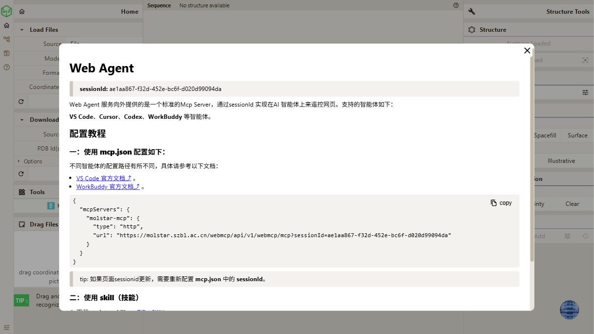
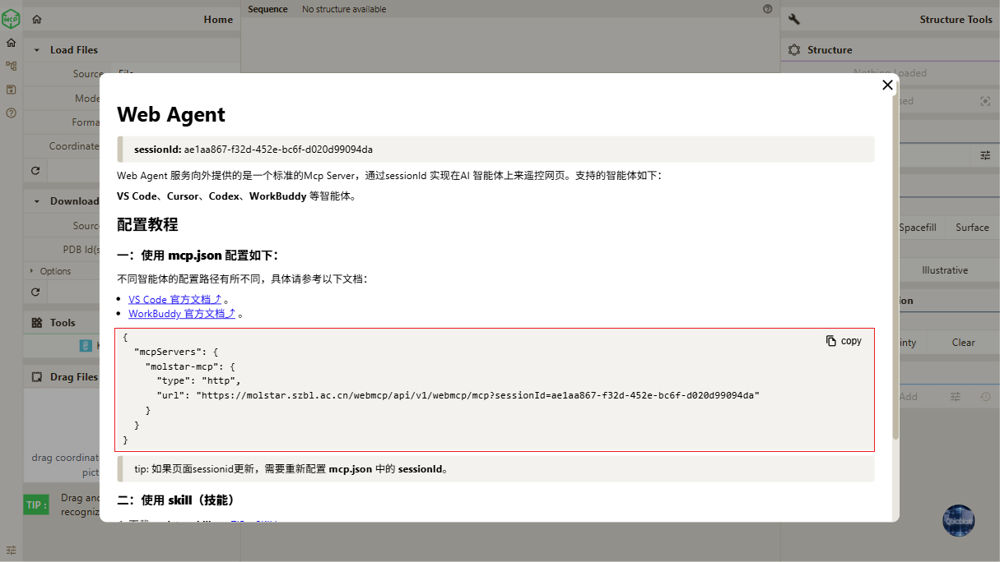
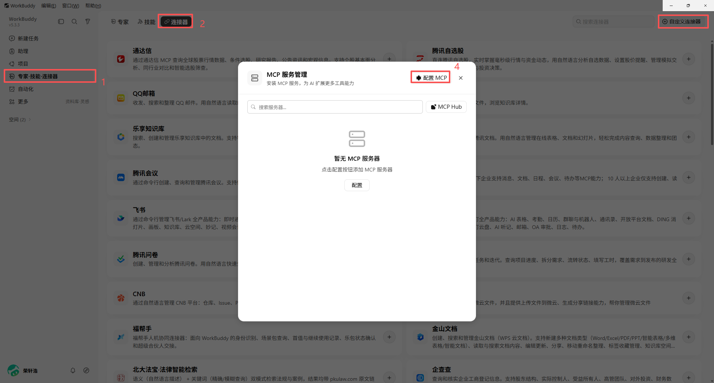
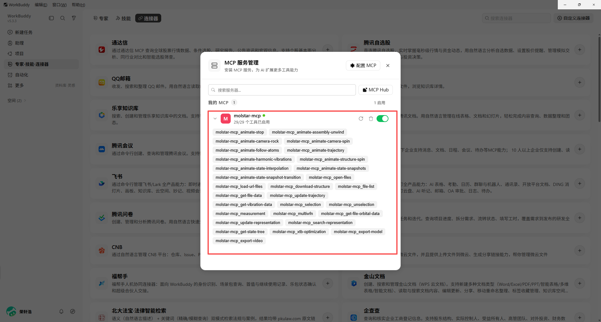

# 十一、WebAgent 使用教程

> **Qbics-Molstar 分子可视化平台用户手册**
>
> 官方网站：[https://molstar.szbl.ac.cn/viewer](https://molstar.szbl.ac.cn/viewer)
> 
> 官方文档：[https://molstar.szbl.ac.cn/docs](https://molstar.szbl.ac.cn/docs)
> 
> 第三方文档：[https://rxht.github.io/molstar/](https://rxht.github.io/molstar/)

Qbics-MolStar 内置 Web Agent，对外提供标准 MCP Server，通过唯一 sessionId 实现 **用户自有Agent智能体应用** 远程操控网页分子可视化平台。

**注意⚠️：** 本教程将以 **WorkBuddy** 为例，介绍如何通过唯一 sessionId 实现 **WorkBuddy** 远程操控网页分子可视化平台。

**Web Agent 介绍说明：**

MCP 可以理解为 AI 的"USB 接口"——就像电脑通过 USB 连接外设一样，MCP 让 AI 连接各种外部工具和数据源。

- [MCP 介绍说明](https://www.codebuddy.cn/docs/workbuddy/From-Beginner-to-Expert-Guide/Function-Description/MCP-Guide)

## 接入模式

1. MCP 原生配置模式（mcp.json，推荐长期稳定使用）

2. Skill 技能包导入模式

::: tip 前置重要规则
- 浏览器标签页关闭、页面刷新会生成全新 sessionId，旧连接立即失效。

- MCP 图标状态：红色 = 未连接Agent服务器；绿色 = 已连接Agent服务器。

- 唤起 Web Agent 弹窗流程：

    点击红色 MCP 图标（转为绿色连接Agent服务器）→ 再次点击绿色 MCP 图标打开配置弹窗。
:::

## 前期准备，获取有效 SessionId

**步骤 1：打开网页端 Qbics-MolStar**

- 使用浏览器访问链接：https://molstar.szbl.ac.cn/viewer/
- 等待页面资源加载完成，完整加载左侧工具栏、右侧结构面板。

**步骤 2：启动 Web Agent 服务并打开配置弹窗**

- 找到页面左上角 MCP 图标，初始状态为红色。
- 第一次单击红色 MCP 图标：图标变为绿色，后台 Web Agent MCP 服务启动。
- 此时服务已经就绪，但看不到配置信息。
- 第二次单击绿色 MCP 图标：弹出【Web Agent】配置弹窗。

**步骤 3：复制有效 sessionId**

- 在弹窗顶部复制 sessionId，示例字符串：XXXX-XXXXX-XXXXX-XXXX-XXXXXXXX
- 拼接完整 MCP 服务地址模板（将字符串替换为你复制的 ID）：

::: tip 关键提醒
页面刷新、关闭标签页后，sessionId 自动变更，旧地址永久失效，需要重复本章节操作重新获取。
:::

## 方案一：mcp.json MCP 原生连接方案（推荐）

**方案优势**

遵循标准 **MCP** 协议，**WorkBuddy** 自动识别全部 MolStar 操作工具；新会话建立后需要在 **WorkBuddy** 中重新配置 **mcp.json** 。

**步骤 1：复制 mcp.json 配置文本**

点击将下方代码块右上角的 **copy** 按钮，复制代码到剪贴板：

**步骤 2：WorkBuddy 导入 MCP 配置**

1. 打开 WorkBuddy 客户端，进入 **专家-技能-连接器** 界面。

2. 在顶部切换到 **连接器** 选项卡。

3. 在连接器页面中的右上角点击 **自定义连接器** 按钮，会弹出 **自定义连接器** 弹窗，具体如下图所示。

4. 在 **自定义连接器** 弹窗的顶部，点击 **配置MCP** 按钮，在下方将会显示一个 **json输入框**。

5. 将 **步骤一** 中复制的 **mcp.json** 配置文本粘贴至 **json输入框**，然后点击 **保存** 按钮。

参考文档： 

- [WorkBuddy 配置 MCP](https://www.codebuddy.cn/docs/workbuddy/From-Beginner-to-Expert-Guide/Function-Description/MCP-Guide)

**步骤 3：连通测试**

1. 保持浏览器 Qbics-MolStar 页面打开，左上角 MCP 图标维持绿色

2. 在 WorkBuddy 的 MCP 列表中，点击重连按钮，即可连接 Web Agent 服务

    - 连接成功后，WorkBuddy 会显示当前 MCP的所有工具列表
    - 在每个 MCP 工具的右侧，有一个 **禁用/启用** 按钮
    - 鼠标移动到 MCP 工具上后会显示工具的详细描述
    - 鼠标点击 MCP 工具，即可在 WorkBuddy 中禁用/启用该工具

:::tip 常见注意事项
1. 网页刷新 → sessionId 变更 → 必须重新更新 **WorkBuddy** 中的 **mcp.json** ，并重新连接Agent服务
2. 浏览器标签不可关闭，关闭将直接断开 MCP 通信通道
3. 网络环境需要正常访问域名 https://molstar.szbl.ac.cn
:::

## 方案二：molstar-skill 技能包导入方案

**方案优势**

无需手动编写 JSON 配置，适合快速测试；新会话简单发送 sessionId 即可建立连接。

**步骤 1：下载 molstar-skill 技能包**

1. 确保已经打开【Web Agent】弹窗。

2. 在Web Agent弹窗区域，点击 **ZIP**、**SKILL** 下载技能压缩包。

**步骤 2：WorkBuddy 导入 Skill**

打开 **WorkBuddy**，创建一个新对话会话，然后将刚刚下载的技能压缩包上传到 **对话框** 中。

然后就可以在对话框中使用 molstar-skill 技能了。

**步骤 3：功能测试**

在对话框中输入 `加载乙醇分子结构` 或者 `播放相机旋转动画`，然后点击发送按钮，智能体会指定调用 molstar-skill 远程控制网页 **Qbics-MolStar** 执行操作。

:::tip 常见注意事项
1. sessionId 更新后，必须在对话内重新发送 `更新sessionId=xxxx-xxx-xxxxx-xxxx` 来更新连接

2. 技能包无需重复下载，除非官方推送技能更新版本

3. 全程保持浏览器页面开启，MCP 图标保持绿色
:::

## 故障排查完整清单

### 1. AI 发送指令，网页 MolStar 完全无响应

1. 检查浏览器页面是否关闭；确认左上角 MCP 图标为绿色。

2. 重新打开 Web Agent 弹窗，核对配置内填写的 sessionId 和弹窗内 ID 完全一致。

3. 刷新 MolStar 页面，重新生成 sessionId，更新所有配置。

### 2. WorkBuddy 提示 MCP 连接失败

1. 确认电脑网络能够正常访问 https://molstar.szbl.ac.cn/viewer/。

2. 清除浏览器缓存，重新打开页面，重启 Web Agent 服务。

### 3. WorkBuddy 找不到 Qbics-MolStar 相关工具

1. 使用方案一：进入 MCP 管理界面，确认 molstar-mcp 服务状态为启用，重载配置。

2. 使用方案二：确认 molstar-skill 技能已在当前会话开启，且已经发送有效的 sessionId。

### 4. 偶尔出现调用超时

1. 关闭浏览器多余占用资源的页面。

2. 不要长时间闲置网页，闲置过久建议刷新页面重新获取 sessionId。

## 最佳使用规范

1. 每次开始工作前，先确认 MCP 图标绿色，重新打开弹窗核对 sessionId。

2. 不要复制分享你的 sessionId，他人可通过该 ID 操控你的 Qbics-MolStar 网页。

3. 结束工作直接关闭浏览器标签页，自动终止 Web Agent 会话。
